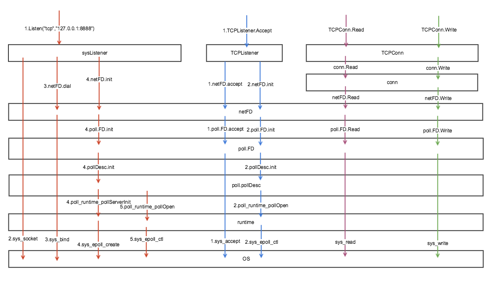
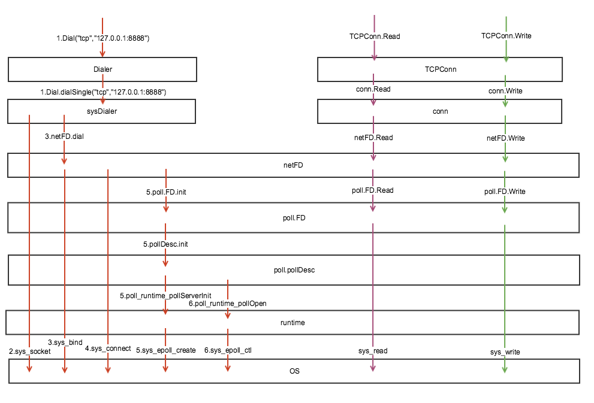

# 从源码角度看Golang的TCP Socket(epoll)实现

Golang的TCP是基于系统的epoll IO模型进行封装实现，本章从TCP的预备工作到runtime下的实时运行工作原理进行分析。仅关注linux系统下的逻辑。代码版本GO1.12.6。

本章例子中的代码对应详细注释参考：[gosrc1.12.6](https://github.com/thinkboy/gosrc1.12.6)

>读文章可能并不是最好的读懂源码的办法，读文章只能有个大致概念，最好的办法拿文章是对照源码理解。

-------------------------------------

# 目录

先来个目录方便读者理解文本结构

* 1.[TCP预备工作](#TCP预备工作)
	* 1.1 [Server端](#Server端)
	* 1.2 [Client端](#Client端)
* 2.[epoll](#epoll)
	* 2.1 [如何实现异步非阻塞](#如何实现异步非阻塞)
	* 2.2 [epoll的创建与事件注册](#epoll的事件监听)
	* 2.3 [小结](#小结)
* 3.[TCP的超时机制](#TCP的超时机制)
	

# TCP预备工作
    
## Server端

```
//TcpServer.go
package main

import (
	"fmt"
	"net"
)

func main() {
	ln, err := net.Listen("tcp", ":8080")
	if err != nil {
		panic(err)
	}
	for {
		conn, err := ln.Accept()
		if err != nil {
			panic(err)
		}
		// 每个Client一个Goroutine
		go handleConnection(conn)
	}
}

func handleConnection(conn net.Conn) {
	defer conn.Close()
	var body [4]byte
	addr := conn.RemoteAddr()
	for {
		// 读取客户端消息
		_, err := conn.Read(body[:])
		if err != nil {
			break
		}
		fmt.Printf("收到%s消息: %s\n", addr, string(body[:]))
		// 回包
		_, err = conn.Write(body[:])
		if err != nil {
			break
		}
		fmt.Printf("发送给%s: %s\n", addr, string(body[:]))
	}
	fmt.Printf("与%s断开!\n", addr)
}
```

上面是一个简单的TCP Server的例子，代码并不是很多。通过一张图先来看下TCP相关源代码的大致结构。



通过上图可以看到主要通过`netFD`、`poll.FD`、`poll.pollDesc`几个关键结构分装系统的`fd(文件描述符)`然后提供给上层用户调用，同时暴露结构实现诸如socket监听、建立、读写等。下层通过runtime与系统交互。

开启服务大致过程：

* 1.用户层开始监听一个地址:`net.Listen("tcp", ":8080")`
* 2.调用系统方法sys_socket取得一个fd
* 3.将第2步拿到的fd通过系统方法sys_bind绑定，即绑定本地监听地址、端口
* 4.在系统中初始化epoll
* 5.将2步拿到的fd注册到系统的epoll里，等待有建立连接的事件

接听一个连接大致过程:

* 1.用户层阻塞accept，等待一个连接的建立：`ln.Accept()`
* 2.先去系统层`sys_accept`等到一个连接请求同时返回请求连接的fd
* 3.将第2步拿到的fd注册到系统epoll里，用于监听读写事件

服务端`Listen`和`accept`好后剩下的就是在封装好的fd下面通过系统方法`sys_read`、`sys_write`方法进行socket的读写。

## Client端实现

```
//TcpClient.go
package main

import (
	"fmt"
	"net"
)

func main() {
	var msg = []byte("abcd")
	conn, err := net.Dial("tcp", "127.0.0.1:8080")
	if err != nil {
		panic(err)
	}
	// 发送消息
	_, err = conn.Write([]byte(msg))
	if err != nil {
		panic(err)
	}
	fmt.Println("发送消息: " + string(msg))
	// 读取消息
	_, err = conn.Read(msg[:])
	if err != nil {
		panic(err)
	}
	fmt.Println("收到消息: " + string(msg))
}
```

上面是一个简单的TCP Client的例子，通过一张图先来看下TCP相关源代码的大致结构。



可以看到大致与Server端的结构类似。也是基于相同的几个封装fd的结构进行结构暴露。下层与runtime、OS的交互相同。

大致过程：

* 1.用户发起一个连接请求:`net.Dial("tcp", "127.0.0.1:8080")`
* 2.调用系统方法sys_socket取得一个fd
* 3.将第2步拿到的fd通过系统方法sys_bind绑定，即绑定本地监听地址、端口
* 4.调用系统方法sys_connect发起远程建立连接
* 5.在系统中初始化epoll(同一个进程下如果开启多个连接，只会初始化一次)
* 6.将第2步拿到的fd注册到系统epoll里，用于监听读写事件

连接创建后，后续的读写操作与server端一致。

# epoll

在上文中对TCP预备的工作有了一些了解。下面继续对下层epoll的封装做一些分析，看下运行时是如何工作的。epoll我们更多的是关注服务端如何实现的，所以这里就只从server端的角度分析（下面假设你对epoll有一定的基础知识）。

## 如何实现异步非阻塞

我们知道epoll属于异步非阻塞IO模型，下面看下如何实现的异步及非阻塞。通过上文的代码结构的介绍，我们就不从头列出代码了，直接跳到关键的代码处看一下：

```
// internal/poll/fd_unix.go

func (fd *FD) Read(p []byte) (int, error) {
	if err := fd.readLock(); err != nil {
		return 0, err
	}
	defer fd.readUnlock()
	if len(p) == 0 {
		// If the caller wanted a zero byte read, return immediately
		// without trying (but after acquiring the readLock).
		// Otherwise syscall.Read returns 0, nil which looks like
		// io.EOF.
		// TODO(bradfitz): make it wait for readability? (Issue 15735)
		return 0, nil
	}
	if err := fd.pd.prepareRead(fd.isFile); err != nil {
		return 0, err
	}
	if fd.IsStream && len(p) > maxRW {
		p = p[:maxRW]
	}
	for {
		n, err := syscall.Read(fd.Sysfd, p)
		if err != nil {
			n = 0
			if err == syscall.EAGAIN && fd.pd.pollable() {
				if err = fd.pd.waitRead(fd.isFile); err == nil {
					continue
				}
			}

			// On MacOS we can see EINTR here if the user
			// pressed ^Z.  See issue #22838.
			if runtime.GOOS == "darwin" && err == syscall.EINTR {
				continue
			}
		}
		err = fd.eofError(n, err)
		return n, err
	}
}

// Write implements io.Writer.
func (fd *FD) Write(p []byte) (int, error) {
	if err := fd.writeLock(); err != nil {
		return 0, err
	}
	defer fd.writeUnlock()
	if err := fd.pd.prepareWrite(fd.isFile); err != nil {
		return 0, err
	}
	var nn int
	for {
		max := len(p)
		if fd.IsStream && max-nn > maxRW {
			max = nn + maxRW
		}
		n, err := syscall.Write(fd.Sysfd, p[nn:max])
		if n > 0 {
			nn += n
		}
		if nn == len(p) {
			return nn, err
		}
		if err == syscall.EAGAIN && fd.pd.pollable() {
			if err = fd.pd.waitWrite(fd.isFile); err == nil {
				continue
			}
		}
		if err != nil {
			return nn, err
		}
		if n == 0 {
			return nn, io.ErrUnexpectedEOF
		}
	}
}
```
上面是IO操作的读写方法，其中调用到`syscall.Read`、`syscall.Write`两个系统调用，但我们知道这两个系统调用并不会block住用户线程(系统方法可自行google)，但是我们上层应用代码确实会阻塞住，而真正实现block操作是在`fd.pd.waitRead(fd.isFile)`、`fd.pd.waitWrite(fd.isFile)`两个方法里。下面直接跳到关键实现的代码。

```
// runtime/netpoll.go

func poll_runtime_pollWait(pd *pollDesc, mode int) int {
	err := netpollcheckerr(pd, int32(mode))
	if err != 0 {
		return err
	}
	// As for now only Solaris and AIX use level-triggered IO.
	if GOOS == "solaris" || GOOS == "aix" {
		netpollarm(pd, mode)
	}
	for !netpollblock(pd, int32(mode), false) {
		err = netpollcheckerr(pd, int32(mode))
		if err != 0 {
			return err
		}
		// Can happen if timeout has fired and unblocked us,
		// but before we had a chance to run, timeout has been reset.
		// Pretend it has not happened and retry.
	}
	return 0
}

// 如果IO已经ready则返回true，IO超时或者关闭返回false
// waitio设置为true的话，则忽略错误，让G进入休眠
func netpollblock(pd *pollDesc, mode int32, waitio bool) bool {
	gpp := &pd.rg
	if mode == 'w' {
		gpp = &pd.wg
	}

	// set the gpp semaphore to WAIT
	for {
		old := *gpp
		if old == pdReady {
			*gpp = 0
			return true
		}
		if old != 0 {
			throw("runtime: double wait")
		}
		if atomic.Casuintptr(gpp, 0, pdWait) {
			break
		}
	}

	// need to recheck error states after setting gpp to WAIT
	// this is necessary because runtime_pollUnblock/runtime_pollSetDeadline/deadlineimpl
	// do the opposite: store to closing/rd/wd, membarrier, load of rg/wg
	if waitio || netpollcheckerr(pd, mode) == 0 { // netpollcheckerr(pd, mode) == 0 表明socket是正常的没有被关闭或者超时
		gopark(netpollblockcommit, unsafe.Pointer(gpp), waitReasonIOWait, traceEvGoBlockNet, 5) // 进入休眠,且在方法中把gpp指向了当前执行的G，即pd.rg指向当前G
	}
	// be careful to not lose concurrent READY notification
	old := atomic.Xchguintptr(gpp, 0)
	if old > pdWait {
		throw("runtime: corrupted polldesc")
	}
	return old == pdReady
}
```
实际通过`gopark`方法把当前的G休眠进入休眠，因此用户层感受到的Read阻塞住是因为通过休眠G实现的，而并没有阻塞到某个系统调用里，因此对于系统来说实现了`非阻塞IO`。

>gopark休眠相关实现参考我之前写的一片文章:[从源码角度看Golang的调度](https://github.com/thinkboy/go-notes/blob/master/%E4%BB%8E%E6%BA%90%E7%A0%81%E8%A7%92%E5%BA%A6%E7%9C%8BGolang%E7%9A%84%E8%B0%83%E5%BA%A6.md)

## epoll的创建与事件注册

先来看两个epoll api的封装:

**创建epoll句柄**

```
// runtime/netpoll_epoll.go

// 内核epoll_create方法创建epoll句柄
func netpollinit() {
	epfd = epollcreate1(_EPOLL_CLOEXEC) // epfd保存epoll句柄
	if epfd >= 0 {
		return
	}
	epfd = epollcreate(1024)
	if epfd >= 0 {
		closeonexec(epfd)
		return
	}
	println("runtime: epollcreate failed with", -epfd)
	throw("runtime: netpollinit failed")
}
```
```
// system/sys_linux_amd64.s

// int32 runtime·epollcreate(int32 size);
TEXT runtime·epollcreate(SB),NOSPLIT,$0
	MOVL    size+0(FP), DI
	MOVL    $SYS_epoll_create, AX
	SYSCALL
	MOVL	AX, ret+8(FP)
	RET

// int32 runtime·epollcreate1(int32 flags);
TEXT runtime·epollcreate1(SB),NOSPLIT,$0
	MOVL	flags+0(FP), DI
	MOVL	$SYS_epoll_create1, AX
	SYSCALL
	MOVL	AX, ret+8(FP)
	RET
```
时间比较简单,通过`epollcreate1`、`epollcreate`调用系统方法创建epoll句柄，得到epoll的句柄epfd，以后所有的fd在epoll的事件注册都通过该epfd注册到epoll里。

**epoll事件注册**

```
// runtime/netpoll_epoll.go

// 通过内核epoll_ctl方法在内核epoll注册一个新的fd到epfd中
func netpollopen(fd uintptr, pd *pollDesc) int32 {
	var ev epollevent
	ev.events = _EPOLLIN | _EPOLLOUT | _EPOLLRDHUP | _EPOLLET
	*(**pollDesc)(unsafe.Pointer(&ev.data)) = pd 
	return -epollctl(epfd, _EPOLL_CTL_ADD, int32(fd), &ev)
}
```

epoll事件封装成了一个`epollevent`结构，将当前运行goroutine的的pollDesc结构的地址放到epoll事件的data结构里，待从epoll获取ready事件时找到该goroutine并唤醒。

## epoll的事件监听

goroutine阻塞在了Read的时候，当有数据来了之后又是如何感知到的？我们知道epoll有个`epoll_wait`方法用来监听事件，我们看下对该方法的封装。

```
// runtime/netpoll_epoll.go

// 从epoll里获取已经ready事件，并找到因accept、read、write方法无数据进入休眠的G里面的pollDesc结构，通过该结构可以反向找到该G
func netpoll(block bool) gList {
	if epfd == -1 {
		return gList{}
	}
	waitms := int32(-1)
	if !block {
		waitms = 0
	}
	var events [128]epollevent
retry:
	n := epollwait(epfd, &events[0], int32(len(events)), waitms) // 通过epoll_pwait获取被内核ready的一批epoll event，最大128个
	if n < 0 {
		if n != -_EINTR {
			println("runtime: epollwait on fd", epfd, "failed with", -n)
			throw("runtime: netpoll failed")
		}
		goto retry
	}
	var toRun gList
	for i := int32(0); i < n; i++ {
		ev := &events[i]
		if ev.events == 0 {
			continue
		}
		var mode int32
		if ev.events&(_EPOLLIN|_EPOLLRDHUP|_EPOLLHUP|_EPOLLERR) != 0 {
			mode += 'r'
		}
		if ev.events&(_EPOLLOUT|_EPOLLHUP|_EPOLLERR) != 0 {
			mode += 'w'
		}
		if mode != 0 {
			pd := *(**pollDesc)(unsafe.Pointer(&ev.data)) // ev.data的地址就是pollDesc结构对象地址,该结构对象初始化的时候设置的。

			netpollready(&toRun, pd, mode) // 唤醒G并加入到toRun列表里返回给上层
		}
	}
	if block && toRun.empty() {
		goto retry
	}
	return toRun
}
```
>在我之前的文章<<从源码角度看Golang的调度>>里已经提到该方法是如何执行的，在这里只简单复述几点

该方法有单独一个常驻的goroutine在高效快速的轮询检测执行，当有网络包收到后，每次都会取最多128个事件，然后在ev.data里就是当初注册事件时的pollDesc，也就找到了要唤醒的G，唤醒之。

## 小结

go在epoll的过程中遵循了epoll的逻辑，借助go自身的goroutine调度机制实现**异步非阻塞IO**。

# TCP的超时机制

上文中对TCP的基本实现原理有了个大致了解了，但是很多新手在写TCP长连接服务中往往容易遗漏对于TCP读写超时的控制。很多非Go技术栈的人都知道系统有个keepalive的超时时间2小时，由内核来探测TCP的保活，但是时间太长不可取，又不想改内核参数，所以更多的人会在用户层加个定时心跳的逻辑控制超时。在很多人封装的网络包里面并不会为用户实现这种**超时机制**，而Go在标注库里则提供了超时机制。

在标准库的net包里有三个方法提供了设置方法`SetDeadline`、`SetReadDeadline`、`SetWriteDeadline`，直接跳到关键代码看实现：

```
// runtime/netpoll.go

func poll_runtime_pollSetDeadline(pd *pollDesc, d int64, mode int) {
	lock(&pd.lock)
	
	......
	combo := pd.rd > 0 && pd.rd == pd.wd
	rtf := netpollReadDeadline
	if combo {
		rtf = netpollDeadline
	}
	
	if pd.rt.f == nil {
		if pd.rd > 0 {
			pd.rt.f = rtf // 设置唤醒时调用的函数
			pd.rt.when = pd.rd
			// Copy current seq into the timer arg.
			// Timer func will check the seq against current descriptor seq,
			// if they differ the descriptor was reused or timers were reset.
			pd.rt.arg = pd
			pd.rt.seq = pd.rseq
			addtimer(&pd.rt) // 添加到全局timer里
		}
	} else if pd.rd != rd0 || combo != combo0 {
		pd.rseq++ // invalidate current timers
		if pd.rd > 0 {
			modtimer(&pd.rt, pd.rd, 0, rtf, pd, pd.rseq)
		} else {
			deltimer(&pd.rt)
			pd.rt.f = nil
		}
	}
	if pd.wt.f == nil {
		if pd.wd > 0 && !combo {
			pd.wt.f = netpollWriteDeadline // 设置唤醒时调用的函数
			pd.wt.when = pd.wd
			pd.wt.arg = pd
			pd.wt.seq = pd.wseq
			addtimer(&pd.wt) // 添加到全局timer里
		}
	} else if pd.wd != wd0 || combo != combo0 {
		pd.wseq++ // invalidate current timers
		if pd.wd > 0 && !combo {
			modtimer(&pd.wt, pd.wd, 0, netpollWriteDeadline, pd, pd.wseq)
		} else {
			deltimer(&pd.wt)
			pd.wt.f = nil
		}
	}
	// If we set the new deadline in the past, unblock currently pending IO if any.
	var rg, wg *g
	if pd.rd < 0 || pd.wd < 0 {
		atomic.StorepNoWB(noescape(unsafe.Pointer(&wg)), nil) // full memory barrier between stores to rd/wd and load of rg/wg in netpollunblock
		if pd.rd < 0 {
			rg = netpollunblock(pd, 'r', false)
		}
		if pd.wd < 0 {
			wg = netpollunblock(pd, 'w', false)
		}
	}
	unlock(&pd.lock)
	if rg != nil {
		netpollgoready(rg, 3)
	}
	if wg != nil {
		netpollgoready(wg, 3)
	}
}
```
```
// runtime/time.go

func addtimer(t *timer) {
	tb := t.assignBucket()
	lock(&tb.lock)
	ok := tb.addtimerLocked(t)
	unlock(&tb.lock)
	if !ok {
		badTimer()
	}
}
```
方法里被set的超时时间实质通过`addtimer`方法被添加到了runtime下的全局timer管理器里，这个timer管理器是用户态的，由被拆分出来的多个堆结构管理，当超时后会通过`netpollReadDeadline`、`netpollDeadline`、`netpollWriteDeadline`几个方法将休眠的goroutine唤醒。

因此可以简单理解Go的TCP超时机制就是通过单独实现了一个用户态的全局的timer管理器来主动唤醒的。