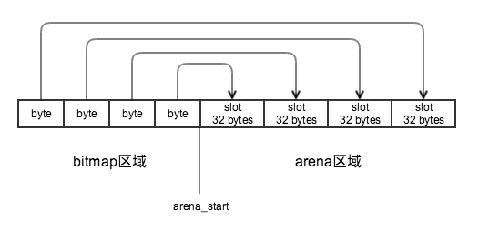
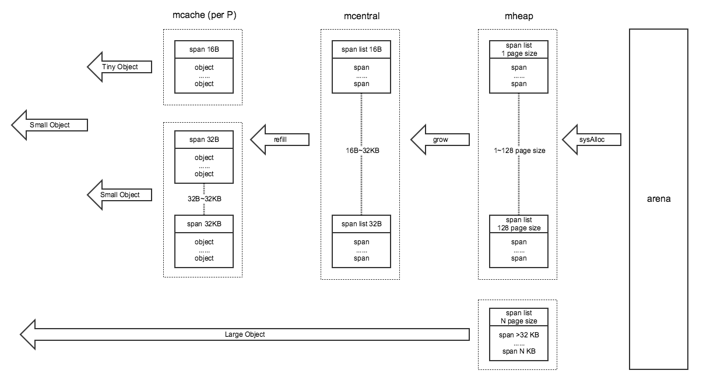
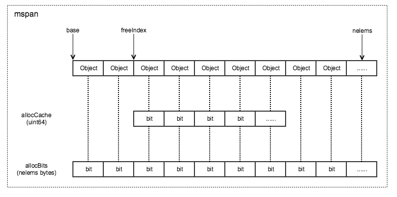
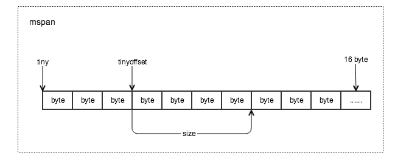
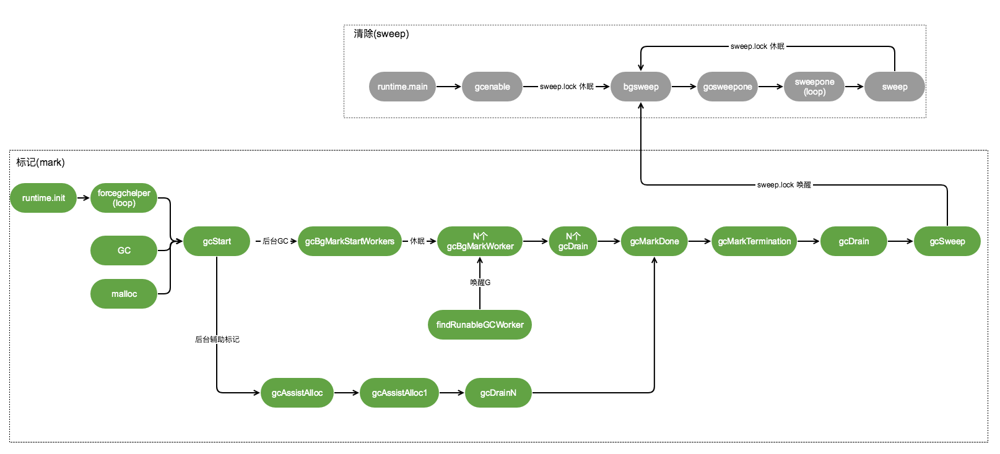

# 从源码角度看Golang的堆内存管理

本章主要从源码角度针对Go堆上的内存管理进行分析。仅关注linux系统下的逻辑。代码版本GO1.9.2。

本章例子中的代码对应详细注释参考：[gosrc-reader](https://github.com/thinkboy/gosrc-reader/tree/master/runtime)

-------------------------------------

## 简单概念

Go的内存分配器最开始基于tcmalloc的逻辑实现，但是后续有了一些差异。

### 内存结构

整体内存区域划分:


span区域与arena区域的关系:


>注：这个图里的mspan是`mspan指针`，多个mspan指针可能指向同一个`mspan对象`，取决于mspan对象里维护了多大的内存页(page size)

bitmap区域与arena区域的关系:



bitmap区域和arena区域的映射关系是以arena_start地址处向相反方向映射的。

### 关键结构体

```
//	mheap: 堆分配, 以每个内存页大小(page size)8KB的粒度管理。
//	mspan: 由mheap管理的一串连续的内存页(page)。
//	mcentral: 聚集一个大小分类(size class)的所有mspan。
//	mcache: 每个P里cache的一个有空闲内存的mspan。
//	mstats: 各种内存分配统计。
```

## 堆内存分配

先看下堆内存分配的过程图：



对象由`mspan`、`mcache`、`mcentral`、`mheap`四个组件管理。

* mspan: 原本一连串的内存页被拆分了相等大小的对象(Object)。
* mcache: 每个P里面对每个大小分类(size class)里都cache了一个mspan，等同于local cache。
* mcentral: 按对象大小分类(size class)划分为67个mcentral，每个mcentral里有一个相应大小的mspan list。
* mheap: 包含128个按页大小(page size)分类的mspan list，以及大于128页的mspan mTreap(树堆结构存储不固定页数的mspan)

对象分配被区分了`小对象(Small Object)`、`大对象(Large Object)`两类。下面分别看下实现：

### 分配小对象(Small Object)

小对象分配中依赖了四个组件`mspan`、`mcache`、`mcentral`、`mheap`。0~32KB大小范围的对象，根据不同大小被划分为67个大小分类(size class)进行管理。

对象大小分类(size class)在源码中有总结如下：

```
// runtime/sizeclasses.go

// class  bytes/obj  bytes/span  objects  waste bytes
//     1          8        8192     1024            0
//     2         16        8192      512            0
//     3         32        8192      256            0
//     4         48        8192      170           32
//     5         64        8192      128            0
//     6         80        8192      102           32
//     7         96        8192       85           32
//     8        112        8192       73           16
//     9        128        8192       64            0
//    10        144        8192       56          128
//    11        160        8192       51           32
//    12        176        8192       46           96
//    13        192        8192       42          128
//    14        208        8192       39           80
//    15        224        8192       36          128
//    16        240        8192       34           32
//    17        256        8192       32            0
//    18        288        8192       28          128
//    19        320        8192       25          192
//    20        352        8192       23           96
//    21        384        8192       21          128
//    22        416        8192       19          288
//    23        448        8192       18          128
//    24        480        8192       17           32
//    25        512        8192       16            0
//    26        576        8192       14          128
//    27        640        8192       12          512
//    28        704        8192       11          448
//    29        768        8192       10          512
//    30        896        8192        9          128
//    31       1024        8192        8            0
//    32       1152        8192        7          128
//    33       1280        8192        6          512
//    34       1408       16384       11          896
//    35       1536        8192        5          512
//    36       1792       16384        9          256
//    37       2048        8192        4            0
//    38       2304       16384        7          256
//    39       2688        8192        3          128
//    40       3072       24576        8            0
//    41       3200       16384        5          384
//    42       3456       24576        7          384
//    43       4096        8192        2            0
//    44       4864       24576        5          256
//    45       5376       16384        3          256
//    46       6144       24576        4            0
//    47       6528       32768        5          128
//    48       6784       40960        6          256
//    49       6912       49152        7          768
//    50       8192        8192        1            0
//    51       9472       57344        6          512
//    52       9728       49152        5          512
//    53      10240       40960        4            0
//    54      10880       32768        3          128
//    55      12288       24576        2            0
//    56      13568       40960        3          256
//    57      14336       57344        4            0
//    58      16384       16384        1            0
//    59      18432       73728        4            0
//    60      19072       57344        3          128
//    61      20480       40960        2            0
//    62      21760       65536        3          256
//    63      24576       24576        1            0
//    64      27264       81920        3          128
//    65      28672       57344        2            0
//    66      32768       32768        1            0
```
拿第一个分类为例解释：第一个分类里的对象大小是8字节(bytes/obj)，该分类的span总大小8192字节(bytes/span)也就是一个page，因此该span里有个1024个对象(objects)，由于8192/8刚好等于1024所以span里的空间刚好被划分没有浪费内存，因此浪费0字节(waste bytes)。

> 从上面的列表里只看到了66个大小分类，还有一个大小为0的分类没列在里面，因为没有内存空间大小要特殊处理，也就不在这里列出了。

对象分配过程如下：

1）从每个P的`mcache`里找到对应的大小分类的`mspan`扫描mspan里的`mbitmap`找到一个空闲的对象。不需要加锁。

2) 如果`mcache`里的`mspan`没有空闲的对象，则从相应大小分类的`mcentral`里的`mspan list`里获取一个新的mspan。

3) 如果`mcentral`里的`mspan list`空了，则从`mheap`中获取一定大小的内存页(page)的mspan。

4) 如果`mheap`也空了或者没有足够大小的内存页，则从系统分配内存页(至少1MB)。

### 小对象如何获取一个Object

要看一个对象是否在堆上创建，我们经常`go tool compile -s main.go`反汇编看到有`runtime.newobject`方法，这个方法就是创建对象的入口。

```
// runtime/malloc.go

func mallocgc(size uintptr, typ *_type, needzero bool) unsafe.Pointer {
	if gcphase == _GCmarktermination {
		throw("mallocgc called with gcphase == _GCmarktermination")
	}

	if size == 0 { // 0长度大小的对象，直接返回全局对象zerobase的指针,注意这里是个全局对象，所以指针相同
		return unsafe.Pointer(&zerobase)
	}

	......

	// 拿到当前M的mcache
	c := gomcache()
	var x unsafe.Pointer
	noscan := typ == nil || typ.kind&kindNoPointers != 0
	// 小对象, maxSmallSize=32KB
	// 小对象里面又区分微小对象跟小对象，微小对象 maxTinySize=16B
	if size <= maxSmallSize {
		if noscan && size < maxTinySize {
			// Tiny allocator.
			//
			// Tiny allocator combines several tiny allocation requests
			// into a single memory block. The resulting memory block
			// is freed when all subobjects are unreachable. The subobjects
			// must be noscan (don't have pointers), this ensures that
			// the amount of potentially wasted memory is bounded.
			//
			// Size of the memory block used for combining (maxTinySize) is tunable.
			// Current setting is 16 bytes, which relates to 2x worst case memory
			// wastage (when all but one subobjects are unreachable).
			// 8 bytes would result in no wastage at all, but provides less
			// opportunities for combining.
			// 32 bytes provides more opportunities for combining,
			// but can lead to 4x worst case wastage.
			// The best case winning is 8x regardless of block size.
			//
			// Objects obtained from tiny allocator must not be freed explicitly.
			// So when an object will be freed explicitly, we ensure that
			// its size >= maxTinySize.
			//
			// SetFinalizer has a special case for objects potentially coming
			// from tiny allocator, it such case it allows to set finalizers
			// for an inner byte of a memory block.
			//
			// The main targets of tiny allocator are small strings and
			// standalone escaping variables. On a json benchmark
			// the allocator reduces number of allocations by ~12% and
			// reduces heap size by ~20%.

			// Tiny分配器将几个微小的分配请求组合到一个内存块中。当所有子对象都无法访问时，将释放生成的内存块。子对象必须是noscan（没有指针），这可以确保可能浪费的内存量受到限制。
			// 用于组合的内存块的大小（maxTinySize）是可调的。当前设置为16个字节，这与2x最坏情况的内存浪费（当除了一个子对象之外的所有子对象都无法访问时）有关。
			// 8字节将导致完全没有浪费，但提供更少的组合机会。
			// 32字节提供了更多的组合机会，但可能导致4倍最坏情况下的浪费。
			// 无论块大小如何，获胜的最佳案例是8倍。
			// 从tiny分配器获得的对象不得明确释放。因此，当显式释放对象时，我们确保其大小>= maxTinySize。
			// SetFinalizer对于可能来自微小分配器的对象有一个特殊情况，它允许为内存块的内部字节设置finalizers。
			// 微分配器的主要目标是小字符串和独立的转义字符。在json压测中，分配器将分配数量减少了大约12％，并将堆大小减少了大约20％。
			off := c.tinyoffset
			// Align tiny pointer for required (conservative) alignment.
			if size&7 == 0 {
				off = round(off, 8)
			} else if size&3 == 0 {
				off = round(off, 4)
			} else if size&1 == 0 {
				off = round(off, 2)
			}
			// 如果tiny里面有足够大小（maxTinySize==16 bytes），则直接返回
			if off+size <= maxTinySize && c.tiny != 0 {
				// The object fits into existing tiny block.
				x = unsafe.Pointer(c.tiny + off)
				c.tinyoffset = off + size
				c.local_tinyallocs++
				mp.mallocing = 0
				releasem(mp)
				return x
			}
			// Allocate a new maxTinySize block.
			// 获取tinySpanClass=2的span,也就是16B内存块的span
			span := c.alloc[tinySpanClass]
			v := nextFreeFast(span)
			if v == 0 { // 如果没有空闲span，则更换一个空闲内存的span到mcache里
				v, _, shouldhelpgc = c.nextFree(tinySpanClass)
			}
			// 初始化tiny块
			x = unsafe.Pointer(v)
			(*[2]uint64)(x)[0] = 0
			(*[2]uint64)(x)[1] = 0
			// See if we need to replace the existing tiny block with the new one
			// based on amount of remaining free space.
			if size < c.tinyoffset || c.tiny == 0 {
				c.tiny = uintptr(x)
				c.tinyoffset = size
			}
			size = maxTinySize
		} else {
			// 小对象(16B~32KB)获取

			// 查表计算找到sizeclass,从而找到需要的span大小
			var sizeclass uint8
			if size <= smallSizeMax-8 {
				sizeclass = size_to_class8[(size+smallSizeDiv-1)/smallSizeDiv]
			} else {
				sizeclass = size_to_class128[(size-smallSizeMax+largeSizeDiv-1)/largeSizeDiv]
			}
			size = uintptr(class_to_size[sizeclass])
			spc := makeSpanClass(sizeclass, noscan)
			span := c.alloc[spc]
			v := nextFreeFast(span)
			if v == 0 {
				v, span, shouldhelpgc = c.nextFree(spc) // 如果没有空闲span，则更换一个空闲内存的span到mcache里
			}
			x = unsafe.Pointer(v)
			if needzero && span.needzero != 0 {
				memclrNoHeapPointers(unsafe.Pointer(v), size)
			}
		}
	} else {
		// 大对象(>32KB)分配
		var s *mspan
		shouldhelpgc = true
		systemstack(func() {
			s = largeAlloc(size, needzero, noscan)
		})
		s.freeindex = 1
		s.allocCount = 1
		x = unsafe.Pointer(s.base())
		size = s.elemsize
	}

	......

	return x
}
```
小对象分配里面又做了一个细化的优化，区分成了`微小对象(Tiny Object)`、`小对象(Small Object)`两种。

**小对象的分配方式：**

`c := gomcache()`拿到当前P下面的mcache，在mcache中有个变量`alloc`类型`[numSpanClasses]*mspan`是一个固定的数组，在该数组中cache了16B~32KB的67个大小分类(size class)的mspan，源码中提供了`size_to_class8`、`size_to_class128`两个对照表，通过计算需要的对象大小找到最接近的size class，然后就可以拿到对应大小的mspan。

> alloc数组角标不是`size class`，而是`span class`，两者关系spanClass=(sizeClass<<1)|noscan，也就是说最后一位bit用一个noscan的标识占用，其余bit表示zeClass。

找到span后下一步就是在mspan里取出来一个空闲对象(Object)，用到`nextFreeFast`、`mcache.nextFree`两个方法，先看下思路，如图：



mbitmap区域里在该mspan的部分抽象出一个allocBits来，每一个bit代表一个对象，通过`allocBits`来扫描哪个对象是可用的(1代表空闲对象，0代表对象已被使用)。但是可能allocBits可能会很长，所以为了加快计算，在allocBits之上的一段做个cache，也就是allocCache，并借助freeIndex指针标记已经分配到的位置，这样就不用每次都从allocBits的开始位置扫描了，allocCache分配完后再移动到下一段，加快了扫描效率。

>GC Sweep的时候会将freeIndex、allocCache重新移动到mspan的base位置，下面分析GC过程时会涉及到。

看下`nextFreeFast`实现：

```
// runtime/malloc.go

func nextFreeFast(s *mspan) gclinkptr {
	theBit := sys.Ctz64(s.allocCache) // 计算s.allocCache从低位起有多少个0	if theBit < 64 {
		result := s.freeindex + uintptr(theBit)
		if result < s.nelems {
			freeidx := result + 1
			if freeidx%64 == 0 && freeidx != s.nelems { // 如果是最后一个，特殊处理：告诉上层没有空闲的object,在span.nextFreeIndex里会分配
				return 0
			}
			s.allocCache >>= uint(theBit + 1)
			s.freeindex = freeidx
			v := gclinkptr(result*s.elemsize + s.base()) // 计算空闲内存块指针地址
			s.allocCount++
			return v
		}
	}
	return 0
}
```
先计算s.allocCache末尾的0的bit位个数，然后向右移动指定个数bit位跳过已使用的对象，同时通过s.freeindex快速定位到空闲对象。

再看`mcache.nextFree`实现：

```
// runtime/malloc.go

func (c *mcache) nextFree(spc spanClass) (v gclinkptr, s *mspan, shouldhelpgc bool) {
	s = c.alloc[spc]
	shouldhelpgc = false
	freeIndex := s.nextFreeIndex()
	if freeIndex == s.nelems { // 如果span里的内存已经用完了,则重新填充
		// The span is full.
		if uintptr(s.allocCount) != s.nelems {
			println("runtime: s.allocCount=", s.allocCount, "s.nelems=", s.nelems)
			throw("s.allocCount != s.nelems && freeIndex == s.nelems")
		}
		systemstack(func() {
			c.refill(spc) // 更换一个空闲内存的span到mcache里
		})
		shouldhelpgc = true
		s = c.alloc[spc]

		freeIndex = s.nextFreeIndex()
	}

	if freeIndex >= s.nelems {
		throw("freeIndex is not valid")
	}

	v = gclinkptr(freeIndex*s.elemsize + s.base()) // 计算空闲内存块指针地址
	s.allocCount++
	if uintptr(s.allocCount) > s.nelems {
		println("s.allocCount=", s.allocCount, "s.nelems=", s.nelems)
		throw("s.allocCount > s.nelems")
	}
	return
}
```
```
// runtime/mbitmap.go

func (s *mspan) nextFreeIndex() uintptr {
	sfreeindex := s.freeindex
	snelems := s.nelems
	if sfreeindex == snelems { // 如果已经到span的最后一个object,则直接返回最后object的index
		return sfreeindex
	}
	if sfreeindex > snelems {
		throw("s.freeindex > s.nelems")
	}

	aCache := s.allocCache

	bitIndex := sys.Ctz64(aCache) // 计算低位0的个数
	for bitIndex == 64 {
		// Move index to start of next cached bits.
		sfreeindex = (sfreeindex + 64) &^ (64 - 1) // 计算64的倍数
		if sfreeindex >= snelems {
			s.freeindex = snelems
			return snelems
		}
		whichByte := sfreeindex / 8 // 因为sfreeindex是按bit计数的，因此要除以8得到字节数，然后按字节数更新allocCache
		// Refill s.allocCache with the next 64 alloc bits.
		s.refillAllocCache(whichByte) // 重新移动s.allocCache指向下一个64位(8字节)的allocBit
		aCache = s.allocCache
		bitIndex = sys.Ctz64(aCache)
		// nothing available in cached bits
		// grab the next 8 bytes and try again.
	}
	result := sfreeindex + uintptr(bitIndex)
	if result >= snelems {
		s.freeindex = snelems
		return snelems
	}

	s.allocCache >>= uint(bitIndex + 1)
	sfreeindex = result + 1

	if sfreeindex%64 == 0 && sfreeindex != snelems {
		// We just incremented s.freeindex so it isn't 0.
		// As each 1 in s.allocCache was encountered and used for allocation
		// it was shifted away. At this point s.allocCache contains all 0s.
		// Refill s.allocCache so that it corresponds
		// to the bits at s.allocBits starting at s.freeindex.
		whichByte := sfreeindex / 8 // 因为sfreeindex是按bit计数的，因此要除以8得到字节数，然后按字节数更新allocCache
		s.refillAllocCache(whichByte)
	}
	s.freeindex = sfreeindex
	return result
}
```
在`mspan.nextFree`方法中通过`mspan.nextFreeIndex`方法寻找对象，寻找方式与上面的`nextFreeFast`方法类似，多出一个`mspan.refillAllocCache`方法,当`mspan.allocCache`标记的对象分配完后移动到allocBits的下一段区域。

**微小对象的分配方式：**

为什么要有微小对象？在代码注释里有这么一句：

```
// The main targets of tiny allocator are small strings and
// standalone escaping variables. On a json benchmark
// the allocator reduces number of allocations by ~12% and
// reduces heap size by ~20%.
```
微分配器的主要目标是小字符串和独立的转义字符。在json压测中，分配器将分配数量减少了大约12％，并将堆大小减少了大约20％。

对于只有1个或者几个字节的很小的对象分配上做了更细力度的优化。实现思路如图：



微小对象的大小是可以改变的，默认是16字节。与小对象不同的是，微小对象没有利用bitmap寻找空闲对象，而是从tinyoffset指针地址开始分配需要的size，分配后移动tinyoffset指向下一段空闲对象的起始地址，为下一次分配做准备。

### 小对象如何获取一个mspan

上一节中主要是分析从mspan中获取一个空闲`对象`，但是当mspan中没有空闲对象后该怎么办？它就需要从`mcentral`组件中获取一个新的空闲mspan来替换当前mcache中的对应size class的mspan。在上一节中`mspan.nextFree`方法中有判断如果元素不够时则`mcache.refill`方法填充一个新的mspan。

```
// runtime/mcache.go

func (c *mcache) refill(spc spanClass) *mspan {
	_g_ := getg()

	_g_.m.locks++
	// Return the current cached span to the central lists.
	s := c.alloc[spc]

	if uintptr(s.allocCount) != s.nelems {
		throw("refill of span with free space remaining")
	}
	// 取消正在使用标记
	if s != &emptymspan {
		s.incache = false
	}

	// Get a new cached span from the central lists.
	// 从mheap的central里分配一个span
	s = mheap_.central[spc].mcentral.cacheSpan()
	if s == nil {
		throw("out of memory")
	}

	if uintptr(s.allocCount) == s.nelems {
		throw("span has no free space")
	}

	c.alloc[spc] = s // mheap的central里分配一个span替换了mcache里的span
	_g_.m.locks--
	return s
}
```
该方法中通过`mcentral.cacheSpan`获取一个mcenntral中的mspan

```
// runtime/mcentral.go

func (c *mcentral) cacheSpan() *mspan {
	......

	lock(&c.lock)
	
	......
	
retry:
	// 从nonempty列表里找可用的span
	var s *mspan
	for s = c.nonempty.first; s != nil; s = s.next {
		if s.sweepgen == sg-2 && atomic.Cas(&s.sweepgen, sg-2, sg-1) {// 如果GC已经开始一轮循环了，当前span还没被清理，则提前清理
			c.nonempty.remove(s)
			c.empty.insertBack(s)
			unlock(&c.lock)
			s.sweep(true) // 只初始化span
			goto havespan
		}
		// 忽略正在清理的span
		if s.sweepgen == sg-1 {
			// the span is being swept by background sweeper, skip
			continue
		}
		// we have a nonempty span that does not require sweeping, allocate from it
		// c.nonempty里有span的话就从c.nonempty里取出来放到c.empty里
		c.nonempty.remove(s)
		c.empty.insertBack(s)
		unlock(&c.lock)
		goto havespan
	}
	// 尝试从empty列表里清理出一个可用的span
	for s = c.empty.first; s != nil; s = s.next {
		if s.sweepgen == sg-2 && atomic.Cas(&s.sweepgen, sg-2, sg-1) {// 如果GC已经开始一轮循环了，当前span还没被清理，则提前清理
			// we have an empty span that requires sweeping,
			// sweep it and see if we can free some space in it
			c.empty.remove(s)
			// swept spans are at the end of the list
			c.empty.insertBack(s)
			unlock(&c.lock)
			s.sweep(true) // 只初始化span
			freeIndex := s.nextFreeIndex()
			if freeIndex != s.nelems {
				s.freeindex = freeIndex
				goto havespan
			}
			lock(&c.lock)
			// the span is still empty after sweep
			// it is already in the empty list, so just retry
			goto retry
		}
		if s.sweepgen == sg-1 {
			// the span is being swept by background sweeper, skip
			continue
		}
		// already swept empty span,
		// all subsequent ones must also be either swept or in process of sweeping
		break
	}
	if trace.enabled {
		traceGCSweepDone()
		traceDone = true
	}
	unlock(&c.lock)

	// Replenish central list if empty.
	// 两个链表都没有可用span，则从mheap里获取一个
	s = c.grow()
	if s == nil {
		return nil
	}
	lock(&c.lock)
	c.empty.insertBack(s)
	unlock(&c.lock)

	// At this point s is a non-empty span, queued at the end of the empty list,
	// c is unlocked.
havespan:
	......

	return s
}
```
尝试从`nonempty`或者`empty`两个链表中获取空闲mspan，`nonempty`表示有空闲对象的mspan list，`empty`表示没有空闲对象或者在mcache中cache的mspan list

> empty中的mspan既然可能是在mcache中的，会不会被其它的mcache再次分配到？答案是会，在当前1.9.2版本还存在该问题，已经在Go1.12.5版本中解决了。参考：https://github.com/golang/go/commit/873bd47dfb34ba4416d4df30180905250b91f137

在`cacheSpan`方法中如果也找不到空闲的mspan呢？代码中可以看到一个`c.grow`，就是要增长一个mspan。

```
// runtime/mcentral.go

// 内存按pase size增长。
func (c *mcentral) grow() *mspan {
	npages := uintptr(class_to_allocnpages[c.spanclass.sizeclass()]) // 内存页数
	size := uintptr(class_to_size[c.spanclass.sizeclass()])          // 每个对象的大小
	n := (npages << _PageShift) / size                               // 对象数量

	// 从mheap里分配一个span
	s := mheap_.alloc(npages, c.spanclass, false, true)
	if s == nil {
		return nil
	}

	p := s.base()
	s.limit = p + size*n // 设置span的limit指针指向内存区域的末尾

	heapBitsForSpan(s.base()).initSpan(s)
	return s
}
```
在方法里准备从`mheap`去分配一个mspan。到这里传入的参数就有`内存页(page)`的概念了，把需要的页大小传给`mheap.alloc`。下面就是mheap组件分配出一个mspan。

```
// runtime/mheap.go

func (h *mheap) alloc(npage uintptr, spanclass spanClass, large bool, needzero bool) *mspan {
	// Don't do any operations that lock the heap on the G stack.
	// It might trigger stack growth, and the stack growth code needs
	// to be able to allocate heap.
	var s *mspan
	systemstack(func() {
		s = h.alloc_m(npage, spanclass, large)
	})

	......
	return s
}

func (h *mheap) alloc_m(npage uintptr, spanclass spanClass, large bool) *mspan {
	_g_ := getg()
	if _g_ != _g_.m.g0 {
		throw("_mheap_alloc not on g0 stack")
	}
	lock(&h.lock)

	......

	// 分配指定页数的span
	s := h.allocSpanLocked(npage, &memstats.heap_inuse)

	......
	unlock(&h.lock)
	return s
}

func (h *mheap) allocSpanLocked(npage uintptr, stat *uint64) *mspan {
	var list *mSpanList
	var s *mspan

	// Try in fixed-size lists up to max.
	// 先尝试从h.free获取指定npage的Span
	// 指定npage里没有span的话，就从更大npage的spanlist里获取
	for i := int(npage); i < len(h.free); i++ {
		list = &h.free[i]
		if !list.isEmpty() {
			s = list.first
			list.remove(s)
			goto HaveSpan
		}
	}
	// Best fit in list of large spans.
	s = h.allocLarge(npage) // 从h.freelarge获取一个大对象span(有可能分配一个大于npage的span) // allocLarge removed s from h.freelarge for us
	if s == nil {           // 还没有就得从系统申请了
		if !h.grow(npage) { // 分配一个至少是1MB的span
			return nil
		}
		s = h.allocLarge(npage)
		if s == nil {
			return nil
		}
	}

HaveSpan:
	......
	return s
}
```
几次调用下来在`allocSpanLocked`方法里尝试从`free`数组里获取指定page size的mspan。不过free数组里依然是属于用户态下的内存管理，我们都知道内存最终来源还是系统。下一步当free数组里面也没有mspan的话就准备去系统申请一块内存了。

>`free`数组结构是`free [_MaxMHeapList]mSpanList`, _MaxMHeapList==128。因此他只维护了128个page size的mspan，更大的page size在`freelarge`树堆结构里，属于`大对象`范畴，在下面会说到。

```
// runtime/mheap.go

// 向系统申请内存，至少1MB
func (h *mheap) grow(npage uintptr) bool {
	// Ask for a big chunk, to reduce the number of mappings
	// the operating system needs to track; also amortizes
	// the overhead of an operating system mapping.
	// Allocate a multiple of 64kB.
	// 大小总是按64KB的倍数分配,最小1MB
	npage = round(npage, (64<<10)/_PageSize) // 按64KB补齐页数
	ask := npage << _PageShift               // 计算npage页数的内存大小
	if ask < _HeapAllocChunk {               // 不能小于1MB内存
		ask = _HeapAllocChunk
	}
	// 向操作系统申请内存
	v := h.sysAlloc(ask)
	if v == nil {
		if ask > npage<<_PageShift {
			ask = npage << _PageShift
			v = h.sysAlloc(ask)
		}
		if v == nil {
			print("runtime: out of memory: cannot allocate ", ask, "-byte block (", memstats.heap_sys, " in use)\n")
			return false
		}
	}

	// Create a fake "in use" span and free it, so that the
	// right coalescing happens.
	// 创建span，用来管理刚从系统申请的内存。
	// 同时也抽象的把arane区域与span区域做了个页映射
	s := (*mspan)(h.spanalloc.alloc())
	s.init(uintptr(v), ask>>_PageShift)
	p := (s.base() - h.arena_start) >> _PageShift // 计算出来当前分配的span内存属于arena区域的第p页
	for i := p; i < p+s.npages; i++ {             // spans区域的每个span指针与arena区域的每一页(Page)关联
		h.spans[i] = s
	}
	atomic.Store(&s.sweepgen, h.sweepgen)
	s.state = _MSpanInUse
	h.pagesInUse += uint64(s.npages)
	// 放到mheap.free或mheap.freelarge链表里
	h.freeSpanLocked(s, false, true, 0)
	return true
}
```
```
// runtime/malloc.go

func (h *mheap) sysAlloc(n uintptr) unsafe.Pointer {

	......

	// 不超出arena大小限制
	if n <= h.arena_end-h.arena_alloc {
		// Keep taking from our reservation.
		p := h.arena_alloc // 获取arena区域已分配的内存尾部地址，也是未分配内存的起始指针地址
		// 系统mmap方法分配内存
		sysMap(unsafe.Pointer(p), n, h.arena_reserved, &memstats.heap_sys)
		h.arena_alloc += n
		if h.arena_alloc > h.arena_used {
			h.setArenaUsed(h.arena_alloc, true)
		}

		if p&(_PageSize-1) != 0 {
			throw("misrounded allocation in MHeap_SysAlloc")
		}
		return unsafe.Pointer(p)
	}

	......
	
	return unsafe.Pointer(p)
}
```
```
//runtime/mem_linux.go

func sysMap(v unsafe.Pointer, n uintptr, reserved bool, sysStat *uint64) {
	......

	p := mmap(v, n, _PROT_READ|_PROT_WRITE, _MAP_ANON|_MAP_FIXED|_MAP_PRIVATE, -1, 0)
	if uintptr(p) == _ENOMEM {
		throw("runtime: out of memory")
	}
	if p != v {
		throw("runtime: cannot map pages in arena address space")
	}
}
```
最后一连串调用下来，最终还是通过`mmap`系统函数从系统分配内存。

>从系统分配内存有个大小条件，最少分配1MB，也就是128 page size，以免频繁进行系统调用。

### 分配大对象(Large Object)

与分配小对象不同的是，大对象只依赖了两个组件`mspan`、`mheap`，>32KB大小范围的对象。回到最开始的`mallocgc`方法。

```
// runtime/malloc.go

func mallocgc(size uintptr, typ *_type, needzero bool) unsafe.Pointer {
	......
	
	// 小对象, maxSmallSize=32KB
	// 小对象里面又区分微小对象跟小对象，微小对象 maxTinySize=16B
	if size <= maxSmallSize {
	
		......
		
	} else {
		// 大对象(>32KB)分配
		var s *mspan
		shouldhelpgc = true
		systemstack(func() {
			s = largeAlloc(size, needzero, noscan)
		})
		s.freeindex = 1
		s.allocCount = 1
		x = unsafe.Pointer(s.base())
		size = s.elemsize
	}

	......

	return x
}

// 直接从mheap_里分配一个大对象
func largeAlloc(size uintptr, needzero bool, noscan bool) *mspan {
	// print("largeAlloc size=", size, "\n")

	if size+_PageSize < size {
		throw("out of memory")
	}
	npages := size >> _PageShift // 大对象直接从heap里分配对象，因此计算出page size
	if size&_PageMask != 0 {
		npages++
	}

	// Deduct credit for this span allocation and sweep if
	// necessary. mHeap_Alloc will also sweep npages, so this only
	// pays the debt down to npage pages.
	deductSweepCredit(npages*_PageSize, npages)

	// 直接从mheap_里分配一个大对象
	s := mheap_.alloc(npages, makeSpanClass(0, noscan), true, needzero)
	if s == nil {
		throw("out of memory")
	}
	s.limit = s.base() + size
	heapBitsForSpan(s.base()).initSpan(s)
	return s
}
```
在大对象分配过程中，没有从mcache到mcentral的各种cache，而是直接跳到`mheap_.alloc`，从mheap组件中获取mspan。

顺着上面小对象中分析mheap_.alloc实现，到`allocSpanLocked`方法里。

```
// runtime/mheap.go

func (h *mheap) allocSpanLocked(npage uintptr, stat *uint64) *mspan {
	var list *mSpanList
	var s *mspan

	// Try in fixed-size lists up to max.
	// 先尝试从h.free获取指定npage的Span
	// 指定npage里没有span的话，就从更大npage的spanlist里获取
	for i := int(npage); i < len(h.free); i++ {
		list = &h.free[i]
		if !list.isEmpty() {
			s = list.first
			list.remove(s)
			goto HaveSpan
		}
	}
	// Best fit in list of large spans.
	s = h.allocLarge(npage) // 从h.freelarge获取一个大对象span(有可能分配一个大于npage的span) // allocLarge removed s from h.freelarge for us
	if s == nil {           // 还没有就得从系统申请了
		if !h.grow(npage) { // 分配一个至少是1MB的span
			return nil
		}
		s = h.allocLarge(npage)
		if s == nil {
			return nil
		}
	}

HaveSpan:
	......
	return s
}

// 从freelarge中分配一个大于128页数的span
func (h *mheap) allocLarge(npage uintptr) *mspan {
	// Search treap for smallest span with >= npage pages.
	return h.freelarge.remove(npage)
}
```
大对象在mheap组件中是cache在freelarge树堆里的。除这些不同之外，其余的与小对象分配没啥太大区别。

堆内存分配的大致过程到这就分析完了。这里尽量复述过程，有一些细节就直接跳过了。

## 堆内存释放(GC)

上面分析完内存分配，有分配自然就有释放，也就是我们的GC了。下面对Go的GC过程做下分析。

先看下堆内存分配的过程图：

