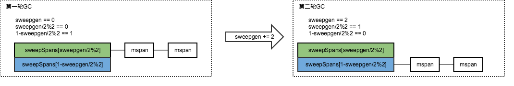
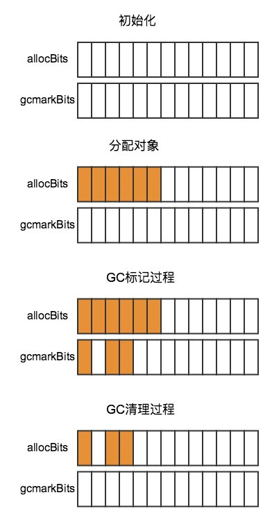

# 从源码角度看Golang的堆内存管理

本章主要从源码角度针对Go堆上的内存管理进行分析。仅关注linux系统下的逻辑。代码版本GO1.9.2。

本章例子中的代码对应详细注释参考：[gosrc-reader](https://github.com/thinkboy/gosrc-reader/tree/master/runtime)

>读文章可能并不是最好的读懂源码的办法，读文章只能有个大致概念，最好的办法拿文章是对照源码理解。

-------------------------------------

# 目录

先来个目录方便读者理解文本结构

* 1.[简单概念](#简单概念)
    * 1.1 [内存结构](#内存结构)
    * 1.2 [关键结构](#关键结构)
* 2.[堆内存分配](#堆内存分配)
	* 2.1 [分配小对象(Small-Object)](#分配小对象(Small-Object))
	* 2.2 [小对象如何获取一个Object](#小对象如何获取一个Object)
	* 2.3 [小对象如何获取一个mspan](#小对象如何获取一个mspan)
	* 2.4 [分配大对象(Large-Object)](#分配大对象(Large-Object))
* 3.[堆内存释放(GC)](#堆内存释放(GC))
	* 3.1 [标记(Mark)过程-后台GC](#标记(Mark)过程-后台GC)
	* 3.2 [标记(Mark)过程-辅助标记](#标记(Mark)过程-辅助标记)
	* 3.3 [清理(Sweep)过程](#清理(Sweep)过程)
	* 3.4 [内存返还给系统](#内存返还给系统)
* 4.[分配对象与释放对象中的标记位用法](#分配对象与释放对象中的标记位用法)
* 5.[自带内存管理相关监控信息](#自带内存管理相关监控信息)
	* 5.1 [MemStats](#MemStats)
	* 5.2 [GCTrace](#GCTrace)

## 简单概念

Go的内存分配器最开始基于tcmalloc的逻辑实现，但是后续有了一些差异。

### 内存结构

整体内存区域划分:


整个堆你内存分配区域由三个区域组成：`span区域`、`bitmap区域`、`arena区域`。

span区域与arena区域的关系:


>注：这个图里的mspan是`mspan指针`，多个mspan指针可能指向同一个`mspan对象`，取决于mspan对象里维护了多大的内存页(page size)

bitmap区域与arena区域的关系:


bitmap区域和arena区域的映射关系是以arena_start地址处向相反方向映射的。

### 关键结构

```
//	mheap: 堆分配, 以每个内存页大小(page size)8KB的粒度管理。
//	mspan: 由mheap管理的一串连续的内存页(page)。
//	mcentral: 聚集一个大小分类(size class)的所有mspan。
//	mcache: 每个P里cache的一个有空闲内存的mspan。
//	mstats: 各种内存分配统计。
```

## 堆内存分配

先看下堆内存分配的过程图：


对象由`mspan`、`mcache`、`mcentral`、`mheap`四个组件管理。

* mspan: 原本一连串的内存页被拆分了相等大小的对象(Object)。
* mcache: 每个P里面对每个大小分类(size class)里都cache了一个mspan，等同于local cache。
* mcentral: 按对象大小分类(size class)划分为67个mcentral，每个mcentral里有一个相应大小的mspan list。
* mheap: 包含128个按页大小(page size)分类的mspan list，以及大于128页的mspan mTreap(树堆结构存储不固定页数的mspan)

对象分配被区分了`小对象(Small Object)`、`大对象(Large Object)`两类。下面分别看下实现：

### 分配小对象(Small-Object)

小对象分配中依赖了四个组件`mspan`、`mcache`、`mcentral`、`mheap`。0~32KB大小范围的对象，根据不同大小被划分为67个大小分类(size class)进行管理。

对象大小分类(size class)在源码中有总结如下：

```
// runtime/sizeclasses.go

// class  bytes/obj  bytes/span  objects  waste bytes
//     1          8        8192     1024            0
//     2         16        8192      512            0
//     3         32        8192      256            0
//     4         48        8192      170           32
//     5         64        8192      128            0
//     6         80        8192      102           32
//     7         96        8192       85           32
//     8        112        8192       73           16
//     9        128        8192       64            0
//    10        144        8192       56          128
//    11        160        8192       51           32
//    12        176        8192       46           96
//    13        192        8192       42          128
//    14        208        8192       39           80
//    15        224        8192       36          128
//    16        240        8192       34           32
//    17        256        8192       32            0
//    18        288        8192       28          128
//    19        320        8192       25          192
//    20        352        8192       23           96
//    21        384        8192       21          128
//    22        416        8192       19          288
//    23        448        8192       18          128
//    24        480        8192       17           32
//    25        512        8192       16            0
//    26        576        8192       14          128
//    27        640        8192       12          512
//    28        704        8192       11          448
//    29        768        8192       10          512
//    30        896        8192        9          128
//    31       1024        8192        8            0
//    32       1152        8192        7          128
//    33       1280        8192        6          512
//    34       1408       16384       11          896
//    35       1536        8192        5          512
//    36       1792       16384        9          256
//    37       2048        8192        4            0
//    38       2304       16384        7          256
//    39       2688        8192        3          128
//    40       3072       24576        8            0
//    41       3200       16384        5          384
//    42       3456       24576        7          384
//    43       4096        8192        2            0
//    44       4864       24576        5          256
//    45       5376       16384        3          256
//    46       6144       24576        4            0
//    47       6528       32768        5          128
//    48       6784       40960        6          256
//    49       6912       49152        7          768
//    50       8192        8192        1            0
//    51       9472       57344        6          512
//    52       9728       49152        5          512
//    53      10240       40960        4            0
//    54      10880       32768        3          128
//    55      12288       24576        2            0
//    56      13568       40960        3          256
//    57      14336       57344        4            0
//    58      16384       16384        1            0
//    59      18432       73728        4            0
//    60      19072       57344        3          128
//    61      20480       40960        2            0
//    62      21760       65536        3          256
//    63      24576       24576        1            0
//    64      27264       81920        3          128
//    65      28672       57344        2            0
//    66      32768       32768        1            0
```
拿第一个分类为例解释：第一个分类里的对象大小是8字节(bytes/obj)，该分类的span总大小8192字节(bytes/span)也就是一个page，因此该span里有个1024个对象(objects)，由于8192/8刚好等于1024所以span里的空间刚好被划分没有浪费内存，因此浪费0字节(waste bytes)。

> 从上面的列表里只看到了66个大小分类，还有一个大小为0的分类没列在里面，因为没有内存空间大小要特殊处理，也就不在这里列出了。

对象分配过程如下：

1）从每个P的`mcache`里找到对应的大小分类的`mspan`扫描mspan里的`mbitmap`找到一个空闲的对象。不需要加锁。

2）如果`mcache`里的`mspan`没有空闲的对象，则从相应大小分类的`mcentral`里的`mspan list`里获取一个新的mspan。

3）如果`mcentral`里的`mspan list`空了，则从`mheap`中获取一定大小的内存页(page)的mspan。

4）如果`mheap`也空了或者没有足够大小的内存页，则从系统分配内存页(至少1MB)。

### 小对象如何获取一个Object

要看一个对象是否在堆上创建，我们经常`go tool compile -s main.go`反汇编看到有`runtime.newobject`方法，这个方法就是创建对象的入口。

```
// runtime/malloc.go

func mallocgc(size uintptr, typ *_type, needzero bool) unsafe.Pointer {
	if gcphase == _GCmarktermination {
		throw("mallocgc called with gcphase == _GCmarktermination")
	}

	if size == 0 { // 0长度大小的对象，直接返回全局对象zerobase的指针,注意这里是个全局对象，所以指针相同
		return unsafe.Pointer(&zerobase)
	}

	......

	// 拿到当前M的mcache
	c := gomcache()
	var x unsafe.Pointer
	noscan := typ == nil || typ.kind&kindNoPointers != 0
	// 小对象, maxSmallSize=32KB
	// 小对象里面又区分微小对象跟小对象，微小对象 maxTinySize=16B
	if size <= maxSmallSize {
		if noscan && size < maxTinySize {
			// Tiny allocator.
			//
			// Tiny allocator combines several tiny allocation requests
			// into a single memory block. The resulting memory block
			// is freed when all subobjects are unreachable. The subobjects
			// must be noscan (don't have pointers), this ensures that
			// the amount of potentially wasted memory is bounded.
			//
			// Size of the memory block used for combining (maxTinySize) is tunable.
			// Current setting is 16 bytes, which relates to 2x worst case memory
			// wastage (when all but one subobjects are unreachable).
			// 8 bytes would result in no wastage at all, but provides less
			// opportunities for combining.
			// 32 bytes provides more opportunities for combining,
			// but can lead to 4x worst case wastage.
			// The best case winning is 8x regardless of block size.
			//
			// Objects obtained from tiny allocator must not be freed explicitly.
			// So when an object will be freed explicitly, we ensure that
			// its size >= maxTinySize.
			//
			// SetFinalizer has a special case for objects potentially coming
			// from tiny allocator, it such case it allows to set finalizers
			// for an inner byte of a memory block.
			//
			// The main targets of tiny allocator are small strings and
			// standalone escaping variables. On a json benchmark
			// the allocator reduces number of allocations by ~12% and
			// reduces heap size by ~20%.

			// Tiny分配器将几个微小的分配请求组合到一个内存块中。当所有子对象都无法访问时，将释放生成的内存块。子对象必须是noscan（没有指针），这可以确保可能浪费的内存量受到限制。
			// 用于组合的内存块的大小（maxTinySize）是可调的。当前设置为16个字节，这与2x最坏情况的内存浪费（当除了一个子对象之外的所有子对象都无法访问时）有关。
			// 8字节将导致完全没有浪费，但提供更少的组合机会。
			// 32字节提供了更多的组合机会，但可能导致4倍最坏情况下的浪费。
			// 无论块大小如何，获胜的最佳案例是8倍。
			// 从tiny分配器获得的对象不得明确释放。因此，当显式释放对象时，我们确保其大小>= maxTinySize。
			// SetFinalizer对于可能来自微小分配器的对象有一个特殊情况，它允许为内存块的内部字节设置finalizers。
			// 微分配器的主要目标是小字符串和独立的转义字符。在json压测中，分配器将分配数量减少了大约12％，并将堆大小减少了大约20％。
			off := c.tinyoffset
			// Align tiny pointer for required (conservative) alignment.
			if size&7 == 0 {
				off = round(off, 8)
			} else if size&3 == 0 {
				off = round(off, 4)
			} else if size&1 == 0 {
				off = round(off, 2)
			}
			// 如果tiny里面有足够大小（maxTinySize==16 bytes），则直接返回
			if off+size <= maxTinySize && c.tiny != 0 {
				// The object fits into existing tiny block.
				x = unsafe.Pointer(c.tiny + off)
				c.tinyoffset = off + size
				c.local_tinyallocs++
				mp.mallocing = 0
				releasem(mp)
				return x
			}
			// Allocate a new maxTinySize block.
			// 获取tinySpanClass=2的span,也就是16B内存块的span
			span := c.alloc[tinySpanClass]
			v := nextFreeFast(span)
			if v == 0 { // 如果没有空闲span，则更换一个空闲内存的span到mcache里
				v, _, shouldhelpgc = c.nextFree(tinySpanClass)
			}
			// 初始化tiny块
			x = unsafe.Pointer(v)
			(*[2]uint64)(x)[0] = 0
			(*[2]uint64)(x)[1] = 0
			// See if we need to replace the existing tiny block with the new one
			// based on amount of remaining free space.
			if size < c.tinyoffset || c.tiny == 0 {
				c.tiny = uintptr(x)
				c.tinyoffset = size
			}
			size = maxTinySize
		} else {
			// 小对象(16B~32KB)获取

			// 查表计算找到sizeclass,从而找到需要的span大小
			var sizeclass uint8
			if size <= smallSizeMax-8 {
				sizeclass = size_to_class8[(size+smallSizeDiv-1)/smallSizeDiv]
			} else {
				sizeclass = size_to_class128[(size-smallSizeMax+largeSizeDiv-1)/largeSizeDiv]
			}
			size = uintptr(class_to_size[sizeclass])
			spc := makeSpanClass(sizeclass, noscan)
			span := c.alloc[spc]
			v := nextFreeFast(span)
			if v == 0 {
				v, span, shouldhelpgc = c.nextFree(spc) // 如果没有空闲span，则更换一个空闲内存的span到mcache里
			}
			x = unsafe.Pointer(v)
			if needzero && span.needzero != 0 {
				memclrNoHeapPointers(unsafe.Pointer(v), size)
			}
		}
	} else {
		// 大对象(>32KB)分配
		var s *mspan
		shouldhelpgc = true
		systemstack(func() {
			s = largeAlloc(size, needzero, noscan)
		})
		s.freeindex = 1
		s.allocCount = 1
		x = unsafe.Pointer(s.base())
		size = s.elemsize
	}

	......

	return x
}
```
小对象分配里面又做了一个细化的优化，区分成了`微小对象(Tiny Object)`、`小对象(Small Object)`两种。

**小对象的分配方式：**

`c := gomcache()`拿到当前P下面的mcache，在mcache中有个变量`alloc`类型`[numSpanClasses]*mspan`是一个固定的数组，在该数组中cache了16B~32KB的67个大小分类(size class)的mspan，源码中提供了`size_to_class8`、`size_to_class128`两个对照表，通过计算需要的对象大小找到最接近的size class，然后就可以拿到对应大小的mspan。

> alloc数组角标不是`size class`，而是`span class`，两者关系spanClass=(sizeClass<<1)|noscan，也就是说最后一位bit用一个noscan的标识占用，其余bit表示zeClass。

找到span后下一步就是在mspan里取出来一个空闲对象(Object)，用到`nextFreeFast`、`mcache.nextFree`两个方法，先看下思路，如图：


mbitmap区域里在该mspan的部分抽象出一个allocBits来，每一个bit代表一个对象，通过`allocBits`来扫描哪个对象是可用的(1代表空闲对象，0代表对象已被使用)。但是可能allocBits可能会很长，所以为了加快计算，在allocBits之上的一段做个cache，也就是allocCache，并借助freeIndex指针标记已经分配到的位置，这样就不用每次都从allocBits的开始位置扫描了，allocCache分配完后再移动到下一段，加快了扫描效率。

>GC Sweep的时候会将freeIndex、allocCache重新移动到mspan的base位置，下面分析GC过程时会涉及到。

看下`nextFreeFast`实现：

```
// runtime/malloc.go

func nextFreeFast(s *mspan) gclinkptr {
	theBit := sys.Ctz64(s.allocCache) // 计算s.allocCache从低位起有多少个0	if theBit < 64 {
		result := s.freeindex + uintptr(theBit)
		if result < s.nelems {
			freeidx := result + 1
			if freeidx%64 == 0 && freeidx != s.nelems { // 如果是最后一个，特殊处理：告诉上层没有空闲的object,在span.nextFreeIndex里会分配
				return 0
			}
			s.allocCache >>= uint(theBit + 1)
			s.freeindex = freeidx
			v := gclinkptr(result*s.elemsize + s.base()) // 计算空闲内存块指针地址
			s.allocCount++
			return v
		}
	}
	return 0
}
```
先计算s.allocCache末尾的0的bit位个数，然后向右移动指定个数bit位跳过已使用的对象，同时通过s.freeindex快速定位到空闲对象。

再看`mcache.nextFree`实现：

```
// runtime/malloc.go

func (c *mcache) nextFree(spc spanClass) (v gclinkptr, s *mspan, shouldhelpgc bool) {
	s = c.alloc[spc]
	shouldhelpgc = false
	freeIndex := s.nextFreeIndex()
	if freeIndex == s.nelems { // 如果span里的内存已经用完了,则重新填充
		// The span is full.
		if uintptr(s.allocCount) != s.nelems {
			println("runtime: s.allocCount=", s.allocCount, "s.nelems=", s.nelems)
			throw("s.allocCount != s.nelems && freeIndex == s.nelems")
		}
		systemstack(func() {
			c.refill(spc) // 更换一个空闲内存的span到mcache里
		})
		shouldhelpgc = true
		s = c.alloc[spc]

		freeIndex = s.nextFreeIndex()
	}

	if freeIndex >= s.nelems {
		throw("freeIndex is not valid")
	}

	v = gclinkptr(freeIndex*s.elemsize + s.base()) // 计算空闲内存块指针地址
	s.allocCount++
	if uintptr(s.allocCount) > s.nelems {
		println("s.allocCount=", s.allocCount, "s.nelems=", s.nelems)
		throw("s.allocCount > s.nelems")
	}
	return
}
```
```
// runtime/mbitmap.go

func (s *mspan) nextFreeIndex() uintptr {
	sfreeindex := s.freeindex
	snelems := s.nelems
	if sfreeindex == snelems { // 如果已经到span的最后一个object,则直接返回最后object的index
		return sfreeindex
	}
	if sfreeindex > snelems {
		throw("s.freeindex > s.nelems")
	}

	aCache := s.allocCache

	bitIndex := sys.Ctz64(aCache) // 计算低位0的个数
	for bitIndex == 64 {
		// Move index to start of next cached bits.
		sfreeindex = (sfreeindex + 64) &^ (64 - 1) // 计算64的倍数
		if sfreeindex >= snelems {
			s.freeindex = snelems
			return snelems
		}
		whichByte := sfreeindex / 8 // 因为sfreeindex是按bit计数的，因此要除以8得到字节数，然后按字节数更新allocCache
		// Refill s.allocCache with the next 64 alloc bits.
		s.refillAllocCache(whichByte) // 重新移动s.allocCache指向下一个64位(8字节)的allocBit
		aCache = s.allocCache
		bitIndex = sys.Ctz64(aCache)
		// nothing available in cached bits
		// grab the next 8 bytes and try again.
	}
	result := sfreeindex + uintptr(bitIndex)
	if result >= snelems {
		s.freeindex = snelems
		return snelems
	}

	s.allocCache >>= uint(bitIndex + 1)
	sfreeindex = result + 1

	if sfreeindex%64 == 0 && sfreeindex != snelems {
		// We just incremented s.freeindex so it isn't 0.
		// As each 1 in s.allocCache was encountered and used for allocation
		// it was shifted away. At this point s.allocCache contains all 0s.
		// Refill s.allocCache so that it corresponds
		// to the bits at s.allocBits starting at s.freeindex.
		whichByte := sfreeindex / 8 // 因为sfreeindex是按bit计数的，因此要除以8得到字节数，然后按字节数更新allocCache
		s.refillAllocCache(whichByte)
	}
	s.freeindex = sfreeindex
	return result
}
```
在`mspan.nextFree`方法中通过`mspan.nextFreeIndex`方法寻找对象，寻找方式与上面的`nextFreeFast`方法类似，多出一个`mspan.refillAllocCache`方法,当`mspan.allocCache`标记的对象分配完后移动到allocBits的下一段区域。

**微小对象的分配方式：**

为什么要有微小对象？在代码注释里有这么一句：

```
// The main targets of tiny allocator are small strings and
// standalone escaping variables. On a json benchmark
// the allocator reduces number of allocations by ~12% and
// reduces heap size by ~20%.
```
微分配器的主要目标是小字符串和独立的转义字符。在json压测中，分配器将分配数量减少了大约12％，并将堆大小减少了大约20％。

对于只有1个或者几个字节的很小的对象分配上做了更细力度的优化。实现思路如图：


微小对象的大小是可以改变的，默认是16字节。与小对象不同的是，微小对象没有利用bitmap寻找空闲对象，而是从tinyoffset指针地址开始分配需要的size，分配后移动tinyoffset指向下一段空闲对象的起始地址，为下一次分配做准备。

### 小对象如何获取一个mspan

上一节中主要是分析从mspan中获取一个空闲`对象`，但是当mspan中没有空闲对象后该怎么办？它就需要从`mcentral`组件中获取一个新的空闲mspan来替换当前mcache中的对应size class的mspan。在上一节中`mspan.nextFree`方法中有判断如果元素不够时则`mcache.refill`方法填充一个新的mspan。

```
// runtime/mcache.go

func (c *mcache) refill(spc spanClass) *mspan {
	_g_ := getg()

	_g_.m.locks++
	// Return the current cached span to the central lists.
	s := c.alloc[spc]

	if uintptr(s.allocCount) != s.nelems {
		throw("refill of span with free space remaining")
	}
	// 取消正在使用标记
	if s != &emptymspan {
		s.incache = false
	}

	// Get a new cached span from the central lists.
	// 从mheap的central里分配一个span
	s = mheap_.central[spc].mcentral.cacheSpan()
	if s == nil {
		throw("out of memory")
	}

	if uintptr(s.allocCount) == s.nelems {
		throw("span has no free space")
	}

	c.alloc[spc] = s // mheap的central里分配一个span替换了mcache里的span
	_g_.m.locks--
	return s
}
```
该方法中通过`mcentral.cacheSpan`获取一个mcenntral中的mspan

```
// runtime/mcentral.go

func (c *mcentral) cacheSpan() *mspan {
	......

	lock(&c.lock)
	
	......
	
retry:
	// 从nonempty列表里找可用的span
	var s *mspan
	for s = c.nonempty.first; s != nil; s = s.next {
		if s.sweepgen == sg-2 && atomic.Cas(&s.sweepgen, sg-2, sg-1) {// 如果GC已经开始一轮循环了，当前span还没被清理，则提前清理
			c.nonempty.remove(s)
			c.empty.insertBack(s)
			unlock(&c.lock)
			s.sweep(true) // 只初始化span
			goto havespan
		}
		// 忽略正在清理的span
		if s.sweepgen == sg-1 {
			// the span is being swept by background sweeper, skip
			continue
		}
		// we have a nonempty span that does not require sweeping, allocate from it
		// c.nonempty里有span的话就从c.nonempty里取出来放到c.empty里
		c.nonempty.remove(s)
		c.empty.insertBack(s)
		unlock(&c.lock)
		goto havespan
	}
	// 尝试从empty列表里清理出一个可用的span
	for s = c.empty.first; s != nil; s = s.next {
		if s.sweepgen == sg-2 && atomic.Cas(&s.sweepgen, sg-2, sg-1) {// 如果GC已经开始一轮循环了，当前span还没被清理，则提前清理
			// we have an empty span that requires sweeping,
			// sweep it and see if we can free some space in it
			c.empty.remove(s)
			// swept spans are at the end of the list
			c.empty.insertBack(s)
			unlock(&c.lock)
			s.sweep(true) // 只初始化span
			freeIndex := s.nextFreeIndex()
			if freeIndex != s.nelems {
				s.freeindex = freeIndex
				goto havespan
			}
			lock(&c.lock)
			// the span is still empty after sweep
			// it is already in the empty list, so just retry
			goto retry
		}
		if s.sweepgen == sg-1 {
			// the span is being swept by background sweeper, skip
			continue
		}
		// already swept empty span,
		// all subsequent ones must also be either swept or in process of sweeping
		break
	}
	if trace.enabled {
		traceGCSweepDone()
		traceDone = true
	}
	unlock(&c.lock)

	// Replenish central list if empty.
	// 两个链表都没有可用span，则从mheap里获取一个
	s = c.grow()
	if s == nil {
		return nil
	}
	lock(&c.lock)
	c.empty.insertBack(s)
	unlock(&c.lock)

	// At this point s is a non-empty span, queued at the end of the empty list,
	// c is unlocked.
havespan:
	......

	return s
}
```
尝试从`nonempty`或者`empty`两个链表中获取空闲mspan，`nonempty`表示有空闲对象的mspan list，`empty`表示没有空闲对象或者在mcache中cache的mspan list

> empty中的mspan既然可能是在mcache中的，会不会被其它的mcache再次分配到？答案是会，在当前1.9.2版本还存在该问题，已经在Go1.12.5版本中解决了。参考：https://github.com/golang/go/commit/873bd47dfb34ba4416d4df30180905250b91f137

在`cacheSpan`方法中如果也找不到空闲的mspan呢？代码中可以看到一个`c.grow`，就是要增长一个mspan。

```
// runtime/mcentral.go

// 内存按pase size增长。
func (c *mcentral) grow() *mspan {
	npages := uintptr(class_to_allocnpages[c.spanclass.sizeclass()]) // 内存页数
	size := uintptr(class_to_size[c.spanclass.sizeclass()])          // 每个对象的大小
	n := (npages << _PageShift) / size                               // 对象数量

	// 从mheap里分配一个span
	s := mheap_.alloc(npages, c.spanclass, false, true)
	if s == nil {
		return nil
	}

	p := s.base()
	s.limit = p + size*n // 设置span的limit指针指向内存区域的末尾

	heapBitsForSpan(s.base()).initSpan(s)
	return s
}
```
在方法里准备从`mheap`去分配一个mspan。到这里传入的参数就有`内存页(page)`的概念了，把需要的页大小传给`mheap.alloc`。下面就是mheap组件分配出一个mspan。

```
// runtime/mheap.go

func (h *mheap) alloc(npage uintptr, spanclass spanClass, large bool, needzero bool) *mspan {
	// Don't do any operations that lock the heap on the G stack.
	// It might trigger stack growth, and the stack growth code needs
	// to be able to allocate heap.
	var s *mspan
	systemstack(func() {
		s = h.alloc_m(npage, spanclass, large)
	})

	......
	return s
}

func (h *mheap) alloc_m(npage uintptr, spanclass spanClass, large bool) *mspan {
	_g_ := getg()
	if _g_ != _g_.m.g0 {
		throw("_mheap_alloc not on g0 stack")
	}
	lock(&h.lock)

	......

	// 分配指定页数的span
	s := h.allocSpanLocked(npage, &memstats.heap_inuse)

	......
	unlock(&h.lock)
	return s
}

func (h *mheap) allocSpanLocked(npage uintptr, stat *uint64) *mspan {
	var list *mSpanList
	var s *mspan

	// Try in fixed-size lists up to max.
	// 先尝试从h.free获取指定npage的Span
	// 指定npage里没有span的话，就从更大npage的spanlist里获取
	for i := int(npage); i < len(h.free); i++ {
		list = &h.free[i]
		if !list.isEmpty() {
			s = list.first
			list.remove(s)
			goto HaveSpan
		}
	}
	// Best fit in list of large spans.
	s = h.allocLarge(npage) // 从h.freelarge获取一个大对象span(有可能分配一个大于npage的span) // allocLarge removed s from h.freelarge for us
	if s == nil {           // 还没有就得从系统申请了
		if !h.grow(npage) { // 分配一个至少是1MB的span
			return nil
		}
		s = h.allocLarge(npage)
		if s == nil {
			return nil
		}
	}

HaveSpan:
	......
	return s
}
```
几次调用下来在`allocSpanLocked`方法里尝试从`free`数组里获取指定page size的mspan。不过free数组里依然是属于用户态下的内存管理，我们都知道内存最终来源还是系统。下一步当free数组里面也没有mspan的话就准备去系统申请一块内存了。

>`free`数组结构是`free [_MaxMHeapList]mSpanList`, _MaxMHeapList==128。因此他只维护了128个page size的mspan，更大的page size在`freelarge`树堆结构里，属于`大对象`范畴，在下面会说到。

```
// runtime/mheap.go

// 向系统申请内存，至少1MB
func (h *mheap) grow(npage uintptr) bool {
	// Ask for a big chunk, to reduce the number of mappings
	// the operating system needs to track; also amortizes
	// the overhead of an operating system mapping.
	// Allocate a multiple of 64kB.
	// 大小总是按64KB的倍数分配,最小1MB
	npage = round(npage, (64<<10)/_PageSize) // 按64KB补齐页数
	ask := npage << _PageShift               // 计算npage页数的内存大小
	if ask < _HeapAllocChunk {               // 不能小于1MB内存
		ask = _HeapAllocChunk
	}
	// 向操作系统申请内存
	v := h.sysAlloc(ask)
	if v == nil {
		if ask > npage<<_PageShift {
			ask = npage << _PageShift
			v = h.sysAlloc(ask)
		}
		if v == nil {
			print("runtime: out of memory: cannot allocate ", ask, "-byte block (", memstats.heap_sys, " in use)\n")
			return false
		}
	}

	// Create a fake "in use" span and free it, so that the
	// right coalescing happens.
	// 创建span，用来管理刚从系统申请的内存。
	// 同时也抽象的把arane区域与span区域做了个页映射
	s := (*mspan)(h.spanalloc.alloc())
	s.init(uintptr(v), ask>>_PageShift)
	p := (s.base() - h.arena_start) >> _PageShift // 计算出来当前分配的span内存属于arena区域的第p页
	for i := p; i < p+s.npages; i++ {             // spans区域的每个span指针与arena区域的每一页(Page)关联
		h.spans[i] = s
	}
	atomic.Store(&s.sweepgen, h.sweepgen)
	s.state = _MSpanInUse
	h.pagesInUse += uint64(s.npages)
	// 放到mheap.free或mheap.freelarge链表里
	h.freeSpanLocked(s, false, true, 0)
	return true
}
```
```
// runtime/malloc.go

func (h *mheap) sysAlloc(n uintptr) unsafe.Pointer {
	......

	// 不超出arena大小限制
	if n <= h.arena_end-h.arena_alloc {
		// Keep taking from our reservation.
		p := h.arena_alloc // 获取arena区域已分配的内存尾部地址，也是未分配内存的起始指针地址
		// 系统mmap方法分配内存
		sysMap(unsafe.Pointer(p), n, h.arena_reserved, &memstats.heap_sys)
		h.arena_alloc += n
		if h.arena_alloc > h.arena_used {
			h.setArenaUsed(h.arena_alloc, true)
		}

		if p&(_PageSize-1) != 0 {
			throw("misrounded allocation in MHeap_SysAlloc")
		}
		return unsafe.Pointer(p)
	}

	......
	
	return unsafe.Pointer(p)
}
```
```
//runtime/mem_linux.go

func sysMap(v unsafe.Pointer, n uintptr, reserved bool, sysStat *uint64) {
	......

	p := mmap(v, n, _PROT_READ|_PROT_WRITE, _MAP_ANON|_MAP_FIXED|_MAP_PRIVATE, -1, 0)
	if uintptr(p) == _ENOMEM {
		throw("runtime: out of memory")
	}
	if p != v {
		throw("runtime: cannot map pages in arena address space")
	}
}
```
最后一连串调用下来，最终还是通过`mmap`系统函数从系统分配内存。

>从系统分配内存有个大小条件，最少分配1MB，也就是128 page size，以免频繁进行系统调用。

### 分配大对象(Large-Object)

与分配小对象不同的是，大对象只依赖了两个组件`mspan`、`mheap`，>32KB大小范围的对象。回到最开始的`mallocgc`方法。

```
// runtime/malloc.go

func mallocgc(size uintptr, typ *_type, needzero bool) unsafe.Pointer {
	......
	
	// 小对象, maxSmallSize=32KB
	// 小对象里面又区分微小对象跟小对象，微小对象 maxTinySize=16B
	if size <= maxSmallSize {
	
		......
		
	} else {
		// 大对象(>32KB)分配
		var s *mspan
		shouldhelpgc = true
		systemstack(func() {
			s = largeAlloc(size, needzero, noscan)
		})
		s.freeindex = 1
		s.allocCount = 1
		x = unsafe.Pointer(s.base())
		size = s.elemsize
	}

	......

	return x
}

// 直接从mheap_里分配一个大对象
func largeAlloc(size uintptr, needzero bool, noscan bool) *mspan {
	// print("largeAlloc size=", size, "\n")

	if size+_PageSize < size {
		throw("out of memory")
	}
	npages := size >> _PageShift // 大对象直接从heap里分配对象，因此计算出page size
	if size&_PageMask != 0 {
		npages++
	}

	// Deduct credit for this span allocation and sweep if
	// necessary. mHeap_Alloc will also sweep npages, so this only
	// pays the debt down to npage pages.
	deductSweepCredit(npages*_PageSize, npages)

	// 直接从mheap_里分配一个大对象
	s := mheap_.alloc(npages, makeSpanClass(0, noscan), true, needzero)
	if s == nil {
		throw("out of memory")
	}
	s.limit = s.base() + size
	heapBitsForSpan(s.base()).initSpan(s)
	return s
}
```
在大对象分配过程中，没有从mcache到mcentral的各种cache，而是直接跳到`mheap_.alloc`，从mheap组件中获取mspan。

顺着上面小对象中分析mheap_.alloc实现，到`allocSpanLocked`方法里。

```
// runtime/mheap.go

func (h *mheap) allocSpanLocked(npage uintptr, stat *uint64) *mspan {
	var list *mSpanList
	var s *mspan

	// Try in fixed-size lists up to max.
	// 先尝试从h.free获取指定npage的Span
	// 指定npage里没有span的话，就从更大npage的spanlist里获取
	for i := int(npage); i < len(h.free); i++ {
		list = &h.free[i]
		if !list.isEmpty() {
			s = list.first
			list.remove(s)
			goto HaveSpan
		}
	}
	// Best fit in list of large spans.
	s = h.allocLarge(npage) // 从h.freelarge获取一个大对象span(有可能分配一个大于npage的span) // allocLarge removed s from h.freelarge for us
	if s == nil {           // 还没有就得从系统申请了
		if !h.grow(npage) { // 分配一个至少是1MB的span
			return nil
		}
		s = h.allocLarge(npage)
		if s == nil {
			return nil
		}
	}

HaveSpan:

	......
	
	return s
}

// 从freelarge中分配一个大于128页数的span
func (h *mheap) allocLarge(npage uintptr) *mspan {
	// Search treap for smallest span with >= npage pages.
	return h.freelarge.remove(npage)
}
```
大对象在mheap组件中是cache在freelarge树堆里的。除这些不同之外，其余的与小对象分配没啥太大区别。

堆内存分配的大致过程到这就分析完了。这里尽量复述过程，有一些细节就直接跳过了。

## 堆内存释放(GC)

上面分析完内存分配，有分配自然就有释放，也就是我们的GC了。

下面对Go的GC过程做下分析，在源码里有这么一段注释：

```
// runtime/mgc.go

// The GC runs concurrently with mutator threads, is type accurate (aka precise), allows multiple
// GC thread to run in parallel. It is a concurrent mark and sweep that uses a write barrier. It is
// non-generational and non-compacting.
```
`GC`与`mutator`线程并行运行，允许GC线程并行的运行。它是一个使用写屏障的标记(mark)和清除(sweep)。它即不是**分代算法**也不是**标记-压缩(Mark-Compact)**算法。Go的GC采用的是**标记-清除(Mark-Sweep)**算法。

先看下GC的主要流程图：


GC被分为两大块逻辑异步执行：一块`标记`(绿色部分)、一块`清除`(灰色部分)。首先runtime启动的时候开启一个用于清扫的Goroutine，启动后不做任何操作进入休眠等待有清除的工作。然后启动标记工作任务进行并发标记，标记完成后唤醒负责清除任务的Goroutine，清除任务完成后再次休眠等待下一轮GC。

GC的启动有三个触发方式：1）内存分配时检测增长到达一定量时触发(每轮GC依据上次存活以及标记的数量做自动动态变更)。2）强制2分钟触发(forcegchelper)。3）用户主动触发。同一时间只有一个触发条件可以触发一轮GC。

Go有两种GC模式：`后台GC`、`强制GC`，在Go1.9版本之前每两分钟一次强制GC进行的是强制GC模式，而在Go1.9版本之后已经改为后台GC模式了。强制GC模式已经慢慢退化到只有做一些Debug的时候使用了。

> 注意2：源码注释里有说sweep是并发的，为什么只开启了一个Goroutine？因为源码中所描述的sweep是并发的指的是`sweep方法`可以并发调用，也就是说纯做清除工作的方法是支持并发的，并不是可以开启多个`sweep过程`的Goroutine。

下面分别从`标记过程`、`清理过程`、`如何与内存分配的关联`三个方向看实现。

### 标记(Mark)过程-后台GC

GC的第一步先是要标记，Go用了一种叫**三色标记**的算法标记**存活的对象**，剩余的对象就默认就认为是清理掉了。

> 三色标记实现较为复杂，需要单独一片文章分析，不在此文中分析。此文只分析下GC的过程。

标记过程主流程是开启后台并发标记。拿最频繁的`内存达到一定量时触发`场景看下实现过程。先看下如何触发的。

```
// runtime/proc.go

func mallocgc(size uintptr, typ *_type, needzero bool) unsafe.Pointer {
	......

	if shouldhelpgc {
		if t := (gcTrigger{kind: gcTriggerHeap}); t.test() {
			gcStart(gcBackgroundMode, t)
		}
	}

	return x
}

// 判断是否满足GC条件
func (t gcTrigger) test() bool {
	if !memstats.enablegc || panicking != 0 {
		return false
	}
	if t.kind == gcTriggerAlways {
		return true
	}
	if gcphase != _GCoff {
		return false
	}
	switch t.kind {
	case gcTriggerHeap: // 堆内存达到一定范围时
		// Non-atomic access to heap_live for performance. If
		// we are going to trigger on this, this thread just
		// atomically wrote heap_live anyway and we'll see our
		// own write.
		return memstats.heap_live >= memstats.gc_trigger
	case gcTriggerTime: // GC定时触发时(强制GC)
		if gcpercent < 0 {
			return false
		}
		lastgc := int64(atomic.Load64(&memstats.last_gc_nanotime))
		return lastgc != 0 && t.now-lastgc > forcegcperiod
	case gcTriggerCycle: // 主动开启一轮GC(用户触发)
		// t.n > work.cycles, but accounting for wraparound.
		return int32(t.n-work.cycles) > 0
	}
	return true
}
```
触发后台GC的条件是`memstats.heap_live >= memstats.gc_trigger`，`memstats.heap_live`是分配出去的堆字节大小，当`>=memstats.gc_trigger`时会触发，再看下`gc_trigger`的计算来源。

```
// runtime/mgc.go

// gcSetTriggerRatio sets the trigger ratio and updates everything
// derived from it: the absolute trigger, the heap goal, mark pacing,
// and sweep pacing.
//
// This can be called any time. If GC is the in the middle of a
// concurrent phase, it will adjust the pacing of that phase.
//
// This depends on gcpercent, memstats.heap_marked, and
// memstats.heap_live. These must be up to date.
//
// mheap_.lock must be held or the world must be stopped.
func gcSetTriggerRatio(triggerRatio float64) {
	// Set the trigger ratio, capped to reasonable bounds.
	if triggerRatio < 0 {
		// This can happen if the mutator is allocating very
		// quickly or the GC is scanning very slowly.
		triggerRatio = 0
	} else if gcpercent >= 0 {
		// Ensure there's always a little margin so that the
		// mutator assist ratio isn't infinity.
		maxTriggerRatio := 0.95 * float64(gcpercent) / 100
		if triggerRatio > maxTriggerRatio {
			triggerRatio = maxTriggerRatio
		}
	}
	memstats.triggerRatio = triggerRatio

	// Compute the absolute GC trigger from the trigger ratio.
	//
	// We trigger the next GC cycle when the allocated heap has
	// grown by the trigger ratio over the marked heap size.
	trigger := ^uint64(0)
	if gcpercent >= 0 {
		trigger = uint64(float64(memstats.heap_marked) * (1 + triggerRatio))
		// Don't trigger below the minimum heap size.
		minTrigger := heapminimum
		......
		if trigger < minTrigger {
			trigger = minTrigger
		}
		if int64(trigger) < 0 {
			print("runtime: next_gc=", memstats.next_gc, " heap_marked=", memstats.heap_marked, " heap_live=", memstats.heap_live, " initialHeapLive=", work.initialHeapLive, "triggerRatio=", triggerRatio, " minTrigger=", minTrigger, "\n")
			throw("gc_trigger underflow")
		}
	}
	memstats.gc_trigger = trigger

	......
}
```
可以看到`memstats.gc_trigger`跟`gcpercent, memstats.heap_marked, and memstats.heap_live`三个数据有关系，`gcpercent`就是我们设置的环境变量里`GOGC`的值。也就是说触发的条件是根据上次标记的大小以及存活的大小再加上外部的GOGC参数作为控制参数动态计算出来。我们唯一可以操作的就是调整`GOGC`环境变量值来调整GC触发频率。

触发条件满足后，下面就开始进入一轮GC。

```
// runtime/mgc.go

func gcStart(mode gcMode, trigger gcTrigger) {
	......

	if mode == gcBackgroundMode {
		// 开启并发mark后台任务
		gcBgMarkStartWorkers()
	}

	gcResetMarkState() // 重置mark相关状态

	work.stwprocs, work.maxprocs = gcprocs(), gomaxprocs
	work.heap0 = atomic.Load64(&memstats.heap_live)
	work.pauseNS = 0
	work.mode = mode

	now := nanotime()     // 开始时间：该设计即是sweep开始时间也是mark开始时间
	work.tSweepTerm = now // 记录开始sweep阶段时间
	work.pauseStart = now
	systemstack(stopTheWorldWithSema) // 停止世界，准备mark初始阶段
	// Finish sweep before we start concurrent scan.
	systemstack(func() {
		finishsweep_m() // 开始并发扫描之前先确保完成sweep
	})
	// clearpools before we start the GC. If we wait they memory will not be
	// reclaimed until the next GC cycle.
	clearpools()

	work.cycles++
	if mode == gcBackgroundMode { // 后台GC模式 // Do as much work concurrently as possible
		gcController.startCycle()        // 新一轮gc开始前，初始化各种状态字段和计算变量
		work.heapGoal = memstats.next_gc // 记录本次目标gc的堆大小(在gcController.startCycle()里通过gc_trigger计算得到) TODO:为什么目标gc的堆大小大于实际当前存活堆？

		// Enter concurrent mark phase and enable
		// write barriers.
		//
		// Because the world is stopped, all Ps will
		// observe that write barriers are enabled by
		// the time we start the world and begin
		// scanning.
		//
		// Write barriers must be enabled before assists are
		// enabled because they must be enabled before
		// any non-leaf heap objects are marked. Since
		// allocations are blocked until assists can
		// happen, we want enable assists as early as
		// possible.
		setGCPhase(_GCmark) // 标记gc mark阶段

		gcBgMarkPrepare() // Must happen before assist enable.
		gcMarkRootPrepare()

		// Mark all active tinyalloc blocks. Since we're
		// allocating from these, they need to be black like
		// other allocations. The alternative is to blacken
		// the tiny block on every allocation from it, which
		// would slow down the tiny allocator.
		gcMarkTinyAllocs()

		// At this point all Ps have enabled the write
		// barrier, thus maintaining the no white to
		// black invariant. Enable mutator assists to
		// put back-pressure on fast allocating
		// mutators.
		atomic.Store(&gcBlackenEnabled, 1) // 标记可以开启辅助mark

		// Assists and workers can start the moment we start
		// the world.
		// 记录本次gc的mark阶段开始时间,
		// 当下面start-the-word的时候即开始进行辅助mark或者mark任务
		gcController.markStartTime = now

		// Concurrent mark.
		systemstack(startTheWorldWithSema)
		now = nanotime()
		work.pauseNS += now - work.pauseStart // pauseNS为真正STW时长，这里累加的是sweep阶段STW的耗时
		work.tMark = now                      // 记录gc mark阶段的开始时间
	} else {
	
		......
		
	}

	semrelease(&work.startSema)
}

// 预备后台mark任务goroutines，直到mark阶段这些goroutines不会运行，但是它们必须启动
func gcBgMarkStartWorkers() {
	// Background marking is performed by per-P G's. Ensure that
	// each P has a background GC G.
	// 由每个P的G来执行mark操作，每个P起一个G并行mark
	for _, p := range &allp {
		if p == nil || p.status == _Pdead {
			break
		}
		if p.gcBgMarkWorker == 0 { // 如果已启动则不需要再启动
			go gcBgMarkWorker(p)
			notetsleepg(&work.bgMarkReady, -1)
			noteclear(&work.bgMarkReady)
		}
	}
}

func gcBgMarkWorker(_p_ *p) {
	gp := getg()

	type parkInfo struct {
		m      muintptr // Release this m on park.
		attach puintptr // If non-nil, attach to this p on park.
	}
	// We pass park to a gopark unlock function, so it can't be on
	// the stack (see gopark). Prevent deadlock from recursively
	// starting GC by disabling preemption.
	gp.m.preemptoff = "GC worker init"
	park := new(parkInfo)
	gp.m.preemptoff = ""

	park.m.set(acquirem())
	park.attach.set(_p_)
	// Inform gcBgMarkStartWorkers that this worker is ready.
	// After this point, the background mark worker is scheduled
	// cooperatively by gcController.findRunnable. Hence, it must
	// never be preempted, as this would put it into _Grunnable
	// and put it on a run queue. Instead, when the preempt flag
	// is set, this puts itself into _Gwaiting to be woken up by
	// gcController.findRunnable at the appropriate time.
	notewakeup(&work.bgMarkReady) // 通知gcBgMarkStartWorkers继续处理下一个P

	for {
		// Go to sleep until woken by gcController.findRunnable.
		// We can't releasem yet since even the call to gopark
		// may be preempted.
		// 进入休眠，直到在gcController.findRunnable里唤醒.
		// 后台标记任务的G被当做调度任务里的其中一个G处理
		gopark(func(g *g, parkp unsafe.Pointer) bool {
			park := (*parkInfo)(parkp)

			// The worker G is no longer running, so it's
			// now safe to allow preemption.
			// G不再运行，因此现在允许抢占
			releasem(park.m.ptr())

			// If the worker isn't attached to its P,
			// attach now. During initialization and after
			// a phase change, the worker may have been
			// running on a different P. As soon as we
			// attach, the owner P may schedule the
			// worker, so this must be done after the G is
			// stopped.
			if park.attach != 0 {
				p := park.attach.ptr()
				park.attach.set(nil)
				// cas the worker because we may be
				// racing with a new worker starting
				// on this P.
				if !p.gcBgMarkWorker.cas(0, guintptr(unsafe.Pointer(g))) { // 当前G设为P的mark工作任务,用于以后唤醒mark任务找到该G
					// The P got a new worker.
					// Exit this worker.
					return false
				}
			}
			return true
		}, unsafe.Pointer(park), "GC worker (idle)", traceEvGoBlock, 0)

		......

		systemstack(func() {
			// Mark our goroutine preemptible so its stack
			// can be scanned. This lets two mark workers
			// scan each other (otherwise, they would
			// deadlock). We must not modify anything on
			// the G stack. However, stack shrinking is
			// disabled for mark workers, so it is safe to
			// read from the G stack.
			casgstatus(gp, _Grunning, _Gwaiting)
			switch _p_.gcMarkWorkerMode { 
			default:
				throw("gcBgMarkWorker: unexpected gcMarkWorkerMode")
			case gcMarkWorkerDedicatedMode: // 专注参与标记模式
				gcDrain(&_p_.gcw, gcDrainUntilPreempt|gcDrainFlushBgCredit)
				if gp.preempt {
					// We were preempted. This is
					// a useful signal to kick
					// everything out of the run
					// queue so it can run
					// somewhere else.
					lock(&sched.lock)
					for { // 如果当前标记任务被抢占了，则把本地待运行的G扔给全局队列
						gp, _ := runqget(_p_)
						if gp == nil {
							break
						}
						globrunqput(gp)
					}
					unlock(&sched.lock)
				}
				// Go back to draining, this time
				// without preemption.
				gcDrain(&_p_.gcw, gcDrainNoBlock|gcDrainFlushBgCredit)
			case gcMarkWorkerFractionalMode: // 少量参与标记模式
				gcDrain(&_p_.gcw, gcDrainUntilPreempt|gcDrainFlushBgCredit)
			case gcMarkWorkerIdleMode: // 空闲时参与标记模式
				gcDrain(&_p_.gcw, gcDrainIdle|gcDrainUntilPreempt|gcDrainFlushBgCredit)
			}
			casgstatus(gp, _Gwaiting, _Grunning)
		})

		......

		// If this worker reached a background mark completion
		// point, signal the main GC goroutine.
		// 如果本次worker已经是最后一个完成的则进入标记完成阶段
		if incnwait == work.nproc && !gcMarkWorkAvailable(nil) {
			// Make this G preemptible and disassociate it
			// as the worker for this P so
			// findRunnableGCWorker doesn't try to
			// schedule it.
			_p_.gcBgMarkWorker.set(nil)
			releasem(park.m.ptr())

			gcMarkDone() // 所有标记任务完成

			// Disable preemption and prepare to reattach
			// to the P.
			//
			// We may be running on a different P at this
			// point, so we can't reattach until this G is
			// parked.
			park.m.set(acquirem())
			park.attach.set(_p_)
		}
	}
}
```
首先开启了后台并发任务，每个P开启一个计划任务。开启任务之后并不会开始执行标记工作，而是直接进入了休眠状态，休眠之前把G记录到了`p.gcBgMarkWorker`里面，会在调度循环里的`findRunnableGCWorker`方法里找到工作任务然后执行。

```
// runtime/mgc.go

// 找一个可运行的GC mark任务
func (c *gcControllerState) findRunnableGCWorker(_p_ *p) *g {
	......

	decIfPositive := func(ptr *int64) bool {
		if *ptr > 0 {
			if atomic.Xaddint64(ptr, -1) >= 0 {
				return true
			}
			// We lost a race
			atomic.Xaddint64(ptr, +1)
		}
		return false
	}

	// 这里控制了只有1/4的标记任务并发运行，实现逻辑如下：
	// 1. c.dedicatedMarkWorkersNeeded初始化时只有核数的1/4，表示有1/4的标记任务可以运行(在gcControllerState.startCycle()里实现)
	// 2. decIfPositive给c.dedicatedMarkWorkersNeeded计数减1，表示可运行的标记并行任务少1个。
	// 3. 标记任务执行完后再给c.dedicatedMarkWorkersNeeded计数加1，表示允许多一个标记任务可并行运行。
	// 通过上面3个步骤可以控制并发的数量只有1/4的核数
	if decIfPositive(&c.dedicatedMarkWorkersNeeded) { // 如果有需要标记的任务
		// This P is now dedicated to marking until the end of
		// the concurrent mark phase.
		// 记录当前P开始被用于专用标记工作，直到并发标记阶段结束
		_p_.gcMarkWorkerMode = gcMarkWorkerDedicatedMode
	} else {
	
		......
		
		_p_.gcMarkWorkerMode = gcMarkWorkerFractionalMode // 设置当前P可进行的标记模式：少量参与标记，其实就是只处理下P本地的
	}

	// Run the background mark worker
	gp := _p_.gcBgMarkWorker.ptr()
	casgstatus(gp, _Gwaiting, _Grunnable)
	if trace.enabled {
		traceGoUnpark(gp, 0)
	}
	return gp
}
```
由于标记任务是在调度过程中执行的，当同时开启的标记任务过多的话，用户的Goroutine就没机会执行了？因此在方法，通过`c.dedicatedMarkWorkersNeeded`标记来控制同时启动的任务数量不能超过1/4。

标记任务启动后继续执行`gcBgMarkWorker`方法，真正的进行`三色标记`的工作是在`gcDrain`方法里操作。在源码里可以看到标记模式被分为了三种:

* gcMarkWorkerDedicatedMode：全力去标记，不能被抢占。在`findRunnableGCWorker`中设置
* gcMarkWorkerFractionalMode：进行少数标记，可以被抢占。在`findRunnableGCWorker`中设置
* gcMarkWorkerIdleMode：空闲时去标记，可以被抢占，并且如果有工作任务也停下来。在`findrunnable`中设置

>在上面的`gcStart`里可以看到`systemstack(stopTheWorldWithSema)`,`systemstack(startTheWorldWithSema)`，字面意思就可以看出来，就是STW(stop the world)。在整个GC过程有两次STW，这里是第一次STW。

当标记工作完成后，在`gcBgMarkWorker`方法最后进入`gcMarkDone`方法。

```
// runtime/mgc.go

func gcMarkDone() {
	......

	if !gcBlackenPromptly {
	
		......
		
	} else {
		// Transition to mark termination.
		now := nanotime()
		work.tMarkTerm = now
		work.pauseStart = now
		getg().m.preemptoff = "gcing"
		systemstack(stopTheWorldWithSema) // 进入Mark Termination阶段之前世界停止了(STW)
		// The gcphase is _GCmark, it will transition to _GCmarktermination
		// below. The important thing is that the wb remains active until
		// all marking is complete. This includes writes made by the GC.

		// Record that one root marking pass has completed.
		work.markrootDone = true

		// Disable assists and background workers. We must do
		// this before waking blocked assists.
		atomic.Store(&gcBlackenEnabled, 0) // 设置0，表示mark工作结束，不再需要辅助标记

		// Wake all blocked assists. These will run when we
		// start the world again.
		gcWakeAllAssists() // 等待辅助标记工作任务结束

		// Likewise, release the transition lock. Blocked
		// workers and assists will run when we start the
		// world again.
		semrelease(&work.markDoneSema)

		// endCycle depends on all gcWork cache stats being
		// flushed. This is ensured by mark 2.
		nextTriggerRatio := gcController.endCycle() // 计算下一次trigger比例

		// Perform mark termination. This will restart the world.
		// 完成mark最终步骤
		gcMarkTermination(nextTriggerRatio)
	}
}

func gcMarkTermination(nextTriggerRatio float64) {
	......

	// Run gc on the g0 stack. We do this so that the g stack
	// we're currently running on will no longer change. Cuts
	// the root set down a bit (g0 stacks are not scanned, and
	// we don't need to scan gc's internal state).  We also
	// need to switch to g0 so we can shrink the stack.
	systemstack(func() {
		gcMark(startTime)
		// Must return immediately.
		// The outer function's stack may have moved
		// during gcMark (it shrinks stacks, including the
		// outer function's stack), so we must not refer
		// to any of its variables. Return back to the
		// non-system stack to pick up the new addresses
		// before continuing.
	})

	systemstack(func() {
		work.heap2 = work.bytesMarked // 清理前记录下marked的堆字节大小
		if debug.gccheckmark > 0 {
			// Run a full stop-the-world mark using checkmark bits,
			// to check that we didn't forget to mark anything during
			// the concurrent mark process.
			gcResetMarkState()
			initCheckmarks()
			gcMark(startTime)
			clearCheckmarks()
		}

		// marking is complete so we can turn the write barrier off
		setGCPhase(_GCoff)
		gcSweep(work.mode) // 唤醒后台清理任务

		......
	})

	......
	systemstack(startTheWorldWithSema) // sweep结束了，世界又开启了
	......
}

// 唤醒后台清理任务
func gcSweep(mode gcMode) {
	......

	// Background sweep.
	lock(&sweep.lock)
	if sweep.parked {
		sweep.parked = false
		ready(sweep.g, 0, true) // 唤醒bgsweep，开始清理操作
	}
	unlock(&sweep.lock)
}
```
最终到`mark termination`阶段通过`gcSweep`方法唤醒后台清理任务。

>在`mark termination`前后可以再次看到`systemstack(stopTheWorldWithSema)`,`systemstack(startTheWorldWithSema)`，这里是第二次STW。

### 标记(Mark)过程-辅助标记

在`mallocgc`方法，最开始的地方做了一个判断`gcBlackenEnabled`被设置的话，则做一些辅助标记工作。

```
// runtime/malloc.go

func mallocgc(size uintptr, typ *_type, needzero bool) unsafe.Pointer {
	......

	// assistG is the G to charge for this allocation, or nil if
	// GC is not currently active.
	var assistG *g
	if gcBlackenEnabled != 0 { // 如果可以开启辅助标记
		// Charge the current user G for this allocation.
		assistG = getg()
		if assistG.m.curg != nil {
			assistG = assistG.m.curg
		}
		// Charge the allocation against the G. We'll account
		// for internal fragmentation at the end of mallocgc.
		assistG.gcAssistBytes -= int64(size)

		if assistG.gcAssistBytes < 0 {
			// This G is in debt. Assist the GC to correct
			// this before allocating. This must happen
			// before disabling preemption.
			gcAssistAlloc(assistG)
		}
	}
	......
}
```
通过`gcBlackenEnabled`追下来源，是在`gcStart`里启动后台标记任务的时候设置1且在`gcMarkDone`标记结束时设置为0的，也就是说**辅助标记的任务只在后台标记过程中执行**。

```
// runtime/mgcmark.go

func gcAssistAlloc(gp *g) {
	// Don't assist in non-preemptible contexts. These are
	// generally fragile and won't allow the assist to block.
	if getg() == gp.m.g0 {
		return
	}
	if mp := getg().m; mp.locks > 0 || mp.preemptoff != "" {
		return
	}

	traced := false
retry:
	// Compute the amount of scan work we need to do to make the
	// balance positive. When the required amount of work is low,
	// we over-assist to build up credit for future allocations
	// and amortize the cost of assisting.
	debtBytes := -gp.gcAssistBytes
	scanWork := int64(gcController.assistWorkPerByte * float64(debtBytes))
	if scanWork < gcOverAssistWork {
		scanWork = gcOverAssistWork
		debtBytes = int64(gcController.assistBytesPerWork * float64(scanWork))
	}

	// Steal as much credit as we can from the background GC's
	// scan credit. This is racy and may drop the background
	// credit below 0 if two mutators steal at the same time. This
	// will just cause steals to fail until credit is accumulated
	// again, so in the long run it doesn't really matter, but we
	// do have to handle the negative credit case.
	bgScanCredit := atomic.Loadint64(&gcController.bgScanCredit)
	stolen := int64(0)
	if bgScanCredit > 0 {
		if bgScanCredit < scanWork {
			stolen = bgScanCredit
			gp.gcAssistBytes += 1 + int64(gcController.assistBytesPerWork*float64(stolen))
		} else {
			stolen = scanWork
			gp.gcAssistBytes += debtBytes
		}
		atomic.Xaddint64(&gcController.bgScanCredit, -stolen)

		scanWork -= stolen

		if scanWork == 0 {
			// We were able to steal all of the credit we
			// needed.
			if traced {
				traceGCMarkAssistDone()
			}
			return
		}
	}

	if trace.enabled && !traced {
		traced = true
		traceGCMarkAssistStart()
	}

	// Perform assist work
	systemstack(func() {
		gcAssistAlloc1(gp, scanWork) // 扫描标记scanWork大小的对象
		// The user stack may have moved, so this can't touch
		// anything on it until it returns from systemstack.
	})

	......
}

func gcAssistAlloc1(gp *g, scanWork int64) {
	......
	
	workDone := gcDrainN(gcw, scanWork)

	......
}
```
辅助标记通过各种计算得到扫描工作的大小(scanWork)，最终通过`gcDrainN`做标记操作。之后就是**三色标记**的范畴了。

>要更细的理解为什么会有辅助GC，可以参考https://docs.google.com/document/d/1wmjrocXIWTr1JxU-3EQBI6BK6KgtiFArkG47XK73xIQ/edit#。
>
>大致意思是对象的分配速度可能会超过后台GC速度，而可能超过的原因是分配内存造成的，因此可以通过分配时机做一些辅助GC的清理工作，所以就可以看到开启辅助GC的代码是在mallocgc方法里。收集器不会无条件的执行辅助GC，而是引入了工作信用(work credit)系统，通过计算信用分来计算需要开启辅助GC的大小，后台GC会进行减分，因此可以认为如果分配速度过大的话，辅助GC的工作量也会随之增大。

### 清理(Sweep)过程

清理过程方法在进程启动的时候就开启了，等待标记任务完成后启动运行。

```
// runtime/mgc.go

func gcenable() {
	c := make(chan int, 1)
	go bgsweep(c)
	<-c
	memstats.enablegc = true // now that runtime is initialized, GC is okay
}
```
```
// runtime/mgcsweep.go

func bgsweep(c chan int) {
	sweep.g = getg()

	lock(&sweep.lock)
	sweep.parked = true
	c <- 1
	goparkunlock(&sweep.lock, "GC sweep wait", traceEvGoBlock, 1)

	for {
		// 清理一个span
		// 返回值是返还给heap的页的数量，如果没有清理则返回0
		for gosweepone() != ^uintptr(0) {
			sweep.nbgsweep++
			Gosched()
		}
		for freeSomeWbufs(true) {
			Gosched()
		}
		lock(&sweep.lock)
		if !gosweepdone() { // 如果sweep没有结束就继续循环清理
			// This can happen if a GC runs between
			// gosweepone returning ^0 above
			// and the lock being acquired.
			unlock(&sweep.lock)
			continue
		}
		sweep.parked = true
		goparkunlock(&sweep.lock, "GC sweep wait", traceEvGoBlock, 1) // 等待扫描任务到终止阶段唤醒该任务
	}
}
```
单独开启一个`bgsweep`方法的协程运行，该方法永久不退出。每次扫描一个mspan，直到全部mspan扫描完后`goparkunlock`进入休眠状态，等待下一轮GC标记完成后唤醒。

下面详细看下`gosweepone`的实现。

```
// runtime/mgcsweep.go

func gosweepone() uintptr {
	var ret uintptr
	systemstack(func() {
		ret = sweepone()
	})
	return ret
}

// 清理一个span
// 返回值是返还给heap的页的数量，如果没有清理则返回0
//go:nowritebarrier
func sweepone() uintptr {
	......

	npages := ^uintptr(0)
	sg := mheap_.sweepgen
	for {
		s := mheap_.sweepSpans[1-sg/2%2].pop() // 从未清扫列表里弹出一个span
		if s == nil {
			atomic.Store(&mheap_.sweepdone, 1) // 标记sweep结束
			break
		}
		if s.state != mSpanInUse {
			// This can happen if direct sweeping already
			// swept this span, but in that case the sweep
			// generation should always be up-to-date.
			if s.sweepgen != sg {
				print("runtime: bad span s.state=", s.state, " s.sweepgen=", s.sweepgen, " sweepgen=", sg, "\n")
				throw("non in-use span in unswept list")
			}
			continue
		}
		// 切换span的状态为h->sweepgen - 1,即表示span开始进入清扫中状态
		if s.sweepgen != sg-2 || !atomic.Cas(&s.sweepgen, sg-2, sg-1) {
			continue
		}
		npages = s.npages
		if !s.sweep(false) {
			// Span is still in-use, so this returned no
			// pages to the heap and the span needs to
			// move to the swept in-use list.
			npages = 0
		}
		break
	}

	......
	
	return npages
}
```
在上面方法中，通过`mheap_.sweepSpans[1-sg/2%2]`链表里弹出一个`未扫描的mspan`，然后对该mspan进行清理。

**sweepSpans是怎么运作的？**

该变量有段注释：

```
// runtime/mheap.go

// sweepSpans contains two mspan stacks: one of swept in-use
// spans, and one of unswept in-use spans. These two trade
// roles on each GC cycle. Since the sweepgen increases by 2
// on each cycle, this means the swept spans are in
// sweepSpans[sweepgen/2%2] and the unswept spans are in
// sweepSpans[1-sweepgen/2%2]. Sweeping pops spans from the
// unswept stack and pushes spans that are still in-use on the
// swept stack. Likewise, allocating an in-use span pushes it
// on the swept stack.
	
sweepSpans [2]gcSweepBuf
```
sweepSpans包含2个mspan：一个清理过的正在使用的spans，一个是未清理过的正在使用的spans。这两个span在每一次gc循环中通过数组下角标使用sweepgen+2(也就是sweepgen/2%2的值+1)实现交换两个spans，也就是说把“清扫过”的spans通过数组下角标增加1的方式切换为“未清扫”。sweepSpans[sweepgen/2%2]保存清扫过的正在使用的span，sweepSpans[1-sweepgen/2%2]保存未清扫过的正在使用的span。sweep工作就是从未清扫sweepSpans里pop出来，然后push给清扫过的sweepSpans里。

用一张图更好理解是什么原理：



`sweepSpans`是一个包含2个固定元素的数组，在每轮GC的开始都给`sweepgen`加2，通过调换数组索引的方式调换了数组的两个元素。

反过头来再看清理过程，上面代码POP出一个mspan后，调用了一个`s.sweep`方法，开始对mspan清理。

```
// 清理mspan自身，返还给mheap里的heap或者mcentral
// 如果preserve=true,将不或返还给heap或者mcentral，就只是做清理及初始化操作
func (s *mspan) sweep(preserve bool) bool {
	......

	// gcmarkBits becomes the allocBits.
	// get a fresh cleared gcmarkBits in preparation for next GC
	// gcmarkBits变成allocBits。这里的操作意味着快速的把mark阶段标记的bitmap替换了用于内存分配的bitmap，同时也就清扫了没有标记的对象的bitmap中的bit位
	// 获取一个新的gcmarkBits用于下一轮GC的mark阶段
	s.allocBits = s.gcmarkBits
	s.gcmarkBits = newMarkBits(s.nelems)

	// Initialize alloc bits cache.
	s.refillAllocCache(0) // 重置s.allocCache指向s.allocBits的起始位置

	if freeToHeap || nfreed == 0 {
		// The span must be in our exclusive ownership until we update sweepgen,
		// check for potential races.
		if s.state != mSpanInUse || s.sweepgen != sweepgen-1 {
			print("MSpan_Sweep: state=", s.state, " sweepgen=", s.sweepgen, " mheap.sweepgen=", sweepgen, "\n")
			throw("MSpan_Sweep: bad span state after sweep")
		}
		// Serialization point.
		// At this point the mark bits are cleared and allocation ready
		// to go so release the span.
		atomic.Store(&s.sweepgen, sweepgen) // 标记span为“清扫过”状态
	}

	if nfreed > 0 && spc.sizeclass() != 0 {
		c.local_nsmallfree[spc.sizeclass()] += uintptr(nfreed)             // 累计释放的object的数量
		res = mheap_.central[spc].mcentral.freeSpan(s, preserve, wasempty) // 释放span给mcentral或者mheap
		// MCentral_FreeSpan updates sweepgen
	} else if freeToHeap { // 如果是大对象,则直接返还给mheap
		// Free large span to heap

		if debug.efence > 0 {
			s.limit = 0 // prevent mlookup from finding this span
			sysFault(unsafe.Pointer(s.base()), size)
		} else {
			mheap_.freeSpan(s, 1) // 返还给mheap
		}
		c.local_nlargefree++
		c.local_largefree += size
		res = true
	}
	if !res { // res==true表示span返还给mheap了,已经不使用了
		// The span has been swept and is still in-use, so put
		// it on the swept in-use list.
		mheap_.sweepSpans[sweepgen/2%2].push(s) // span被sweep后如果还是处于in-use状态，那么把它放到清扫过的sweepSpans链表里
	}
	return res
}
```
在方法中通过`s.allocBits = s.gcmarkBits`直接把mark后的bit标记替换了allocBits，下次再分配对象的时候就利用了GC后的标记位了。如果s.gcmarkBits标记的没有存活的对象了，则`mheap_.freeSpan`返还给mheap。如果还有存活的对象，则放到`sweepSpans[sweepgen/2%2]`的`已清扫mspan链表`里，等待下一轮GC的时候sweepgen +=2 切换再切换到未清扫链表。

```
// runtime/mheap.go

func (h *mheap) freeSpan(s *mspan, acct int32) {
	systemstack(func() {
		mp := getg().m
		lock(&h.lock)
		
		......
		
		h.freeSpanLocked(s, true, true, 0)
		unlock(&h.lock)
	})
}

// 把span返回给mheap
func (h *mheap) freeSpanLocked(s *mspan, acctinuse, acctidle bool, unusedsince int64) {
	......

	// Coalesce with earlier, later spans.
	p := (s.base() - h.arena_start) >> _PageShift
	if p > 0 {
		before := h.spans[p-1]
		if before != nil && before.state == _MSpanFree {
			// Now adjust s.
			s.startAddr = before.startAddr
			s.npages += before.npages
			s.npreleased = before.npreleased // absorb released pages
			s.needzero |= before.needzero
			p -= before.npages
			h.spans[p] = s
			// The size is potentially changing so the treap needs to delete adjacent nodes and
			// insert back as a combined node.
			if h.isLargeSpan(before.npages) {
				// We have a t, it is large so it has to be in the treap so we can remove it.
				h.freelarge.removeSpan(before)
			} else {
				h.freeList(before.npages).remove(before)
			}
			before.state = _MSpanDead
			h.spanalloc.free(unsafe.Pointer(before))
		}
	}

	// Now check to see if next (greater addresses) span is free and can be coalesced.
	if (p + s.npages) < uintptr(len(h.spans)) {
		after := h.spans[p+s.npages]
		if after != nil && after.state == _MSpanFree {
			s.npages += after.npages
			s.npreleased += after.npreleased
			s.needzero |= after.needzero
			h.spans[p+s.npages-1] = s
			if h.isLargeSpan(after.npages) {
				h.freelarge.removeSpan(after)
			} else {
				h.freeList(after.npages).remove(after)
			}
			after.state = _MSpanDead
			h.spanalloc.free(unsafe.Pointer(after))
		}
	}

	// Insert s into appropriate list or treap.
	if h.isLargeSpan(s.npages) {
		h.freelarge.insert(s)
	} else {
		h.freeList(s.npages).insert(s)
	}
}

func (h *mheap) freeList(npages uintptr) *mSpanList {
	return &h.free[npages]
}
```
最终还是返还给`mheap.freelarge`或者`mheap.free`，在分配对象的过程有看到两个结构。

### 内存返还给系统

在上面看到只是mspan返还给了mheap结构，但mheap里也依然是进程占用内存，那么什么时候返还给系统的？

在程序启动的时候有开启一个单独的监控Gouroutine，定时检测需要返还给系统。

```
// runtime/proc.go

func sysmon() {
	......
	
	for {
		// scavenge heap once in a while
		if lastscavenge+scavengelimit/2 < now { // 过2分30秒检查清理一下mheap里的空闲内存返回给系统。
			mheap_.scavenge(int32(nscavenge), uint64(now), uint64(scavengelimit))
			lastscavenge = now
			nscavenge++
		}
		if debug.schedtrace > 0 && lasttrace+int64(debug.schedtrace)*1000000 <= now {
			lasttrace = now
			schedtrace(debug.scheddetail > 0)
		}
	}
}
```
```
// runtime/mheap.go

// 检查清理mheap里的空闲内存返回给系统
func (h *mheap) scavenge(k int32, now, limit uint64) {
	......
	
	for i := 0; i < len(h.free); i++ {
		sumreleased += scavengelist(&h.free[i], now, limit) // 检查free链表
	}
	sumreleased += scavengetreap(h.freelarge.treap, now, limit) // 检查freelarge链表
	unlock(&h.lock)
	gp.m.mallocing--
}
```
在`scavengelist`、`scavengetreap`内都用到一个`sysUnused`方法

```
// runtime/mem_linux.go

func sysUnused(v unsafe.Pointer, n uintptr) {
	......

	madvise(v, n, _MADV_DONTNEED)
}
```
最终`madvise`释放内存。(该方法自行Google)。

## 分配对象与释放对象中的标记位用法

在分配对象与释放对象都涉及到`allocBits`、`gcmarkBits`两个用bit位做对象使用或未使用的结构，每一位都映射一个对象。看一轮GC的变化：	



在标记过程中只操作`gcmarkBits`，在清除的最后直接替换`allocBits`，这样在下一轮GC就会用标记过的bit位用于分配对象。

## 自带内存管理相关监控信息

### MemStats

查看方式: `http://127.0.0.1/debug/pprof/heap?debug=1`在打开的页面里拉到最下面，可以看到如下信息。

> 为了计数尽量准确，获取的时候会触发STW，但时间很快，毕竟只是统计计数。
>
> pprof http的打开方式请自行搜索。

```
# runtime.MemStats
# Alloc = 4875464 // 当前存活的从mheap和mcentral分配出去的字节数
# TotalAlloc = 450569384 // 从mheap和mcenntral分配出去的内存字节数历史总和
# Sys = 75692280 // 当前存活的从系统分配的堆、栈字节数
# Lookups = 0
# Mallocs = 7657232 // 从mheap或者mcentral分配出去的object的历史总和
# Frees = 7635198 // 返还给mheap或者mcentral的未被使用的object的历史总和
# HeapAlloc = 4875464 // 当前存活的从mheap和mcentral分配出去的字节数
# HeapSys = 62849024 // 当前存活的mheap中从系统获取到的虚拟地址空间字节大小（堆内存+栈内存）
# HeapIdle = 54968320 // mheap中空闲的字节数，也就是未分配出去的字节数
# HeapInuse = 7880704 // 当前正在使用的字节数，可能在mcache中也可能在mcentral中（inuse表示从mheap结构里分配出去的，该字段包含了未被使用的字节数） 
# HeapReleased = 53641216 // 返还给系统的字节数历史总和
# HeapObjects = 22034 // 当前存活的从mheap和mcentral里分配出去的对象数量，也就是正在使用的对象
# Stack = 4259840 / 4259840 
# MSpan = 123728 / 163840 // 当前正在使用的mspan的数量 / 当前从系统分配到的mspan数量
# MCache = 69120 / 98304 // 当前正在使用的mcache的数量 / 当前从系统分配到的mcache数量
# BuckHashSys = 1532537
# GCSys = 2383872 // GC过程中从系统分配的内存字节数
# OtherSys = 4404863
# NextGC = 8439856 // 下一次GC的目标存活字节数,就是：memstats.heap_marked + memstats.heap_marked*uint64(gcpercent)/100
# LastGC = 1560255579178515995
// 每轮GC的耗时,单位纳秒
# PauseNs = [110771 1461757 195408 134840 115287 197398 749475 235373 170433 236903 602257 230437 1083207 145053 148821 150406 193327 288128 192870 237741 199011 159825 178522 211195 303179 230132 176998 253839 237991 214732 251631 224727 360843 248818 240741 365730 320796 251304 163886 243502 216418 290457 211011 244927 379930 735169 167138 280881 183537 217690 170099 218778 300837 363067 1686769 365819 357833 204071 314158 204869 219810 192086 289142 238173 264659 218871 194494 254007 1175152 288554 229318 427403 285178 392037 259260 443697 314134 254271 248223 194019 186488 263417 279644 191238 294658 731168 287874 238704 304094 187039 199438 256530 348837 255095 269344 2281016 317762 313662 241000 311580 212290 294348 200200 293677 238375 195652 210615 249743 208501 197633 187443 282297 274204 202015 150503 262856 832771 242384 285309 301248 204787 286285 216724 207457 1188544 188743 157582 239204 321961 223576 906143 178108 267408 204279 381800 307345 341982 346087 354190 275551 245590 241010 252507 243004 262288 254132 215707 351083 280052 200479 820355 365402 466234 247208 277537 259102 653918 296060 397223 236069 176337 262355 334140 247386 809246 285059 1043625 269183 269114 247821 177284 279837 288138 188692 213037 214342 194529 239678 277119 261979 384019 303774 320273 302664 205304 729419 334574 282651 559720 336174 207077 200810 233402 320517 931009 318281 194271 366001 1291789 361890 207566 332651 318961 257455 318223 211785 180559 299132 5143538 218632 230440 1898294 387623 446844 276751 315609 252637 243255 187386 247254 0 0 0 0 0 0 0 0 0 0 0 0 0 0 0 0 0 0 0 0 0 0 0 0 0 0 0 0 0 0 0 0 0 0 0 0]
// 每轮GC结束时的绝对时间,单位纳秒
# PauseEnd = [1560233822484875511 1560233822507208282 1560233822854399751 1560233832365744459 1560233849330746106 1560233928013172693 1560233975005929780 1560234062743033797 1560234182744341149 1560234282511562191 1560234402514834503 1560234484119926564 1560234497495629676 1560234508746143002 1560234514115460404 1560234520357604774 1560234529776050340 1560234541413633388 1560234554085736449 1560234564553013938 1560234576086880721 1560234586729183703 1560234600334156870 1560234621961136115 1560234694474347844 1560234711047710839 1560234725851874935 1560234732980853977 1560234739353616601 1560234746714145718 1560234758204214700 1560234768826896427 1560234780373283056 1560234792028944782 1560234802646419408 1560234830329821801 1560234936910125709 1560235029916663667 1560235149918107304 1560235269919361783 1560235389921431704 1560235509923464534 1560235629925529139 1560235749927288052 1560235869929661714 1560235989932375521 1560236109934155135 1560236229935542225 1560236349937436405 1560236400943525103 1560236423823446573 1560236505852141172 1560236625853613817 1560236745855805353 1560236865859682500 1560236985861781827 1560237105864593537 1560237225866401785 1560237345868735744 1560237465870487675 1560237585872498926 1560237705874403555 1560237825877176236 1560237945879552857 1560238053934547373 1560238173936330612 1560238293938264219 1560238404048994388 1560238524051633505 1560238625422359509 1560238745424572478 1560238851963112541 1560238971964891022 1560239091966812610 1560239211968419564 1560239324170892227 1560239444172742043 1560239564175001873 1560239684177473307 1560239804179559764 1560239924181267915 1560240001132957728 1560240092770309230 1560240187043468363 1560240307045457904 1560240427047912790 1560240547049260278 1560240667051469058 1560240787053639749 1560240907055491574 1560241027057317210 1560241101600767374 1560241207016884983 1560241327018470224 1560241436982228453 1560241556987766818 1560241655852311384 1560241775854852842 1560241895856534463 1560242015858775034 1560242135860537940 1560242244605282400 1560242364607394281 1560242484609774651 1560242604611468826 1560242724613449163 1560242840689523409 1560242960691531934 1560243080693427315 1560243200695820552 1560243320697572189 1560243424852858019 1560243504130462542 1560243602513003217 1560243608282434857 1560243692510263925 1560243808026639305 1560243928028480152 1560244048030885906 1560244168032844420 1560244288034480146 1560244408036871896 1560244528039607369 1560244648041323676 1560244768044521350 1560244888046413423 1560245006215077788 1560245126216462480 1560245244915531827 1560245364917444054 1560245484921629140 1560245604923707795 1560245724925450693 1560245844927471577 1560245958377479537 1560246075852486537 1560246195854624779 1560246315856698220 1560246435858515069 1560246555861445056 1560246675852424288 1560246775939316736 1560246895941577838 1560246988245762498 1560247061510274195 1560247181512676579 1560247202515626309 1560247322517723225 1560247431579969871 1560247551581375556 1560247666391453480 1560247786394179734 1560247898836762447 1560248018838451077 1560248133588289961 1560248249918920799 1560248369921713789 1560248485852546964 1560248595684941829 1560248715686433346 1560248835688559467 1560248951418743922 1560249071420772349 1560249191422549188 1560249311425122612 1560249431426519701 1560249551430678217 1560249671432704852 1560249791435105047 1560249911436474248 1560250031438480284 1560250151440697564 1560250271442580459 1560250391444466336 1560250511446629036 1560250622852201135 1560250742853883865 1560250801151037181 1560250870790696028 1560250990792383731 1560251110794531417 1560251230796516680 1560251350798993297 1560251470800465994 1560251590802387490 1560251710804964733 1560251830806797998 1560251950808619448 1560252070810997027 1560252190812515726 1560252310814461529 1560252430816309146 1560252550818465460 1560252670821040812 1560252790823327591 1560252899770294730 1560253019772482052 1560253110758216231 1560253222512724274 1560253342514857881 1560253452511006844 1560253572512849716 1560253668876527839 1560253788878770368 1560253908880537120 1560254028882409030 1560254148884348426 1560254268886905727 1560254388900658216 1560254402518412139 1560254508497571528 1560254628501366722 1560254748504036006 1560254868505988434 1560254988507750185 1560255108509799492 1560255228511534082 1560255348513445570 1560255459176238453 1560255579178515995 0 0 0 0 0 0 0 0 0 0 0 0 0 0 0 0 0 0 0 0 0 0 0 0 0 0 0 0 0 0 0 0 0 0 0 0]
# NumGC = 220 // 第NumGC次gc
# NumForcedGC = 0
# GCCPUFraction = 4.721362104234305e-06
# DebugGC = false
```

### GCTrace

打开方式：设置启动环境变量 `GODEBUG="gctrace=1"`。在标准输出里可以看到如下信息。

```
gc 84 @1385.961s 2%: 0.20+4138+0.29 ms clock, 6.4+33879/40532/68952+9.3 ms cpu, 14799->15033->7927 MB, 15626 MB goal, 40 P
```

`84` 第84次进行gc操作，是从进程启动的时候开始的。

`@1385.961s` 相对进程启动后进行了1385.961秒的时间。

`2%` (没理解)

`0.20+4138+0.29 ms clock` 清扫上一轮GC未sweep的耗时+标记阶段耗时+本轮GC sweep耗时。mark阶段用4138ms，这个时间阶段是不会STW的，首先进入该阶段前会先start-the-word。因此真正stop-the-word的只sweep阶段，也就是两个时间0.20+0.29=0.49ms。

`6.4+33879/40532/68952+9.3 ms cpu` 5个数字分别为：`辅助mark`+`gcMarkWorkerDedicatedMode mark模式/gcMarkWorkerFractionalMode mark模式/gcMarkWorkerIdleMode mark模式`+`mark阶段总时长(参与gc的线程数*mark时长)`

`14799->15033->7927 MB` 开始GC时的存活堆大小->GC(GC只包含sweep、mark两个阶段，不包含清理阶段)后的堆大小->存活的堆大小(非精确值但是接近的值)

`15626 MB goal` 此轮GC目标GC的堆大小。

`40 P` 40个线程参与GC