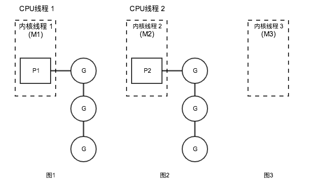
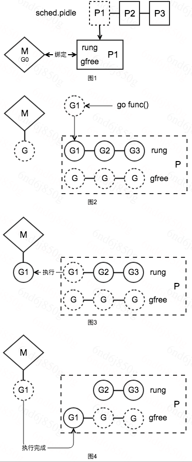
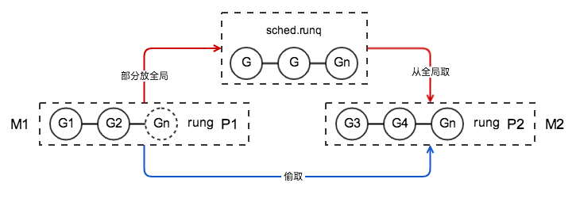

# GO调度讨论

本章主要针对Go调度相关的角度介绍。本章只看linux系统下的逻辑。代码版本GO1.9.2。

-------------------------------------

## 先有个简单的概念

调度器设计有三个重要的概念：G、M、P

* G：代表一个goroutine，每个goroutine都有自己独立的栈存放当前的运行内存及状态。可以把一个G当做一个任务。
* M: 代表内核线程(Pthread)，它本身就与一个内核线程进行绑定，goroutine运行在M上。
* P：代表一个处理器，可以认为一个“有运行任务”的P占了一个CPU线程的资源，且只要处于调度的时候就有P。

注：`内核线程`和`CPU线程`的区别，在系统里可以有上万个内核线程，但CPU线程都很少，CPU线程也就是Top命令里看到的CPU0、CPU1、CPU2......的数量。

三者关系大致如下图：



前两个图代表2个有运行任务时的状态，M与一个内核线程绑定，可运行的goroutine列表存放到P里面，然后占用了一个CPU线程来运行。第三个图代表没有运行任务时的状态，M依然与一个内核线程绑定，由于没有运行任务因此不占用CPU线程，也就不占用P。

先有个大概的认知，详细的执行过程及实现在下面逐步展开。

## 先从启动说起，程序启动时都做了什么

直接进入正题，下面是一段程序启动的代码

```go

// runtime/asm_amd64.s

TEXT runtime·rt0_go(SB),NOSPLIT,$0
......此处省略N多代码......
ok:
        // set the per-goroutine and per-mach "registers"
        get_tls(BX)  // 将 g0 放到 tls(thread local storage)里
        LEAQ    runtime·g0(SB), CX
        MOVQ    CX, g(BX)
        LEAQ    runtime·m0(SB), AX

        // save m->g0 = g0  // 将全局M0与全局G0绑定
        MOVQ    CX, m_g0(AX)
        // save m0 to g0->m
        MOVQ    AX, g_m(CX)

        CLD                             // convention is D is always left cleared
        CALL    runtime·check(SB)

        MOVL    16(SP), AX              // copy argc
        MOVL    AX, 0(SP)
        MOVQ    24(SP), AX              // copy argv
        MOVQ    AX, 8(SP)
        CALL    runtime·args(SB) // 解析命令行参数
        CALL    runtime·osinit(SB) // 只初始化了CPU核数
        CALL    runtime·schedinit(SB) // 内存分配器、栈、P、GC回收器等初始化

        // create a new goroutine to start program
        MOVQ    $runtime·mainPC(SB), AX         // 
        PUSHQ   AX
        PUSHQ   $0                      // arg size
        CALL    runtime·newproc(SB) // 创建一个新的G来启动runtime.main
        POPQ    AX
        POPQ    AX

        // start this M
        CALL    runtime·mstart(SB) // 启动M0,开始等待空闲G,正式进入调度循环

        MOVL    $0xf1, 0xf1  // crash
        RET
```

在启动过程里与调度相关的主要做这几个事情：

* 初始化固定数量的P，准备用于维护运行中以及空闲的G
* 创建一个新的G来启动`runtime.main`
* 创建全局M0、全局G0，在最后一步启动M0进入调度循环

M0是什么？程序里会启动多个M，第一个启动的叫M0。

G0是什么？G分三种，第一种是执行用户任务的叫做G，第二种执行runtime下调度工作的叫G0，每个M都绑定一个G0，M0绑定的G0就叫做“全局G0”。第三种则是启动`runtime.main`用到的G。

我们按照顺序来详细看是怎么完成上面三个事情的。

### 首先`runtime.osinit(SB)`函数针对系统环境的初始化

这里实质只做了一件事情，就是获取CPU的线程数，也就是Top命令里看到的CPU0、CPU1、CPU2......的数量

```
// runtime/os_linux.go

func osinit() {
	ncpu = getproccount()
}
```
### 接下来`runtime.schedinit(SB)`就要做各种初始化

```
// runtime/proc.go

// 设置最大M数量
sched.maxmcount = 10000

// 初始化当前M,即全局M0
mcommoninit(_g_.m)

// 查看应该启动的P数量，默认为cpu core数.
// 如果设置了环境变量GOMAXPROCS则以环境变量为准,最大不得超过_MaxGomaxprocs(1024)个
procs := ncpu
if n, ok := atoi32(gogetenv("GOMAXPROCS")); ok && n > 0 {
	procs = n
}
if procs > _MaxGomaxprocs {
	procs = _MaxGomaxprocs
}
// 调整P数量，此时由于是初始化阶段，所以P都是新建的
if procresize(procs) != nil {
	throw("unknown runnable goroutine during bootstrap")
}
```
这里`sched.maxmcount`设置了M最大的数量，而M代表的是系统内核线程，因此可以认为一个进程最大只能启动10000个系统线程。

`mcommoninit`初始化全局M0。

`procresize`初始化P的数量，`procs`参数为初始化的数量，而在初始化之前先做数量的判断，默认是`ncpu`(与CPU核数相等)，也可以通过环境变量`GOMAXPROCS`来控制P的数量。`_MaxGomaxprocs`控制了最大的P数量只能是1024。

[tip] 我们在进程初始化的时候经常用到`runtime.GOMAXPROCS()`函数，其实也是调用的`procresize`方法重新设置了最大CPU使用数量。

### 最后`runtime·mstart(SB)`启动调度循环

前面都是各种初始化操作，到这一步则开始真正的调度逻辑，下面来围绕G、M、P三个概念介绍Goroutine调度的运作流程。(这里启动的M就是第一个处理调度的M，也是M0)

## 调度工作流程



图1代表M启动的过程。在程序初始化的过程中说到在进程启动的最后一步启动了第一个M(即M0)，这个M从全局的空闲P列表里拿到一个P，然后与其绑定。而P里面有2个管理G的链表`runq`存储等待运行的G列表，`gfree`存储空闲的G列表，M启动后等待可执行的G。

图2代表创建G的过程。创建一个G先扔到当前P的`runq`待运行队列里。在图3的执行过程里，M从绑定的P的`runq`列表里获取一个G来执行。当执行完成后，图4的流程里把G仍到`gfree`队列里。注意此时G并没有销毁(只重置了G的栈以及状态)，当再次创建G的时候优先从`gfree`列表里获取，这样就起到了复用G的作用，避免反复与系统交互创建内存。

M0即启动后处于一个自循环状态，执行完一个G之后继续执行下一个G，反复上面的图2~图4过程。当第一个M正在繁忙而又有新的G需要执行时，会再开启一个M来执行。下面先看一下非M0的启动过程（M0启动是个特殊的启动过程，由汇编实现的初始化后启动，而后续的M创建以及启动则是Go代码实现）。

```
// runtime/proc.go

func startm(_p_ *p, spinning bool) {
	lock(&sched.lock)
	if _p_ == nil {
		// 从空闲P里获取一个
		_p_ = pidleget()
		// 获取失败则终止
		if _p_ == nil {
			unlock(&sched.lock)
			if spinning {
				// The caller incremented nmspinning, but there are no idle Ps,
				// so it's okay to just undo the increment and give up.
				if int32(atomic.Xadd(&sched.nmspinning, -1)) < 0 {
					throw("startm: negative nmspinning")
				}
			}
			return
		}
	}
	// 获取一个空闲的m
	mp := mget()
	unlock(&sched.lock)
	// 如果没有空闲M，则new一个
	if mp == nil {
		var fn func()
		if spinning {
			// The caller incremented nmspinning, so set m.spinning in the new M.
			fn = mspinning
		}
		newm(fn, _p_)
		return
	}
	if mp.spinning {
		throw("startm: m is spinning")
	}
	if mp.nextp != 0 {
		throw("startm: m has p")
	}
	if spinning && !runqempty(_p_) {
		throw("startm: p has runnable gs")
	}
	// The caller incremented nmspinning, so set m.spinning in the new M.
	// 设置自璇状态，暂存P
	mp.spinning = spinning
	mp.nextp.set(_p_)
	// 唤醒M
	notewakeup(&mp.park)
}

func newm(fn func(), _p_ *p) {
	// 创建一个M对象,切与P关联
	mp := allocm(_p_, fn)
	// 暂存P
	mp.nextp.set(_p_)
	mp.sigmask = initSigmask
	
	......
	
	execLock.rlock() // Prevent process clone.
	// 创建系统内核线程
	newosproc(mp, unsafe.Pointer(mp.g0.stack.hi))
	execLock.runlock()
}

func newosproc(mp *m, stk unsafe.Pointer) {
	......

	var oset sigset
	sigprocmask(_SIG_SETMASK, &sigset_all, &oset)
	errno := bsdthread_create(stk, unsafe.Pointer(mp), funcPC(mstart))
	sigprocmask(_SIG_SETMASK, &oset, nil)

	......
	}
}

func allocm(_p_ *p, fn func()) *m {
	......
	
	mp := new(m)
	mp.mstartfn = fn // 设置启动函数
	mcommoninit(mp)  // 初始化m

	// 创建g0
	// In case of cgo or Solaris, pthread_create will make us a stack.
	// Windows and Plan 9 will layout sched stack on OS stack.
	if iscgo || GOOS == "solaris" || GOOS == "windows" || GOOS == "plan9" {
		mp.g0 = malg(-1)
	} else {
		mp.g0 = malg(8192 * sys.StackGuardMultiplier)
	}
	// 把新创建的g0与M做关联
	mp.g0.m = mp

	......
	
	return mp
}

func mstart() {
	......
	
	mstart1()
}

func mstart1() {

	......
	
	// 进入调度循环(阻塞不返回)
	schedule()
}
```
非M0的启动首先从`startm`方法开始启动，要进行调度工作必须有调度处理器P，因此先从空闲的P里面获取一个P，通过`newm`方法创建一个M与P绑定准备调度。

`newm`方法中通过`newosproc`方法新建一个内核线程，把内核线程与M以及`mstart`方法进行关联，这样内核线程就可以找到M并且同时找到`mstart`方法启动调度工作，并且执行调度任务。注意`allocm`函数创建M的同时创建了一个G与自己关联，这个G就是我们在上面说到的`g0`。为什么M要关联一个g0？因为runtime下执行一个G也需要用到栈空间来完成调度工作，而拥有执行栈的地方只有G，因此需要为每个执行线程里配置一个g0。

内核线程调用`mstart`方法开始执行调度器,最终调用`schedule`进入调度器的调度循环，在这个方法里永远不再返回。下面看下是如何循环的

```
func schedule() {
	_g_ := getg()

	// 进入gc MarkWorker 工作模式
	if gp == nil && gcBlackenEnabled != 0 {
		gp = gcController.findRunnableGCWorker(_g_.m.p.ptr())
	}
	if gp == nil {
		// Check the global runnable queue once in a while to ensure fairness.
		// Otherwise two goroutines can completely occupy the local runqueue
		// by constantly respawning each other.
		// 每处理n个任务就去全局队列获取G任务,确保公平
		if _g_.m.p.ptr().schedtick%61 == 0 && sched.runqsize > 0 {
			lock(&sched.lock)
			gp = globrunqget(_g_.m.p.ptr(), 1)
			unlock(&sched.lock)
		}
	}
	// 从本地P队列里取
	if gp == nil {
		gp, inheritTime = runqget(_g_.m.p.ptr())
		if gp != nil && _g_.m.spinning {
			throw("schedule: spinning with local work")
		}
	}
	// 从其它地方获取G,如果获取不到则沉睡M，并且阻塞在这里，直到M被再次使用
	if gp == nil {
		gp, inheritTime = findrunnable() // blocks until work is available
	}

	// This thread is going to run a goroutine and is not spinning anymore,
	// so if it was marked as spinning we need to reset it now and potentially
	// start a new spinning M.
	if _g_.m.spinning {
		resetspinning()
	}

	if gp.lockedm != nil {
		// Hands off own p to the locked m,
		// then blocks waiting for a new p.
		startlockedm(gp)
		goto top
	}
	// 执行找到的G
	execute(gp, inheritTime)
}
```
`schedule`中首先尝试从P本地队列中获取一个可执行的G，如果没有则从其它地方获取(后面会介绍如何从其它地方获取),最终通过`execute`方法执行找到的可运行的G。

[tip]在这里用到了一个关键方法`getg()`，在runtime的代码里大量使用该函数，它由汇编实现，该方法就是获取当前运行的G，具体实现不再这里阐述。

```
func execute(gp *g, inheritTime bool) {
	_g_ := getg()

	casgstatus(gp, _Grunnable, _Grunning)
	
	......

	// 真正的执行g（汇编实现）
	gogo(&gp.sched)
}
```
`execute`方法先更改G的状态为`_Grunning`表示运行中,最终给`gogo`方法做实际的执行操作。而`gogo`方法则是汇编实现。

```
// runtime.asm_amd64.s

TEXT runtime·gogo(SB), NOSPLIT, $16-8
        MOVQ    buf+0(FP), BX           // gobuf

        // If ctxt is not nil, invoke deletion barrier before overwriting.
        MOVQ    gobuf_ctxt(BX), AX
        TESTQ   AX, AX
        JZ      nilctxt
        LEAQ    gobuf_ctxt(BX), AX
        MOVQ    AX, 0(SP)
        MOVQ    $0, 8(SP)
        CALL    runtime·writebarrierptr_prewrite(SB)
        MOVQ    buf+0(FP), BX

nilctxt:
        MOVQ    gobuf_g(BX), DX
        MOVQ    0(DX), CX               // make sure g != nil
        get_tls(CX)
        MOVQ    DX, g(CX)
        MOVQ    gobuf_sp(BX), SP        // restore SP
        MOVQ    gobuf_ret(BX), AX
        MOVQ    gobuf_ctxt(BX), DX
        MOVQ    gobuf_bp(BX), BP
        MOVQ    $0, gobuf_sp(BX)        // clear to help garbage collector
        MOVQ    $0, gobuf_ret(BX)
        MOVQ    $0, gobuf_ctxt(BX)
        MOVQ    $0, gobuf_bp(BX)
        MOVQ    gobuf_pc(BX), BX
        JMP     BX
```

### TODO：详细介绍gogo方法实现,目的是更深度理解调度的性能消耗有多大。

**这里有个问题：每个P里面的G执行时间是不可控的，如果多个P同时在执行，会不会出现有的P里面的G执行不完，有的P里面几乎没有G可执行呢？**

这就要从M的自循环过程中如何获取G、归还G的行为说起了。在上面是拿单个M在工作(也就是单个内核线程)来介绍，为符合实际场景，下面拿多个M(即多个内核线程)同时工作的场景看下工作流程：



图中可以看出有两种途径：1.借助全局队列`sched.runq`作为中介，本地P里的G太多的话就放全局里，G太少的话就从全局取。2.全局列表里没有的话直接从P1里偷取(steal)。(更多M在执行的话，同样的原理，这里就只拿2个来举例)

**第1种途径实现如下：**

```
// runtime/proc.go

func runqput(_p_ *p, gp *g, next bool) {
	if randomizeScheduler && next && fastrand()%2 == 0 {
		next = false
	}

	// 尝试把G添加到P的runnext节点，这里确保runnext只有一个G，如果之前已经有一个G则踢出来放到runq里
	if next {
	retryNext:
		oldnext := _p_.runnext
		if !_p_.runnext.cas(oldnext, guintptr(unsafe.Pointer(gp))) {
			goto retryNext
		}
		if oldnext == 0 {
			return
		}
		// 把老的g踢出来，在下面放到runq里
		gp = oldnext.ptr()
	}

retry:
	// 如果_p_.runq队列不满，则放到队尾就结束了。
	// 试想如果不放到队尾而放到队头里会怎样？如果频繁的创建G则可能后面的G总是不被执行，对后面的G不公平
	h := atomic.Load(&_p_.runqhead) // load-acquire, synchronize with consumers
	t := _p_.runqtail
	if t-h < uint32(len(_p_.runq)) {
		_p_.runq[t%uint32(len(_p_.runq))].set(gp)
		atomic.Store(&_p_.runqtail, t+1) // store-release, makes the item available for consumption
		return
	}
	//如果队列满了，尝试把G和当前P里的一部分runq放到全局队列
	//因为操作全局需要加锁,所以名字里带个slow
	if runqputslow(_p_, gp, h, t) {
		return
	}
	// the queue is not full, now the put above must succeed
	goto retry
}
```
```
// runtime/proc.go

func runqputslow(_p_ *p, gp *g, h, t uint32) bool {
	var batch [len(_p_.runq)/2 + 1]*g

	// First, grab a batch from local queue.
	n := t - h
	n = n / 2
	if n != uint32(len(_p_.runq)/2) {
		throw("runqputslow: queue is not full")
	}
	// 从runq头部开始取出一半的runq放到临时变量batch里
	for i := uint32(0); i < n; i++ {
		batch[i] = _p_.runq[(h+i)%uint32(len(_p_.runq))].ptr()
	}
	if !atomic.Cas(&_p_.runqhead, h, h+n) { // cas-release, commits consume
		return false
	}
	// 把要put的g也放进batch去
	batch[n] = gp

	// 注释说在竞争检测中为了避免不规范的测试和潜在的假设,所以随机，不明白潜在的假设是指什么,似乎是一种没想清楚的绕过问题的逻辑
	if randomizeScheduler {
		for i := uint32(1); i <= n; i++ {
			j := fastrandn(i + 1)
			batch[i], batch[j] = batch[j], batch[i]
		}
	}

	// 把取出来的一半runq组成链表
	for i := uint32(0); i < n; i++ {
		batch[i].schedlink.set(batch[i+1])
	}

	// 将一半的runq放到global队列里,一次多转移一些省得转移频繁
	lock(&sched.lock)
	globrunqputbatch(batch[0], batch[n], int32(n+1))
	unlock(&sched.lock)
	return true
}
```
```
// runtime/proc.go

func globrunqputbatch(ghead *g, gtail *g, n int32) {
	gtail.schedlink = 0
	if sched.runqtail != 0 {
		sched.runqtail.ptr().schedlink.set(ghead)
	} else {
		sched.runqhead.set(ghead)
	}
	sched.runqtail.set(gtail)
	sched.runqsize += n
}
```
`runqput`方法归还执行完的G,`runq`定义是`runq [256]guintptr`，有固定的长度，因此当前P里的待运行G超过256的时候说明过多了，则执行`runqputslow`方法把一半G扔给全局G链表，`globrunqputbatch`连接全局链表的头尾指针。

上面介绍的是归还过程，获取则是一样的反向流程先从本地取，本地没有的话就从全局里取，这里就不多说了。

**第2种途径实现如下：**

```
// runtime/proc.go

func findrunnable() (gp *g, inheritTime bool) {

	......

	// 从本地队列获取
	if gp, inheritTime := runqget(_p_); gp != nil {
		return gp, inheritTime
	}

	// 全局队列获取
	if sched.runqsize != 0 {
		lock(&sched.lock)
		gp := globrunqget(_p_, 0)
		unlock(&sched.lock)
		if gp != nil {
			return gp, false
		}
	}
	
	......
	
	// 尝试4次从别的P偷
	for i := 0; i < 4; i++ {
		for enum := stealOrder.start(fastrand()); !enum.done(); enum.next() {
			if sched.gcwaiting != 0 {
				goto top
			}
			stealRunNextG := i > 2 // first look for ready queues with more than 1 g
			// 在这里开始针对P进行偷取操作
			if gp := runqsteal(_p_, allp[enum.position()], stealRunNextG); gp != nil {
				return gp, false
			}
		}
	}
```

但可能别的P里面并没有超过256，就不会放到全局G链表里，甚至可能一直维持在不到256个。这就借助第2个途径了：从别的P里面"偷取"一些G过来执行了。`runqsteal`方法实现了"偷取"操作。

```
// runtime/proc.go

func runqsteal(_p_, p2 *p, stealRunNextG bool) *g {
	t := _p_.runqtail
	n := runqgrab(p2, &_p_.runq, t, stealRunNextG)
	if n == 0 {
		return nil
	}
	n--
	// 返回尾部的一个G
	gp := _p_.runq[(t+n)%uint32(len(_p_.runq))].ptr()
	if n == 0 {
		return gp
	}
	h := atomic.Load(&_p_.runqhead) // load-acquire, synchronize with consumers
	if t-h+n >= uint32(len(_p_.runq)) {
		throw("runqsteal: runq overflow")
	}
	atomic.Store(&_p_.runqtail, t+n) // store-release, makes the item available for consumption
	return gp
}
```
```
// runtime/proc.go

func runqgrab(_p_ *p, batch *[256]guintptr, batchHead uint32, stealRunNextG bool) uint32 {
	for {
		// 计算一半的数量
		h := atomic.Load(&_p_.runqhead) // load-acquire, synchronize with other consumers
		t := atomic.Load(&_p_.runqtail) // load-acquire, synchronize with the producer
		n := t - h
		n = n - n/2
		
		......
		
		// 将偷到的任务转移到本地P队列里
		for i := uint32(0); i < n; i++ {
			g := _p_.runq[(h+i)%uint32(len(_p_.runq))]
			batch[(batchHead+i)%uint32(len(batch))] = g
		}
		if atomic.Cas(&_p_.runqhead, h, h+n) { // cas-release, commits consume
			return n
		}
	}
}
```
上面可以看出从别的P里面偷(steal)了一半，这样就足够运行了。有了“偷取”操作也就充分利用多线程的资源。

到这里调度器的调度过程介绍基本完成了。光有了调度器的实现以及调度流程似乎并不能很好的理解调度原理。下面拿个常见应用场景看如何利用这个调度器的。

## 举例一个触发调度的场景

### time.Sleep

当程序调用`time.Sleep`的时候我们是要black住程序不在继续往下执行，此时该goroutine不会做其他事情了，理应把CPU资源释放出来，下面看下实现：

```
// runtime/time.go

func timeSleep(ns int64) {
	if ns <= 0 {
		return
	}

	t := getg().timer
	if t == nil {
		t = new(timer)
		getg().timer = t
	}
	*t = timer{} // 每个定时任务都创建一个timer
	t.when = nanotime() + ns
	t.f = goroutineReady // 记录唤醒该G的方法,唤醒时通过该方法执行唤醒
	t.arg = getg()       // 把timer与当前G关联,时间到了唤醒时通过该参数找到所在的G
	lock(&timers.lock)
	addtimerLocked(t)                                      // 把timer添加到最小堆里
	goparkunlock(&timers.lock, "sleep", traceEvGoSleep, 2) // 切到G0让出CPU,进入休眠
}
```

`timeSleep`函数里通过`addtimerLocked`把定时器加入到timer管理器（timer通过最小堆的数据结构存放每个定时器，在这不做详细说明）后，再通过`goparkunlock`实现把当前G休眠。下面看下该方法如何休眠G的：

```
// runtime/time.go

func goparkunlock(lock *mutex, reason string, traceEv byte, traceskip int) {
	gopark(parkunlock_c, unsafe.Pointer(lock), reason, traceEv, traceskip)
}

func gopark(unlockf func(*g, unsafe.Pointer) bool, lock unsafe.Pointer, reason string, traceEv byte, traceskip int) {
	mp := acquirem()
	gp := mp.curg
	status := readgstatus(gp)
	if status != _Grunning && status != _Gscanrunning {
		throw("gopark: bad g status")
	}
	mp.waitlock = lock
	mp.waitunlockf = *(*unsafe.Pointer)(unsafe.Pointer(&unlockf))
	gp.waitreason = reason
	mp.waittraceev = traceEv
	mp.waittraceskip = traceskip
	releasem(mp)
	// can't do anything that might move the G between Ms here.
	// mcall 在M里从当前正在运行的G切换到g0
	// park_m 在切换到的g0下先把传过来的G切换为_Gwaiting状态挂起该G
	// 调用回调函数waitunlockf()由外层决定是否等待解锁，返回true则等待解锁不在执行G，返回false则不等待解锁继续执行
	mcall(park_m)
}
```
```
// runtime/stubs.go

// mcall switches from the g to the g0 stack and invokes fn(g),
// where g is the goroutine that made the call.
// mcall saves g's current PC/SP in g->sched so that it can be restored later.
......
func mcall(fn func(*g))
```
```
// runtime/time.go

func park_m(gp *g) {
	_g_ := getg() // 此处获得的是g0,而不是gp

	if trace.enabled {
		traceGoPark(_g_.m.waittraceev, _g_.m.waittraceskip)
	}

	casgstatus(gp, _Grunning, _Gwaiting)
	dropg() // 把g0从M的"当前运行"里剥离出来

	if _g_.m.waitunlockf != nil {
		fn := *(*func(*g, unsafe.Pointer) bool)(unsafe.Pointer(&_g_.m.waitunlockf))
		ok := fn(gp, _g_.m.waitlock)
		_g_.m.waitunlockf = nil
		_g_.m.waitlock = nil
		if !ok { // 如果不需要等待解锁，则切换到_Grunnable状态并直接执行G
			if trace.enabled {
				traceGoUnpark(gp, 2)
			}
			casgstatus(gp, _Gwaiting, _Grunnable)
			execute(gp, true) // Schedule it back, never returns.
		}
	}
	schedule()
}
```
`goparkunlock`方法实质是依赖`gopark`的实现，而`gopark`才是进行调度的方法，里面有个方法`mcall()`，注释里这样描述：

* 从当前运行的G切换到g0的运行栈上，然后调用fn(g)，这里被调用的g是调用mcall方法时的G。`mcall`函数保存当前运行的G的 PC/SP 到 g->sched 里，因此该G可以在以后被重新恢复执行.

在本章开始介绍初始化过程中有提到M0启动的时候绑定了一个g0，调度工作是运行在g0的栈上的，`mcall`方法就是此时用到的这个g0。它的做法是先把当前调用的G的执行栈暂存到`g->sched`变量里，然后切换到g0的执行栈上开始进行调度工作。注释里说的fn(g)也就是`park_m(gp *g)`方法，所以进入到`park_m`方法里其实也进入到了g0的执行栈里了，参数 gp 就是当前执行`mall`的G，方法里把gp的状态从`_Grunning`切换到`_Gwaiting`表明进入到等待唤醒状态，此时休眠G的操作就完成了。接下来既然休眠了G了，CPU线程总不能闲下来，在`park_m`方法里又可以看到`schedule`方法，开始进入到调度循环了。

`park_m`方法里还有段小插曲，进入调度循环之前还有个对`waitunlockf`方法的判断，该方法意思是如果解锁不成功则调用`execute`方法继续执行之前的G，而该方法永远不会return(后面会介绍为什么不会return)，也就不会再次进入调度。往回追溯看下`waitunlockf`方法做了啥，以及他要解的`waitlock`锁又是哪来的？首先锁以及解锁方法是在g0的m变量里的，调用`park_m`方法之前在`gopark`方法里面先通过`acquirem`获取了当前执行G所在的M，然后把锁以及锁方法保存在当前的M里，而该M和切换到g0关联的是同一个M，`gopark`里的锁和方法又来源于`goparkunlock`，`goparkunlock`的锁即是`timeSleep`方法里把`timers.lock`锁传了进去，因此解的锁是timer管理器的全局锁，这个锁是锁住最小堆的调整。`parkunlock_c`方法实现如下：

```
func parkunlock_c(gp *g, lock unsafe.Pointer) bool {
	unlock((*mutex)(lock))
	return true
}
```
也就是说一定会解锁，且返回true。那么在`park_m`方法里一定不会执行`execute`,也就是说在`time.Sleep`这个例子里一定会执行`schedule`方法进入，这里就进入到了上面介绍调度工作流程的调度循环里了。

上面介绍的是一个G如何进入到休眠状态的过程，该例子是个定时器，当时间到了的话，当前G就要被唤醒继续执行了。下面就介绍下唤醒的流程。

返回到最开始`timeSleep`方法里在进入调度方法之前有一个`addtimerLocked`方法，看下这个方法做了啥。

```
// runtime/time.go

func addtimerLocked(t *timer) {
	// when must never be negative; otherwise timerproc will overflow
	// during its delta calculation and never expire other runtime timers.
	if t.when < 0 {
		t.when = 1<<63 - 1
	}
	t.i = len(timers.t)
	timers.t = append(timers.t, t) //将当前timer添加到timer管理器里
	siftupTimer(t.i)
	
	......
	
	// 如果没有启动timer管理定时器，则启动。timerproc只会启动一次，即全局timer管理器
	if !timers.created {
		timers.created = true
		go timerproc()
	}
}
```
```
// Timerproc runs the time-driven events.
// It sleeps until the next event in the timers heap.
// If addtimer inserts a new earlier event, it wakes timerproc early.
func timerproc() {
	timers.gp = getg()
	for {
		lock(&timers.lock)
		timers.sleeping = false
		now := nanotime()
		delta := int64(-1)
		for {
			if len(timers.t) == 0 {
				delta = -1
				break
			}
			t := timers.t[0]
			delta = t.when - now
			if delta > 0 {
				break
			}
			if t.period > 0 {
				// leave in heap but adjust next time to fire
				t.when += t.period * (1 + -delta/t.period)
				siftdownTimer(0)
			} else {
				// remove from heap
				last := len(timers.t) - 1
				if last > 0 {
					timers.t[0] = timers.t[last]
					timers.t[0].i = 0
				}
				timers.t[last] = nil
				timers.t = timers.t[:last]
				if last > 0 {
					siftdownTimer(0)
				}
				t.i = -1 // mark as removed
			}
			f := t.f
			arg := t.arg
			seq := t.seq
			unlock(&timers.lock)
			if raceenabled {
				raceacquire(unsafe.Pointer(t))
			}
			f(arg, seq)
			lock(&timers.lock)
		}
		if delta < 0 || faketime > 0 {
			// No timers left - put goroutine to sleep.
			timers.rescheduling = true
			goparkunlock(&timers.lock, "timer goroutine (idle)", traceEvGoBlock, 1)
			continue
		}
		// At least one timer pending. Sleep until then.
		timers.sleeping = true
		timers.sleepUntil = now + delta
		noteclear(&timers.waitnote)
		unlock(&timers.lock)
		notetsleepg(&timers.waitnote, delta)
	}
}
```
在`addtimerLocked`方法的最下面有个逻辑在运行期间开启了'全局时间事件驱动器'`timerproc`,该方法会不断的遍历最小堆，寻找最早进入timer管理器的定时器，然后唤醒。他是怎么找到要唤醒哪个G的？回头看下`timeSleep`方法里把当时正在执行的G以及唤醒方法`goroutineReady`带到了每个定时器里，而在`timerproc`则通过找到期的定时器执行`f(arg, seq)`
即通过`goroutineReady`方法唤醒。方法调用过程: `goroutineReady() -> ready()`

```
// runtime/proc.go

// Mark gp ready to run.
func ready(gp *g, traceskip int, next bool) {
	if trace.enabled {
		traceGoUnpark(gp, traceskip)
	}

	status := readgstatus(gp)

	// Mark runnable.
	_g_ := getg()
	_g_.m.locks++ // disable preemption because it can be holding p in a local var
	if status&^_Gscan != _Gwaiting {
		dumpgstatus(gp)
		throw("bad g->status in ready")
	}

	// status is Gwaiting or Gscanwaiting, make Grunnable and put on runq
	casgstatus(gp, _Gwaiting, _Grunnable)
	runqput(_g_.m.p.ptr(), gp, next)
	
	......
}
```
在上面的方法里可以看到先把休眠的G从`_Gwaiting`切换到`_Grunnable`状态，表明已经可运行。然后通过`runqput`方法把G放到P的待运行队列里，在调度工作流程里等待运行了。

总结下：time.Sleep想要进入阻塞(休眠)状态，其实是通过`park_m`方法给自己标记个`_Gwaiting`状态，然后把自己所占用的CPU线程资源给释放出来，继续执行调度任务，调度其它的G来运行。而唤醒是通过把G更改回`_Grunnable`状态后，然后把G放入到P的待运行队列里等待执行。通过这点可以看出休眠中的G其实并不占用CPU资源，最多是占用内存，是个很轻量级的阻塞。

### TODO 细分析下mall的逻辑切换的成本有多高？目的是更深度理解调度的性能消耗有多大。

## 再看几个触发调度的场景

### channel

### 系统调用

### 网络IO

### 抢占

### GC STW时各个调度的状态
