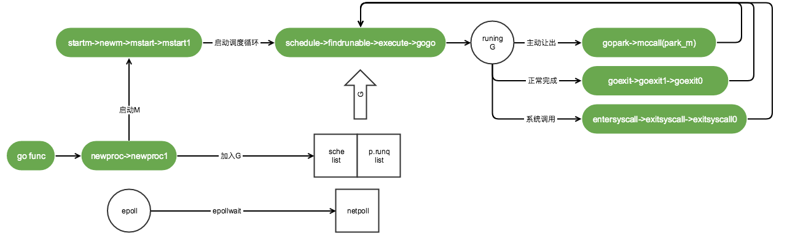

# 谈谈Go的调度实现

本章主要针对Go调度相关介绍。仅关注linux系统下的逻辑。代码版本GO1.9.2。

本章例子中的代码对应详细注释参考：[gosrc-reader](https://github.com/thinkboy/gosrc-reader/tree/master/runtime)

-------------------------------------

## 先有个简单的概念

### 调度器的三个概念：G、M、P

* G：代表一个goroutine，每个goroutine都有自己独立的栈存放当前的运行内存及状态。可以把一个G当做一个任务。
* M: 代表内核线程(Pthread)`，它本身就与一个内核线程进行绑定，goroutine运行在M上。
* P：代表一个处理器，可以认为一个“有运行任务”的P占了一个CPU线程的资源，且只要处于调度的时候就有P。

注：`内核线程`和`CPU线程`的区别，在系统里可以有上万个内核线程，但CPU线程并没有那么多，CPU线程也就是Top命令里看到的CPU0、CPU1、CPU2......的数量。

三者关系大致如下图：


前两个图代表2个有运行任务时的状态。M与一个内核线程绑定，可运行的goroutine列表存放到P里面，然后占用了一个CPU线程来运行。

第三个图代表没有运行任务时的状态，M依然与一个内核线程绑定，由于没有运行任务因此不占用CPU线程，同时也不占用P。

Go的调度也可以看做任务调度的模型。

### 调度的大致轮廓



图中表述了由`go func`触发开始的调度，先创建M通过M启动调度循环，然后调度循环过程中获取G来执行，执行过程中遇到的“主动出让”、“正常完成”、“系统调用”三个case再次进入下一循环。

下面开始从源码角度详细讨论调度实现。

## 从启动说起，进程启动时都做了什么？

直接进入正题，下面是一段程序启动的代码

```go
// runtime/asm_amd64.s

TEXT runtime·rt0_go(SB),NOSPLIT,$0
......此处省略N多代码......
ok:
        // set the per-goroutine and per-mach "registers"
        get_tls(BX)  // 将 g0 放到 tls(thread local storage)里
        LEAQ    runtime·g0(SB), CX
        MOVQ    CX, g(BX)
        LEAQ    runtime·m0(SB), AX

        // save m->g0 = g0  // 将全局M0与全局G0绑定
        MOVQ    CX, m_g0(AX)
        // save m0 to g0->m
        MOVQ    AX, g_m(CX)

        CLD                             // convention is D is always left cleared
        CALL    runtime·check(SB)

        MOVL    16(SP), AX              // copy argc
        MOVL    AX, 0(SP)
        MOVQ    24(SP), AX              // copy argv
        MOVQ    AX, 8(SP)
        CALL    runtime·args(SB) // 解析命令行参数
        CALL    runtime·osinit(SB) // 只初始化了CPU核数
        CALL    runtime·schedinit(SB) // 内存分配器、栈、P、GC回收器等初始化

        // create a new goroutine to start program
        MOVQ    $runtime·mainPC(SB), AX         // 
        PUSHQ   AX
        PUSHQ   $0                      // arg size
        CALL    runtime·newproc(SB) // 创建一个新的G来启动runtime.main
        POPQ    AX
        POPQ    AX

        // start this M
        CALL    runtime·mstart(SB) // 启动M0,开始等待空闲G,正式进入调度循环

        MOVL    $0xf1, 0xf1  // crash
        RET
```

在启动过程里与调度相关的主要做这几个事情：

* 初始化固定数量的P，准备用于维护运行中以及空闲的G
* 创建一个新的G来启动`runtime.main`
* 创建全局M0、全局G0，在最后一步启动M0进入调度循环

M0是什么？程序里会启动多个M，第一个启动的叫M0。

G0是什么？G分三种，第一种是执行用户任务的叫做G，第二种执行runtime下调度工作的叫G0，每个M都绑定一个G0，M0绑定的G0就叫做“全局G0”。第三种则是启动`runtime.main`用到的G。

我们按照顺序来详细看是怎么完成上面三个事情的。

### `runtime.osinit(SB)`函数针对系统环境的初始化

这里实质只做了一件事情，就是获取CPU的线程数，也就是Top命令里看到的CPU0、CPU1、CPU2......的数量

```
// runtime/os_linux.go

func osinit() {
	ncpu = getproccount()
}
```
### `runtime.schedinit(SB)`调度相关的一些初始化

```
// runtime/proc.go

// 设置最大M数量
sched.maxmcount = 10000

// 初始化当前M,即全局M0
mcommoninit(_g_.m)

// 查看应该启动的P数量，默认为cpu core数.
// 如果设置了环境变量GOMAXPROCS则以环境变量为准,最大不得超过_MaxGomaxprocs(1024)个
procs := ncpu
if n, ok := atoi32(gogetenv("GOMAXPROCS")); ok && n > 0 {
	procs = n
}
if procs > _MaxGomaxprocs {
	procs = _MaxGomaxprocs
}
// 调整P数量，此时由于是初始化阶段，所以P都是新建的
if procresize(procs) != nil {
	throw("unknown runnable goroutine during bootstrap")
}
```
这里`sched.maxmcount`设置了M最大的数量，而M代表的是系统内核线程，因此可以认为一个进程最大只能启动10000个系统线程。

`mcommoninit`初始化全局M0。

`procresize`初始化P的数量，`procs`参数为初始化的数量，而在初始化之前先做数量的判断，默认是`ncpu`(与CPU核数相等)，也可以通过环境变量`GOMAXPROCS`来控制P的数量。`_MaxGomaxprocs`控制了最大的P数量只能是1024。

[tip] 我们在进程初始化的时候经常用到`runtime.GOMAXPROCS()`函数，其实也是调用的`procresize`方法重新设置了最大CPU使用数量。

### `runtime·mainPC(SB)`启动监控任务
```

// The main goroutine.
func main() {
	......
	
	// 启动后台监控
	systemstack(func() {
		newm(sysmon, nil)
	})

	......
}
```
在runtime下的main方法里跟调度相关的只有一个启动监控任务，该任务用于监控是否有过长时间执行的G，并进行抢占，下面会详细说到。

### 最后`runtime·mstart(SB)`启动调度循环

前面都是各种初始化操作，启动调度循环后开始真正的调度逻辑，下面来围绕G、M、P三个概念介绍Goroutine调度的运作流程。(这里启动的M就是第一个处理调度的M，也是M0)

## 再看调度循环都做了什么


图1代表M启动的过程，把M跟一个P绑定再一起。在程序初始化的过程中说到在进程启动的最后一步启动了第一个M(即M0)，这个M从全局的空闲P列表里拿到一个P，然后与其绑定。而P里面有2个管理G的链表`runq`存储等待运行的G列表，`gfree`存储空闲的G列表，M启动后等待可执行的G。

图2代表创建G的过程。创建一个G先扔到当前P的`runq`待运行队列里。在图3的执行过程里，M从绑定的P的`runq`列表里获取一个G来执行。当执行完成后，图4的流程里把G仍到`gfree`队列里。注意此时G并没有销毁(只重置了G的栈以及状态)，当再次创建G的时候优先从`gfree`列表里获取，这样就起到了复用G的作用，避免反复与系统交互创建内存。

M即启动后处于一个自循环状态，执行完一个G之后继续执行下一个G，反复上面的图2~图4过程。当第一个M正在繁忙而又有新的G需要执行时，会再开启一个M来执行。

下面详细看下调度循环的实现。

### 调度器如何开启调度循环

先看一下M的启动过程（M0启动是个特殊的启动过程，由汇编实现的初始化后启动，而普通的M创建以及启动则是Go代码实现）。

```
// runtime/proc.go

func startm(_p_ *p, spinning bool) {
	lock(&sched.lock)
	if _p_ == nil {
		// 从空闲P里获取一个
		_p_ = pidleget()
		// 获取失败则终止
		if _p_ == nil {
			unlock(&sched.lock)
			if spinning {
				// The caller incremented nmspinning, but there are no idle Ps,
				// so it's okay to just undo the increment and give up.
				if int32(atomic.Xadd(&sched.nmspinning, -1)) < 0 {
					throw("startm: negative nmspinning")
				}
			}
			return
		}
	}
	// 获取一个空闲的m
	mp := mget()
	unlock(&sched.lock)
	// 如果没有空闲M，则new一个
	if mp == nil {
		var fn func()
		if spinning {
			// The caller incremented nmspinning, so set m.spinning in the new M.
			fn = mspinning
		}
		newm(fn, _p_)
		return
	}
	if mp.spinning {
		throw("startm: m is spinning")
	}
	if mp.nextp != 0 {
		throw("startm: m has p")
	}
	if spinning && !runqempty(_p_) {
		throw("startm: p has runnable gs")
	}
	// The caller incremented nmspinning, so set m.spinning in the new M.
	// 设置自璇状态，暂存P
	mp.spinning = spinning
	mp.nextp.set(_p_)
	// 唤醒M
	notewakeup(&mp.park)
}

func newm(fn func(), _p_ *p) {
	// 创建一个M对象,且与P关联
	mp := allocm(_p_, fn)
	// 暂存P
	mp.nextp.set(_p_)
	mp.sigmask = initSigmask
	
	......
	
	execLock.rlock() // Prevent process clone.
	// 创建系统内核线程
	newosproc(mp, unsafe.Pointer(mp.g0.stack.hi))
	execLock.runlock()
}

// runtime/os_linux.go
func newosproc(mp *m, stk unsafe.Pointer) {
	// Disable signals during clone, so that the new thread starts
	// with signals disabled. It will enable them in minit.
	var oset sigset
	sigprocmask(_SIG_SETMASK, &sigset_all, &oset)
	ret := clone(cloneFlags, stk, unsafe.Pointer(mp), unsafe.Pointer(mp.g0), unsafe.Pointer(funcPC(mstart)))
	sigprocmask(_SIG_SETMASK, &oset, nil)
}

func allocm(_p_ *p, fn func()) *m {
	......
	
	mp := new(m)
	mp.mstartfn = fn // 设置启动函数
	mcommoninit(mp)  // 初始化m

	// 创建g0
	// In case of cgo or Solaris, pthread_create will make us a stack.
	// Windows and Plan 9 will layout sched stack on OS stack.
	if iscgo || GOOS == "solaris" || GOOS == "windows" || GOOS == "plan9" {
		mp.g0 = malg(-1)
	} else {
		mp.g0 = malg(8192 * sys.StackGuardMultiplier)
	}
	// 把新创建的g0与M做关联
	mp.g0.m = mp

	......
	
	return mp
}

func mstart() {
	......
	
	mstart1()
}

func mstart1() {

	......
	
	// 进入调度循环(阻塞不返回)
	schedule()
}
```
非M0的启动首先从`startm`方法开始启动，要进行调度工作必须有调度处理器P，因此先从空闲的P里面获取一个P，通过`newm`方法创建一个M与P绑定准备调度。

`newm`方法中通过`newosproc`方法新建一个内核线程，把内核线程与M以及`mstart`方法进行关联，这样内核线程就可以找到M并且同时找到`mstart`方法启动调度工作，并且执行调度任务。注意`allocm`函数创建M的同时创建了一个G与自己关联，这个G就是我们在上面说到的`g0`。为什么M要关联一个g0？因为runtime下执行一个G也需要用到栈空间来完成调度工作，而拥有执行栈的地方只有G，因此需要为每个执行线程里配置一个g0。

### 调度器如何进行调度循环

内核线程调用`mstart`方法开始执行调度器,最终调用`schedule`进入调度器的调度循环，在这个方法里永远不再返回。

```
func schedule() {
	_g_ := getg()

	// 进入gc MarkWorker 工作模式
	if gp == nil && gcBlackenEnabled != 0 {
		gp = gcController.findRunnableGCWorker(_g_.m.p.ptr())
	}
	if gp == nil {
		// Check the global runnable queue once in a while to ensure fairness.
		// Otherwise two goroutines can completely occupy the local runqueue
		// by constantly respawning each other.
		// 每处理n个任务就去全局队列获取G任务,确保公平
		if _g_.m.p.ptr().schedtick%61 == 0 && sched.runqsize > 0 {
			lock(&sched.lock)
			gp = globrunqget(_g_.m.p.ptr(), 1)
			unlock(&sched.lock)
		}
	}
	// 从本地P队列里取
	if gp == nil {
		gp, inheritTime = runqget(_g_.m.p.ptr())
		if gp != nil && _g_.m.spinning {
			throw("schedule: spinning with local work")
		}
	}
	// 从其它地方获取G,如果获取不到则沉睡M，并且阻塞在这里，直到M被再次使用
	if gp == nil {
		gp, inheritTime = findrunnable() // blocks until work is available
	}

	// This thread is going to run a goroutine and is not spinning anymore,
	// so if it was marked as spinning we need to reset it now and potentially
	// start a new spinning M.
	if _g_.m.spinning {
		resetspinning()
	}

	if gp.lockedm != nil {
		// Hands off own p to the locked m,
		// then blocks waiting for a new p.
		startlockedm(gp)
		goto top
	}
	// 执行找到的G
	execute(gp, inheritTime)
}
```
`schedule`中首先尝试从P本地队列中获取一个可执行的G，如果没有则从其它地方获取(后面会介绍如何从其它地方获取),最终通过`execute`方法执行找到的可运行的G。

[tip]在这里用到了一个关键方法`getg()`，在runtime的代码里大量使用该函数，它由汇编实现，该方法就是获取当前运行的G，具体实现不再这里阐述。

```
func execute(gp *g, inheritTime bool) {
	_g_ := getg()

	casgstatus(gp, _Grunnable, _Grunning)
	
	......

	// 真正的执行g（汇编实现）
	gogo(&gp.sched)
}
```
`execute`方法先更改G的状态为`_Grunning`表示运行中,最终给`gogo`方法做实际的执行操作。而`gogo`方法则是汇编实现。再来看下`gogo`方法的实现:

```
// runtime.asm_amd64.s

TEXT runtime·gogo(SB), NOSPLIT, $16-8
        MOVQ    buf+0(FP), BX           // gobuf 把0偏移的8个字节给BX寄存器, gobuf结构的前8个字节就是SP指针

        // If ctxt is not nil, invoke deletion barrier before overwriting.
        MOVQ    gobuf_ctxt(BX), AX // 在把gobuf的ctxt变量给AX寄存器
        TESTQ   AX, AX // 判断AX寄存器是否为空,传进来gp.sched的话肯定不为空了,因此JZ nilctxt不跳转
        JZ      nilctxt
        LEAQ    gobuf_ctxt(BX), AX
        MOVQ    AX, 0(SP)
        MOVQ    $0, 8(SP)
        CALL    runtime·writebarrierptr_prewrite(SB)
        MOVQ    buf+0(FP), BX

nilctxt: // 下面则是函数栈的BP SP指针移动，最后进入到指定的代码区域
        MOVQ    gobuf_g(BX), DX
        MOVQ    0(DX), CX               // make sure g != nil
        get_tls(CX)
        MOVQ    DX, g(CX)
        MOVQ    gobuf_sp(BX), SP        // restore SP
        MOVQ    gobuf_ret(BX), AX 
        MOVQ    gobuf_ctxt(BX), DX
        MOVQ    gobuf_bp(BX), BP
        MOVQ    $0, gobuf_sp(BX)        // clear to help garbage collector
        MOVQ    $0, gobuf_ret(BX) 
        MOVQ    $0, gobuf_ctxt(BX)
        MOVQ    $0, gobuf_bp(BX)
        MOVQ    gobuf_pc(BX), BX // PC指针即返回地址
        JMP     BX  // 跳转到执行代码处
```
```
// runtime/runtime2.go

type gobuf struct {
	// The offsets of sp, pc, and g are known to (hard-coded in) libmach.
	//
	// ctxt is unusual with respect to GC: it may be a
	// heap-allocated funcval so write require a write barrier,
	// but gobuf needs to be cleared from assembly. We take
	// advantage of the fact that the only path that uses a
	// non-nil ctxt is morestack. As a result, gogo is the only
	// place where it may not already be nil, so gogo uses an
	// explicit write barrier. Everywhere else that resets the
	// gobuf asserts that ctxt is already nil.
	sp   uintptr
	pc   uintptr
	g    guintptr
	ctxt unsafe.Pointer // this has to be a pointer so that gc scans it
	ret  sys.Uintreg
	lr   uintptr
	bp   uintptr // for GOEXPERIMENT=framepointer
}
```
`gogo`方法传的参数注意是`gp.sched`,而这个结构体里可以看到保存了熟悉的`SP/PC/BP`指针，能想象到是把执行栈传了进去(既然是执行一个G，当然要把执行栈传进去了)。可以看到在`gogo`函数中实质就只是做了函数栈指针的移动。

### 调度循环中如何上下文切换

上面介绍的是调度中执行G的过程，那G和G之间的切换又是怎么完成的？在runtime下面有个`gopark`方法来完成切换，直接看代码。

```
// runtime/proc.go

func gopark(unlockf func(*g, unsafe.Pointer) bool, lock unsafe.Pointer, reason string, traceEv byte, traceskip int) {
	mp := acquirem()
	gp := mp.curg
	status := readgstatus(gp)
	if status != _Grunning && status != _Gscanrunning {
		throw("gopark: bad g status")
	}
	mp.waitlock = lock
	mp.waitunlockf = *(*unsafe.Pointer)(unsafe.Pointer(&unlockf))
	gp.waitreason = reason
	mp.waittraceev = traceEv
	mp.waittraceskip = traceskip
	releasem(mp)
	// can't do anything that might move the G between Ms here.
	// mcall 在M里从当前正在运行的G切换到g0
	// park_m 在切换到的g0下先把传过来的G切换为_Gwaiting状态挂起该G
	// 调用回调函数waitunlockf()由外层决定是否等待解锁，返回true则等待解锁不在执行G，返回false则不等待解锁继续执行
	mcall(park_m)
}
```
```
// runtime/stubs.go

// mcall switches from the g to the g0 stack and invokes fn(g),
// where g is the goroutine that made the call.
// mcall saves g's current PC/SP in g->sched so that it can be restored later.
......
func mcall(fn func(*g))
```
```
// runtime/proc.go

func park_m(gp *g) {
	_g_ := getg() // 此处获得的是g0,而不是gp

	if trace.enabled {
		traceGoPark(_g_.m.waittraceev, _g_.m.waittraceskip)
	}

	casgstatus(gp, _Grunning, _Gwaiting)
	dropg() // 把g0从M的"当前运行"里剥离出来

	if _g_.m.waitunlockf != nil {
		fn := *(*func(*g, unsafe.Pointer) bool)(unsafe.Pointer(&_g_.m.waitunlockf))
		ok := fn(gp, _g_.m.waitlock)
		_g_.m.waitunlockf = nil
		_g_.m.waitlock = nil
		if !ok { // 如果不需要等待解锁，则切换到_Grunnable状态并直接执行G
			if trace.enabled {
				traceGoUnpark(gp, 2)
			}
			casgstatus(gp, _Gwaiting, _Grunnable)
			execute(gp, true) // Schedule it back, never returns.
		}
	}
	schedule()
}
```
`gopark`是进行调度出让CPU资源的方法，里面有个方法`mcall()`，注释里这样描述：

* 从当前运行的G切换到g0的运行栈上，然后调用fn(g)，这里被调用的g是调用mcall方法时的G。`mcall`函数保存当前运行的G的 PC/SP 到 g->sched 里，因此该G可以在以后被重新恢复执行.

在本章开始介绍初始化过程中有提到M启动的时候绑定了一个g0，调度工作是运行在g0的栈上的，`mcall`方法就是此时用到的这个g0。它的做法是先把当前调用的G的执行栈暂存到`g->sched`变量里，然后切换到g0的执行栈上开始进行调度工作。注释里说的fn(g)也就是`park_m(gp *g)`方法，所以进入到`park_m`方法里其实也进入到了g0的执行栈里了，参数 gp 就是当前执行`mall`的G，方法里把gp的状态从`_Grunning`切换到`_Gwaiting`表明进入到等待唤醒状态，此时休眠G的操作就完成了。接下来既然休眠了G了，CPU线程总不能闲下来，在`park_m`方法里又可以看到`schedule`方法，开始进入到调度循环了。

`park_m`方法里还有段小插曲，进入调度循环之前还有个对`waitunlockf`方法的判断，该方法意思是如果解锁不成功则调用`execute`方法继续执行之前的G，而该方法永远不会return，也就不会再次进入下一次调度。也就是说给外层一个控制是否要进行下一个调度的选择。

### 多个线程下如何均衡负载

**抛出一个问题：每个P里面的G执行时间是不可控的，如果多个P同时在执行，会不会出现有的P里面的G执行不完，有的P里面几乎没有G可执行呢？**

这就要从M的自循环过程中如何获取G、归还G的行为说起了，先看图：


图中可以看出有两种途径：1.借助全局队列`sched.runq`作为中介，本地P里的G太多的话就放全局里，G太少的话就从全局取。2.全局列表里没有的话直接从P1里偷取(steal)。(更多M在执行的话，同样的原理，这里就只拿2个来举例)

**第1种途径实现如下：**

```
// runtime/proc.go

func runqput(_p_ *p, gp *g, next bool) {
	if randomizeScheduler && next && fastrand()%2 == 0 {
		next = false
	}

	// 尝试把G添加到P的runnext节点，这里确保runnext只有一个G，如果之前已经有一个G则踢出来放到runq里
	if next {
	retryNext:
		oldnext := _p_.runnext
		if !_p_.runnext.cas(oldnext, guintptr(unsafe.Pointer(gp))) {
			goto retryNext
		}
		if oldnext == 0 {
			return
		}
		// 把老的g踢出来，在下面放到runq里
		gp = oldnext.ptr()
	}

retry:
	// 如果_p_.runq队列不满，则放到队尾就结束了。
	// 试想如果不放到队尾而放到队头里会怎样？如果频繁的创建G则可能后面的G总是不被执行，对后面的G不公平
	h := atomic.Load(&_p_.runqhead) // load-acquire, synchronize with consumers
	t := _p_.runqtail
	if t-h < uint32(len(_p_.runq)) {
		_p_.runq[t%uint32(len(_p_.runq))].set(gp)
		atomic.Store(&_p_.runqtail, t+1) // store-release, makes the item available for consumption
		return
	}
	//如果队列满了，尝试把G和当前P里的一部分runq放到全局队列
	//因为操作全局需要加锁,所以名字里带个slow
	if runqputslow(_p_, gp, h, t) {
		return
	}
	// the queue is not full, now the put above must succeed
	goto retry
}
```
```
// runtime/proc.go

func runqputslow(_p_ *p, gp *g, h, t uint32) bool {
	var batch [len(_p_.runq)/2 + 1]*g

	// First, grab a batch from local queue.
	n := t - h
	n = n / 2
	if n != uint32(len(_p_.runq)/2) {
		throw("runqputslow: queue is not full")
	}
	// 从runq头部开始取出一半的runq放到临时变量batch里
	for i := uint32(0); i < n; i++ {
		batch[i] = _p_.runq[(h+i)%uint32(len(_p_.runq))].ptr()
	}
	if !atomic.Cas(&_p_.runqhead, h, h+n) { // cas-release, commits consume
		return false
	}
	// 把要put的g也放进batch去
	batch[n] = gp

	// 注释说在竞争检测中为了避免不规范的测试和潜在的假设,所以随机，不明白潜在的假设是指什么,似乎是一种没想清楚的绕过问题的逻辑
	if randomizeScheduler {
		for i := uint32(1); i <= n; i++ {
			j := fastrandn(i + 1)
			batch[i], batch[j] = batch[j], batch[i]
		}
	}

	// 把取出来的一半runq组成链表
	for i := uint32(0); i < n; i++ {
		batch[i].schedlink.set(batch[i+1])
	}

	// 将一半的runq放到global队列里,一次多转移一些省得转移频繁
	lock(&sched.lock)
	globrunqputbatch(batch[0], batch[n], int32(n+1))
	unlock(&sched.lock)
	return true
}
```
```
// runtime/proc.go

func globrunqputbatch(ghead *g, gtail *g, n int32) {
	gtail.schedlink = 0
	if sched.runqtail != 0 {
		sched.runqtail.ptr().schedlink.set(ghead)
	} else {
		sched.runqhead.set(ghead)
	}
	sched.runqtail.set(gtail)
	sched.runqsize += n
}
```
`runqput`方法归还执行完的G,`runq`定义是`runq [256]guintptr`，有固定的长度，因此当前P里的待运行G超过256的时候说明过多了，则执行`runqputslow`方法把一半G扔给全局G链表，`globrunqputbatch`连接全局链表的头尾指针。

上面介绍的是归还过程，获取则是一样的反向流程先从本地取，本地没有的话就从全局里取，这里就不多说了。

**第2种途径实现如下：**

```
// runtime/proc.go

func findrunnable() (gp *g, inheritTime bool) {

	......

	// 从本地队列获取
	if gp, inheritTime := runqget(_p_); gp != nil {
		return gp, inheritTime
	}

	// 全局队列获取
	if sched.runqsize != 0 {
		lock(&sched.lock)
		gp := globrunqget(_p_, 0)
		unlock(&sched.lock)
		if gp != nil {
			return gp, false
		}
	}
	
	......
	
	// 尝试4次从别的P偷
	for i := 0; i < 4; i++ {
		for enum := stealOrder.start(fastrand()); !enum.done(); enum.next() {
			if sched.gcwaiting != 0 {
				goto top
			}
			stealRunNextG := i > 2 // first look for ready queues with more than 1 g
			// 在这里开始针对P进行偷取操作
			if gp := runqsteal(_p_, allp[enum.position()], stealRunNextG); gp != nil {
				return gp, false
			}
		}
	}
```

但可能别的P里面并没有超过256，就不会放到全局G链表里，甚至可能一直维持在不到256个。这就借助第2个途径了：从别的P里面"偷取"一些G过来执行了。`runqsteal`方法实现了"偷取"操作。

```
// runtime/proc.go

func runqsteal(_p_, p2 *p, stealRunNextG bool) *g {
	t := _p_.runqtail
	n := runqgrab(p2, &_p_.runq, t, stealRunNextG)
	if n == 0 {
		return nil
	}
	n--
	// 返回尾部的一个G
	gp := _p_.runq[(t+n)%uint32(len(_p_.runq))].ptr()
	if n == 0 {
		return gp
	}
	h := atomic.Load(&_p_.runqhead) // load-acquire, synchronize with consumers
	if t-h+n >= uint32(len(_p_.runq)) {
		throw("runqsteal: runq overflow")
	}
	atomic.Store(&_p_.runqtail, t+n) // store-release, makes the item available for consumption
	return gp
}
```
```
// runtime/proc.go

func runqgrab(_p_ *p, batch *[256]guintptr, batchHead uint32, stealRunNextG bool) uint32 {
	for {
		// 计算一半的数量
		h := atomic.Load(&_p_.runqhead) // load-acquire, synchronize with other consumers
		t := atomic.Load(&_p_.runqtail) // load-acquire, synchronize with the producer
		n := t - h
		n = n - n/2
		
		......
		
		// 将偷到的任务转移到本地P队列里
		for i := uint32(0); i < n; i++ {
			g := _p_.runq[(h+i)%uint32(len(_p_.runq))]
			batch[(batchHead+i)%uint32(len(batch))] = g
		}
		if atomic.Cas(&_p_.runqhead, h, h+n) { // cas-release, commits consume
			return n
		}
	}
}
```
上面可以看出从别的P里面偷(steal)了一半，这样就足够运行了。有了“偷取”操作也就充分利用多线程的资源。

### G执行时间过长如何抢占

回想在`runtime.main()`里面有单独启动了一个监控任务，方法是`sysmon`。看下该方法：

```
// runtime/proc.go

func sysmon() {
	......
	
	for {
		// delay参数用于控制for循环的间隔，不至于无限死循环。
		// 控制逻辑是前50次每次sleep 20微秒，超过50次则每次翻2倍，直到最大10毫秒
		if idle == 0 { // start with 20us sleep...
			delay = 20
		} else if idle > 50 { // start doubling the sleep after 1ms...
			delay *= 2
		}
		if delay > 10*1000 { // up to 10ms
			delay = 10 * 1000
		}
		usleep(delay)
		
		......
		
		// retake P's blocked in syscalls
		// and preempt long running G's
		if retake(now) != 0 {
			idle = 0
		} else {
			idle++
		}
		
		......
	}
}

func retake(now int64) uint32 {
	n := 0
	for i := int32(0); i < gomaxprocs; i++ {
		_p_ := allp[i] // 从所有P里面去找
		if _p_ == nil {
			continue
		}
		pd := &_p_.sysmontick
		s := _p_.status
		if s == _Psyscall {
		
			......
			
		} else if s == _Prunning { // 针对正在运行的P
			// Preempt G if it's running for too long.
			t := int64(_p_.schedtick)
			if int64(pd.schedtick) != t {
				pd.schedtick = uint32(t)
				pd.schedwhen = now
				continue
			}
			// 如果已经超过forcePreemptNS(10ms)，则抢占
			if pd.schedwhen+forcePreemptNS > now {
				continue
			}
			// 抢占P
			preemptone(_p_)
		}
	}
	return uint32(n)
}

func preemptone(_p_ *p) bool {
	mp := _p_.m.ptr()
	if mp == nil || mp == getg().m {
		return false
	}
	// 找到当前正在运行的G
	gp := mp.curg
	if gp == nil || gp == mp.g0 {
		return false
	}
	// 标记抢占状态
	gp.preempt = true

	// Every call in a go routine checks for stack overflow by
	// comparing the current stack pointer to gp->stackguard0.
	// Setting gp->stackguard0 to StackPreempt folds
	// preemption into the normal stack overflow check.
	// G里面的每一次调用都会比较当前栈指针与 gp->stackguard0 来检查堆栈溢出
	// 设置 gp->stackguard0 为 StackPreempt 来触发正常的堆栈溢出检测
	gp.stackguard0 = stackPreempt
	return true
}
```
`sysmon()`方法处于无限for循环，整个进程的生命周期监控着。`retake()`方法每次对所有的P遍历检查是否超过10ms的还在运行的执行器(P)，如果有超过10ms的则通过`preemptone()`进行抢占，但是要注意看这个方法的实现，其实并没有做什么实质的停止运行操作，而只是做了个抢占的标记，唯一的一个操作就是给gp.stackguard0赋值了一个`stackPreempt`，因此这里的抢占实质只是一个标记抢占。那么真正停止P执行的操作在哪里？

```
// runtime/stack.go

func newstack(ctxt unsafe.Pointer) {
	......
	
	// NOTE: stackguard0 may change underfoot, if another thread
	// is about to try to preempt gp. Read it just once and use that same
	// value now and below.
	// 这里的逻辑是为G的抢占做的判断。
	// 判断是否是抢占引发栈扩张，如果 gp.stackguard0 == stackPreempt 则说明是抢占触发的栈扩张
	preempt := atomic.Loaduintptr(&gp.stackguard0) == stackPreempt

	......

	//如果判断可以抢占, 则继续判断是否GC引起的, 如果是则对G的栈空间执行标记处理(扫描根对象)然后继续运行,
	//如果不是GC引起的则调用gopreempt_m函数完成抢占.
	if preempt {
		......
		
		// 停止当前运行状态的G,最后放到全局runq里,释放M
		// 这里会进入schedule循环.阻塞到这里
		gopreempt_m(gp) // never return
	}

	......
}
```
```
// runtime/proc.go

func goschedImpl(gp *g) {
	status := readgstatus(gp)
	if status&^_Gscan != _Grunning {
		dumpgstatus(gp)
		throw("bad g status")
	}
	casgstatus(gp, _Grunning, _Grunnable)
	dropg()
	lock(&sched.lock)
	globrunqput(gp)
	unlock(&sched.lock)

	schedule()
}
```
我们都知道Go的调度是非抢占式的，要想实现G不被长时间，就只能主动触发抢占，而Go触发抢占的实际就是栈扩张的时候，在`newstack`新创建栈空间的时候检测是否有抢占标记，如果有则通过`goschedImpl`方法再次进入到熟悉的`schedule`调度循环。判断是否抢占的标记就是判断`gp.stackguard0`是否等于`stackPreempt`。

### G如何进入调度器的调度循环

```
// runtime/proc.go

func newproc(siz int32, fn *funcval) {
	argp := add(unsafe.Pointer(&fn), sys.PtrSize)
	pc := getcallerpc(unsafe.Pointer(&siz))
	systemstack(func() {
		newproc1(fn, (*uint8)(argp), siz, 0, pc)
	})
}

func newproc1(fn *funcval, argp *uint8, narg int32, nret int32, callerpc uintptr) *g {
	......
	
	_p_ := _g_.m.p.ptr()
	// 从当前P里面复用一个空闲G
	newg := gfget(_p_)
	// 如果没有空闲G则新建一个,默认堆大小为_StackMin=2048 bytes
	if newg == nil {
		newg = malg(_StackMin)
		casgstatus(newg, _Gidle, _Gdead)
		// 把新创建的G添加到全局allg里
		allgadd(newg) // publishes with a g->status of Gdead so GC scanner doesn't look at uninitialized stack.
	}

	......
	
	if isSystemGoroutine(newg) {
		atomic.Xadd(&sched.ngsys, +1)
	}
	newg.gcscanvalid = false
	casgstatus(newg, _Gdead, _Grunnable)

	// 把G放到P里的待运行队列，第三参数设置为true，表示要放到runnext里，作为优先要执行的G
	runqput(_p_, newg, true)

	// 如果有其它空闲P则尝试唤醒某个M来执行
	// 如果有M处于自璇等待P或G状态，放弃。
	// NOTE: sched.nmspinning!=0说明正在有M被唤醒，这里判断sched.nmspinnin==0时才进入wakep是防止同时唤醒多个M
	if atomic.Load(&sched.npidle) != 0 && atomic.Load(&sched.nmspinning) == 0 && mainStarted {
		wakep()
	}
	
	......
	
	return newg
}
```

当开启一个Goroutine的时候用到`go func()`这样的语法，在runtime下其实调用的就是`newproc`方法，实质实现是`newproc1`,在该方法中`gfget`先从空闲的G列表获取一个G，最后`runqput`放到当前P待运行队列里。

总结：到这里调度器的调度过程介绍基本完成了。光有了调度器的实现以及调度流程似乎并不能很好的理解调度原理。下面拿几个常见应用场景看如何利用这个调度器的。

## 看几个调度相关的场景

### time.Sleep

当代码中调用`time.Sleep`的时候我们是要black住程序不在继续往下执行，此时该goroutine不会做其他事情了，理应把CPU资源释放出来，下面看下实现：

```
// runtime/time.go

func timeSleep(ns int64) {
	if ns <= 0 {
		return
	}

	t := getg().timer
	if t == nil {
		t = new(timer)
		getg().timer = t
	}
	*t = timer{} // 每个定时任务都创建一个timer
	t.when = nanotime() + ns
	t.f = goroutineReady // 记录唤醒该G的方法,唤醒时通过该方法执行唤醒
	t.arg = getg()       // 把timer与当前G关联,时间到了唤醒时通过该参数找到所在的G
	lock(&timers.lock)
	addtimerLocked(t)                                      // 把timer添加到最小堆里
	goparkunlock(&timers.lock, "sleep", traceEvGoSleep, 2) // 切到G0让出CPU,进入休眠
}
```
```
// runtime/proc.go

func goparkunlock(lock *mutex, reason string, traceEv byte, traceskip int) {
	gopark(parkunlock_c, unsafe.Pointer(lock), reason, traceEv, traceskip)
}
```

`timeSleep`函数里通过`addtimerLocked`把定时器加入到timer管理器（timer通过最小堆的数据结构存放每个定时器，在这不做详细说明）后，再通过`goparkunlock`实现把当前G休眠，这里看到了上面提到的`gopark`方法进行调度循环的上下文切换。

上面介绍的是一个G如何进入到休眠状态的过程，该例子是个定时器，当时间到了的话，当前G就要被唤醒继续执行了。下面就介绍下唤醒的流程。

返回到最开始`timeSleep`方法里在进入调度方法之前有一个`addtimerLocked`方法，看下这个方法做了什么。

```
// runtime/time.go

func addtimerLocked(t *timer) {
	// when must never be negative; otherwise timerproc will overflow
	// during its delta calculation and never expire other runtime timers.
	if t.when < 0 {
		t.when = 1<<63 - 1
	}
	t.i = len(timers.t)
	timers.t = append(timers.t, t) //将当前timer添加到timer管理器里
	siftupTimer(t.i)
	
	......
	
	// 如果没有启动timer管理定时器，则启动。timerproc只会启动一次，即全局timer管理器
	if !timers.created {
		timers.created = true
		go timerproc()
	}
}
```
```
// runtime/time.go

// Timerproc runs the time-driven events.
// It sleeps until the next event in the timers heap.
// If addtimer inserts a new earlier event, it wakes timerproc early.
func timerproc() {
	timers.gp = getg()
	for {
		lock(&timers.lock)
		timers.sleeping = false
		now := nanotime()
		delta := int64(-1)
		for {
			if len(timers.t) == 0 {
				delta = -1
				break
			}
			t := timers.t[0]
			delta = t.when - now
			if delta > 0 {
				break
			}
			if t.period > 0 {
				// leave in heap but adjust next time to fire
				t.when += t.period * (1 + -delta/t.period)
				siftdownTimer(0)
			} else {
				// remove from heap
				last := len(timers.t) - 1
				if last > 0 {
					timers.t[0] = timers.t[last]
					timers.t[0].i = 0
				}
				timers.t[last] = nil
				timers.t = timers.t[:last]
				if last > 0 {
					siftdownTimer(0)
				}
				t.i = -1 // mark as removed
			}
			f := t.f
			arg := t.arg
			seq := t.seq
			unlock(&timers.lock)
			if raceenabled {
				raceacquire(unsafe.Pointer(t))
			}
			f(arg, seq)
			lock(&timers.lock)
		}
		......
	}
}
```
在`addtimerLocked`方法的最下面有个逻辑在运行期间开启了'全局时间事件驱动器'`timerproc`,该方法会不断的遍历最小堆，寻找最早进入timer管理器的定时器，然后唤醒。他是怎么找到要唤醒哪个G的？回头看下`timeSleep`方法里把当时正在执行的G以及唤醒方法`goroutineReady`带到了每个定时器里，而在`timerproc`则通过找到期的定时器执行`f(arg, seq)`
即通过`goroutineReady`方法唤醒。方法调用过程: `goroutineReady() -> ready()`

```
// runtime/time.go

func goroutineReady(arg interface{}, seq uintptr) {
	goready(arg.(*g), 0)
}
```
```
// runtime/proc.go

func goready(gp *g, traceskip int) {
	systemstack(func() {
		ready(gp, traceskip, true)
	})
}

// Mark gp ready to run.
func ready(gp *g, traceskip int, next bool) {
	if trace.enabled {
		traceGoUnpark(gp, traceskip)
	}

	status := readgstatus(gp)

	// Mark runnable.
	_g_ := getg()
	_g_.m.locks++ // disable preemption because it can be holding p in a local var
	if status&^_Gscan != _Gwaiting {
		dumpgstatus(gp)
		throw("bad g->status in ready")
	}

	// status is Gwaiting or Gscanwaiting, make Grunnable and put on runq
	casgstatus(gp, _Gwaiting, _Grunnable)
	runqput(_g_.m.p.ptr(), gp, next)
	
	......
}
```
在上面的方法里可以看到先把休眠的G从`_Gwaiting`切换到`_Grunnable`状态，表明已经可运行。然后通过`runqput`方法把G放到P的待运行队列里，就进入到调度器的调度循环里了。

总结：time.Sleep想要进入阻塞(休眠)状态，其实是通过`gopark`方法给自己标记个`_Gwaiting`状态，然后把自己所占用的CPU线程资源给释放出来，继续执行调度任务，调度其它的G来运行。而唤醒是通过把G更改回`_Grunnable`状态后，然后把G放入到P的待运行队列里等待执行。通过这点还可以看出休眠中的G其实并不占用CPU资源，最多是占用内存，是个很轻量级的阻塞。

### Mutex

```
// sync/mutex.go

func (m *Mutex) Lock() {
	// Fast path: grab unlocked mutex.
	// 首先尝试抢锁，如果抢到则直接返回,并标记mutexLocked状态
	if atomic.CompareAndSwapInt32(&m.state, 0, mutexLocked) {
		if race.Enabled {
			race.Acquire(unsafe.Pointer(m))
		}
		return
	}

	var waitStartTime int64
	starving := false
	awoke := false
	iter := 0
	old := m.state
	for {
		// Don't spin in starvation mode, ownership is handed off to waiters
		// so we won't be able to acquire the mutex anyway.
		// 尝试自璇,但有如下几个条件跳过自璇,这里的自璇是用户态自璇,基本lock的cpu消耗都耗到这里了
		// 1.不在饥饿模式自璇
		// 2.超过4次循环，则不再自璇. (runtime_canSpin里面)
		// 3.全部P空闲时，不自璇.(runtime_canSpin里面)
		// 4.当前P里无运行G时，不自璇.(runtime_canSpin里面)
		if old&(mutexLocked|mutexStarving) == mutexLocked && runtime_canSpin(iter) {
			// Active spinning makes sense.
			// Try to set mutexWoken flag to inform Unlock
			// to not wake other blocked goroutines.
			if !awoke && old&mutexWoken == 0 && old>>mutexWaiterShift != 0 &&
				atomic.CompareAndSwapInt32(&m.state, old, old|mutexWoken) {
				awoke = true
			}
			runtime_doSpin() // doSpin其实就是用户态自璇30次
			iter++
			old = m.state
			continue
		}
		
		......
		
		if atomic.CompareAndSwapInt32(&m.state, old, new) {
			......
			
			runtime_SemacquireMutex(&m.sema, queueLifo)                                     // 这里会再次自璇几次,然后最后切换到g0把G标记_Gwaiting状态阻塞在这里
			starving = starving || runtime_nanotime()-waitStartTime > starvationThresholdNs // 如果锁等了1毫秒才被唤醒，才会标记为饥饿模式
			old = m.state
			
			......
		} else {
			old = m.state
		}
	}

	if race.Enabled {
		race.Acquire(unsafe.Pointer(m))
	}
}
```
```
// runtime/sema.go

func sync_runtime_Semacquire(addr *uint32) {
	semacquire1(addr, false, semaBlockProfile)
}

func semacquire1(addr *uint32, lifo bool, profile semaProfileFlags) {
	......
	
	for {
		......
		
		// Any semrelease after the cansemacquire knows we're waiting
		// (we set nwait above), so go to sleep.
		root.queue(addr, s, lifo)                                     // 把当前锁的信息存起来以便以后唤醒时找到当前G,G是在queue里面获取的。
		goparkunlock(&root.lock, "semacquire", traceEvGoBlockSync, 4) // 进行休眠，然后阻塞在这里
		if s.ticket != 0 || cansemacquire(addr) {
			break
		}
	}
}

// queue adds s to the blocked goroutines in semaRoot.
func (root *semaRoot) queue(addr *uint32, s *sudog, lifo bool) {
	s.g = getg() // 这里记录了当前的G，以便唤醒的时候找到要被唤醒的G
	s.elem = unsafe.Pointer(addr)
	s.next = nil
	s.prev = nil

	var last *sudog
	pt := &root.treap
	for t := *pt; t != nil; t = *pt {
		......
		
		last = t
		if uintptr(unsafe.Pointer(addr)) < uintptr(t.elem) {
			pt = &t.prev
		} else {
			pt = &t.next
		}
	}

	......
```
`Mutex.Lock`方法通过调用`runtime_SemacquireMutex`最终还是调用`goparkunlock`实现把G进入到休眠状态。在进入休眠之前先把自己加入到队列里`root.queue(addr, s, lifo)`，在`queue`方法里，记录了当前的G，以便以后找到并唤醒。

```
// sync/mutex.go

func (m *Mutex) Unlock() {
	......
	
	if new&mutexStarving == 0 { // 如果不是饥饿模式
		old := new
		for {
			......
			
			if atomic.CompareAndSwapInt32(&m.state, old, new) {
				runtime_Semrelease(&m.sema, false) // 唤醒锁
				return
			}
			old = m.state
		}
	} else {
		// Starving mode: handoff mutex ownership to the next waiter.
		// Note: mutexLocked is not set, the waiter will set it after wakeup.
		// But mutex is still considered locked if mutexStarving is set,
		// so new coming goroutines won't acquire it.
		runtime_Semrelease(&m.sema, true) // 唤醒锁
	}
}
```
```
// runtime/sema.go

func sync_runtime_Semrelease(addr *uint32, handoff bool) {
	semrelease1(addr, handoff)
}

func semrelease1(addr *uint32, handoff bool) {
	root := semroot(addr)
	s, t0 := root.dequeue(addr)
	if s != nil {
		atomic.Xadd(&root.nwait, -1)
	}
	
	......
	
	if s != nil { // May be slow, so unlock first
		......
		
		readyWithTime(s, 5)
	}
}

func readyWithTime(s *sudog, traceskip int) {
	if s.releasetime != 0 {
		s.releasetime = cputicks()
	}
	goready(s.g, traceskip)
}
```
`Mutex. Unlock`方法通过调用`runtime_Semrelease `最终还是调用`goready`实现把G唤醒。

### channel

```
// runtime/chan.go

func chansend(c *hchan, ep unsafe.Pointer, block bool, callerpc uintptr) bool {
	// 寻找一个等待中的receiver，直接把值传给这个receiver，绕过下面channel buffer，
	// 避免从sender buffer->chan buffer->receiver buffer，而是直接sender buffer->receiver buffer，仍然做了内存copy
	if sg := c.recvq.dequeue(); sg != nil {
		send(c, sg, ep, func() { unlock(&c.lock) }, 3)
		return true
	}

	// 如果没有receiver等待:
	// 如果当前chan里的元素个数小于环形队列大小(也就是chan还没满),则把内存拷贝到channel buffer里，然后直接返回。
	// 注意dataqsiz是允许为0的，当为0时，也不存在该if里面的内存copy
	if c.qcount < c.dataqsiz {
		// Space is available in the channel buffer. Enqueue the element to send.
		qp := chanbuf(c, c.sendx) // 获取即将要写入的chan buffer的指针地址
		if raceenabled {
			raceacquire(qp)
			racerelease(qp)
		}
		// 把元素内存拷贝进去.
		// 注意这里产生了一次内存copy,也就是说如果没有receiver的话，就一定会产生内存拷贝
		typedmemmove(c.elemtype, qp, ep)
		c.sendx++ // 发送索引+1
		if c.sendx == c.dataqsiz {
			c.sendx = 0
		}
		c.qcount++ // 队列元素计数器+1
		unlock(&c.lock)
		return true
	}

	if !block { // 如果是非阻塞的，到这里就可以结束了
		unlock(&c.lock)
		return false
	}

	// ########下面是进入阻塞模式的如何实现阻塞的处理逻辑

	// Block on the channel. Some receiver will complete our operation for us.
	// 把元素相关信息、当前的G信息打包到一个sudog里，然后扔进send队列
	gp := getg()
	mysg := acquireSudog()
	mysg.releasetime = 0
	if t0 != 0 {
		mysg.releasetime = -1
	}
	// No stack splits between assigning elem and enqueuing mysg
	// on gp.waiting where copystack can find it.
	mysg.elem = ep
	mysg.waitlink = nil
	mysg.g = gp // 把当前G也扔进sudog里,用于别人唤醒该G的时候找到该G
	mysg.selectdone = nil
	mysg.c = c
	gp.waiting = mysg // 记录当前G正在等待的sudog
	gp.param = nil
	c.sendq.enqueue(mysg)
	// 切换到g0，把当前G切换到_Gwaiting状态，然后唤醒lock.
	// 此时当前G被阻塞了,P就继续执行其它G去了.
	goparkunlock(&c.lock, "chan send", traceEvGoBlockSend, 3)

	......
	
	return true
}

func send(c *hchan, sg *sudog, ep unsafe.Pointer, unlockf func(), skip int) {
	......
	
	gp := sg.g
	unlockf()
	gp.param = unsafe.Pointer(sg)
	if sg.releasetime != 0 {
		sg.releasetime = cputicks()
	}
	goready(gp, skip+1)
}
```
当给一个chan发送消息的时候，实质触发的方法是`chansend`。在该方法里不是先进入休眠状态。

1）如果此时有接收者接收这个chan的消息则直接把数据通过`send`方法扔给接收者，并唤醒接收者的G，然后当前G则继续执行。

2）如果没有接收者，就把数据copy到chan的临时内存里，且内存没有满就继续执行当前G。

3) 如果没有接收者且chan满了，依然是通过`goparkunlock`方法进入休眠。在休眠前把当前的G相关信息存到队列（sendq）以便有接收者接收数据的时候唤醒当前G。

```
func chanrecv(c *hchan, ep unsafe.Pointer, block bool) (selected, received bool) {
	......
	
	if sg := c.sendq.dequeue(); sg != nil {
		// Found a waiting sender. If buffer is size 0, receive value
		// directly from sender. Otherwise, receive from head of queue
		// and add sender's value to the tail of the queue (both map to
		// the same buffer slot because the queue is full).
		// 寻找一个正在等待的sender
		// 如果buffer size是0，则尝试直接从sender获取(这种情况是在环形队列长度(dataqsiz)为0的时候出现)
		// 否则(buffer full的时候)从队列head接收，并且帮助sender在队列满时的阻塞的元素信息拷贝到队列里，然后将sender的G状态切换为_Grunning,这样sender就不阻塞了。
		recv(c, sg, ep, func() { unlock(&c.lock) }, 3)
		return true, true
	}

	// 如果有数据则从channel buffer里获取数据后返回(此时环形队列长度dataqsiz!=0)
	if c.qcount > 0 {
		// Receive directly from queue
		qp := chanbuf(c, c.recvx) // 获取即将要读取的chan buffer的指针地址
		if raceenabled {
			raceacquire(qp)
			racerelease(qp)
		}
		if ep != nil {
			typedmemmove(c.elemtype, ep, qp) // copy元素数据内存到channel buffer
		}
		typedmemclr(c.elemtype, qp)
		c.recvx++
		if c.recvx == c.dataqsiz {
			c.recvx = 0
		}
		c.qcount--
		unlock(&c.lock)
		return true, true
	}

	if !block {
		unlock(&c.lock)
		return false, false
	}

	// ##########下面是无任何数据准备把当前G切换为_Gwaiting状态的逻辑

	// no sender available: block on this channel.
	gp := getg()
	mysg := acquireSudog()
	mysg.releasetime = 0
	if t0 != 0 {
		mysg.releasetime = -1
	}
	// No stack splits between assigning elem and enqueuing mysg
	// on gp.waiting where copystack can find it.
	mysg.elem = ep
	mysg.waitlink = nil
	gp.waiting = mysg
	mysg.g = gp
	mysg.selectdone = nil
	mysg.c = c
	gp.param = nil
	c.recvq.enqueue(mysg)
	// 释放了锁，然后把当前G切换为_Gwaiting状态，阻塞在这里等待有数据进来被唤醒
	goparkunlock(&c.lock, "chan receive", traceEvGoBlockRecv, 3)

	......
	
	return true, !closed
}

func recv(c *hchan, sg *sudog, ep unsafe.Pointer, unlockf func(), skip int) {
	......
	
	sg.elem = nil
	gp := sg.g
	unlockf()
	gp.param = unsafe.Pointer(sg)
	if sg.releasetime != 0 {
		sg.releasetime = cputicks()
	}
	goready(gp, skip+1)
}
```
`chanrecv`方法是在chan接收者的地方调用的方法。

1）如果有发送者被休眠，则取出数据然后唤醒发送者，当前接收者的G拿到数据继续执行。

2）如果没有等待的发送者就看下有没有发送的数据还没被接收，有的话就直接取出数据然后返回，当前接收者的G拿到数据继续执行。（注意：这里取的数据不是正在等待的sender的数据，而是从chan的开头的内存取，如果是sender的数据则读出来的数据顺序就乱了）

3）如果即没有发送者，chan里也没数据就通过`goparkunlock`进行休眠，在休眠之前把当前的G相关信息存到`recvq`里面，以便有数据时找到要唤醒的G。

### 网络IO

### 系统调用

### GC STW时调度都收到什么影响？
